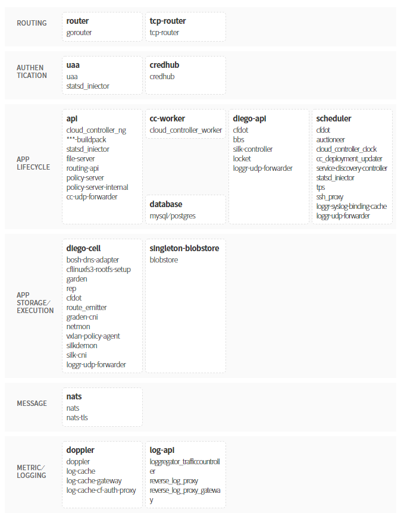

### [Index](https://github.com/K-PaaS/Guide-eng/blob/master/README.md) > [AP Architecture](../README.md) > K-PaaS AP

## Purpose
This document provides the Architecture of the K-PaaS Application Platform (AP).
  

## System Configuration Diagram

| Classification | Number of Instances (N>1) | Speicification |
|-------|----|-----|
| api | N | 1vCPU / 2GB RAM / 50GB Extra Disk |
| cc-worker | N > 1 | 1vCPU / 2GB RAM |
| credhub | N > 1 | 1vCPU / 2GB RAM |
| database | 1(PostgreSQL) or N(MySQL) | 1vCPU / 2GB RAM / 10GB Extra Disk |
| diego-api | N > 1 | 1vCPU / 2GB RAM |
| diego-cell | N > 1 | 4vCPU / 16GB RAM / 100GB Extra Disk |
| doppler | N > 1 | 1vCPU / 2GB RAM |
| haproxy | 1 | 1vCPU / 2GB RAM |
| nats | N > 1 | 1vCPU / 2GB RAM |
| router | N > 1 | 1vCPU / 2GB RAM |
| scheduler | N > 1 | 1vCPU / 2GB RAM |
| singleton-blobstore | 1 | 1vCPU / 2GB RAM / 100GB Extra Disk |
| tcp-router | N > 1 | 1vCPU / 2GB RAM |
| uaa | N > 1 | 1vCPU / 2GB RAM |

## Description
K-PaaS AP is a platform as a service (PaaS), a platform that allows you to select developer frameworks and app services.  
K-PaaS AP makes it faster and easier to deploy, test deploy, and scale applications.

### [Index](https://github.com/K-PaaS/Guide-eng/blob/master/README.md) > [AP Architecture](../README.md) > K-PaaS AP
