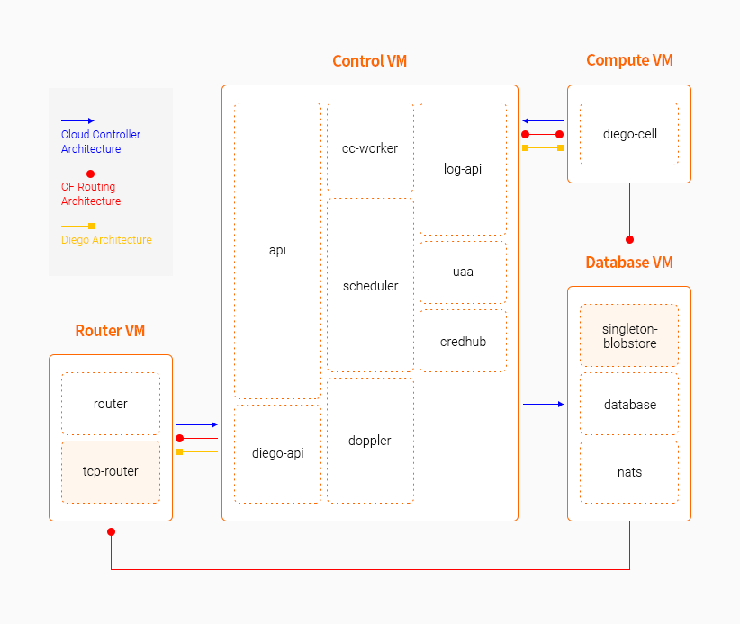

### [Index](https://github.com/K-PaaS/Guide-eng/blob/master/README.md) > [AP Architecture](../README.md) > K-PaaS AP - min

## Purpose
This document provides the Architecture of K-PaaS Application Platform (AP) – min.
 K-PaaS Application Platform(AP) - min is a light version of Application Platform.
  

## System Configuration Diagram

- When Deploying 4VM

| Classification | Number of Instances (N>1) | Specification |
|-------|----|-----|
| compute | N > 1 | 4vCPU / 16GB RAM / 100GB Extra Disk |
| control | N > 1 | 4vCPU / 16GB RAM / 30GB Extra Disk |
| database | 1 | 1vCPU / 2GB RAM / 100GB Extra Disk |
| router | 1 | 1vCPU / 2GB RAM |

- When Deploying 7VM

| Classification | Number of Instances (N>1) | Specificaion |
|-------|----|-----|
| compute | N > 1 | 4vCPU / 16GB RAM / 100GB Extra Disk |
| control | N > 1 | 4vCPU / 16GB RAM / 30GB Extra Disk |
| database | 1(PostgreSQL) or N(MySQL) | 1vCPU / 2GB RAM / 10GB Extra Disk |
| haproxy | 1 | 1vCPU / 2GB RAM |
| router | N > 1 | 1vCPU / 2GB RAM  |
| singleton-blobstore | 1 | 1vCPU / 2GB RAM / 100GB Extra Disk |
| tcp-router | N > 1 | 1vCPU / 2GB RAM |

## Description
K-PaaS AP – min is a lightweight version of K-PaaS AP.    
Existing 15 to 16 VM components can be deployed as 4 VMs or 7 VMs if needed.

### [Index](https://github.com/K-PaaS/Guide-eng/blob/master/README.md) > [AP Architecture](../README.md) > K-PaaS AP - min
