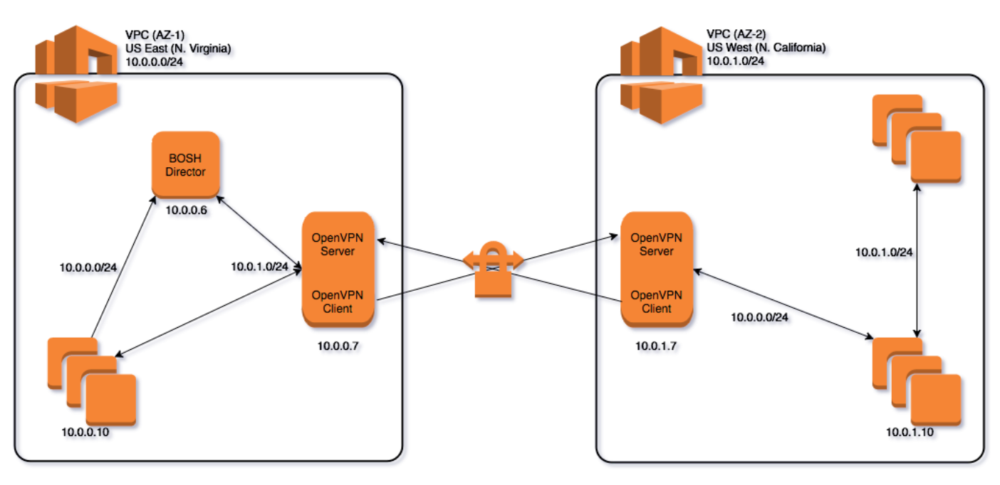

### [Index](https://github.com/PaaS-TA/Guide-eng/blob/master/README.md) > [AP Architecture](../README.md) > PaaS-TA Multi CPI

## Purpose
This document provides the Architecture of PaaS-TA Multi CPI.
  

## System Configuration Diagram

 

| Classification | Number of Instances| Specification |
|-------|----|-----|
| openvpn | 2 | 1vCPU / 0.5GB RAM |
| BOSH | 1 | 4vCPU / 16GB RAM / (25GB + 64GB) Extra Disk |

  

## 참고자료
BOSH Document: [http://bosh.io](http://bosh.io)  
BOSH Deployment: [https://github.com/cloudfoundry/bosh-deployment](https://github.com/cloudfoundry/bosh-deployment)  

### [Index](https://github.com/PaaS-TA/Guide-eng/blob/master/README.md) > [AP Architecture](../README.md) > PaaS-TA Multi CPI
