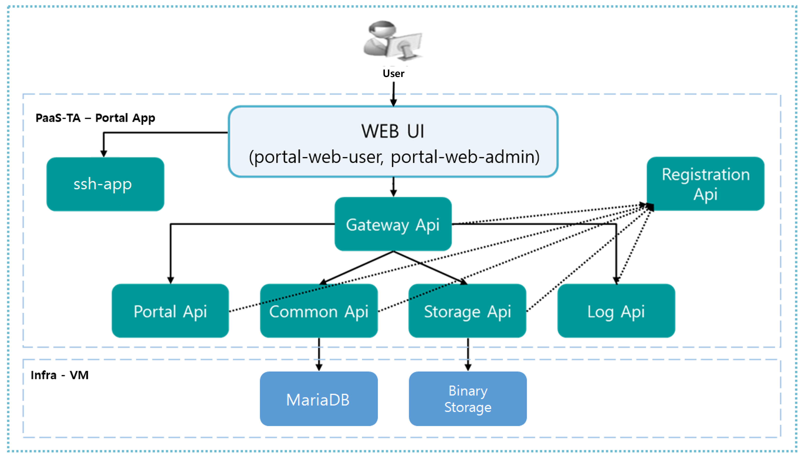

### [Index](https://github.com/K-PaaS/Guide-eng/blob/master/README.md) > [AP Architecture](../README.md) > Portal Container Type

## Purpose
This document provides the Architecture of Application Platform (AP) Portal- Container Type.
  

## System Configuration Diagram
The Container Type AP Portal is composed of two parts: Portal Infra and Portal APP.
Portal Infra is deployed by BOSH, and Portal APP is deployed by K-PaaS AP.
The configuration and specification of Portal Infra and Portal APP are as follows. 
 

 

* K-PaaS Portal infra VM   

| Classification | Specification |
|---------|-------|
| infra (mariadb / binary storage) | 1vCPU / 512MB RAM / 10GB Disk 20GB(Permanent Disk) |

* K-PaaS Portal App

| App Name | Number of Instances | Memory | Disk |
|--------|-------|-------|-------|
| portal-registration | N | 1G | 1G|
| portal-gateway | N | 1G | 1G|
| portal-api | N | 2G | 2G|
| portal-common-api | N | 1G | 1G|
| portal-storage-api | N | 1G | 1G|
| portal-log-api | 1 | 1G | 1G|
| portal-web-admin | N | 1G | 1G|
| portal-web-user | N | 1G | 1G|  
| ssh-app | 1 | 1G | 1G|  

### [Index](https://github.com/K-PaaS/Guide-eng/blob/master/README.md) > [AP Architecture](../README.md) > Portal Container Type
