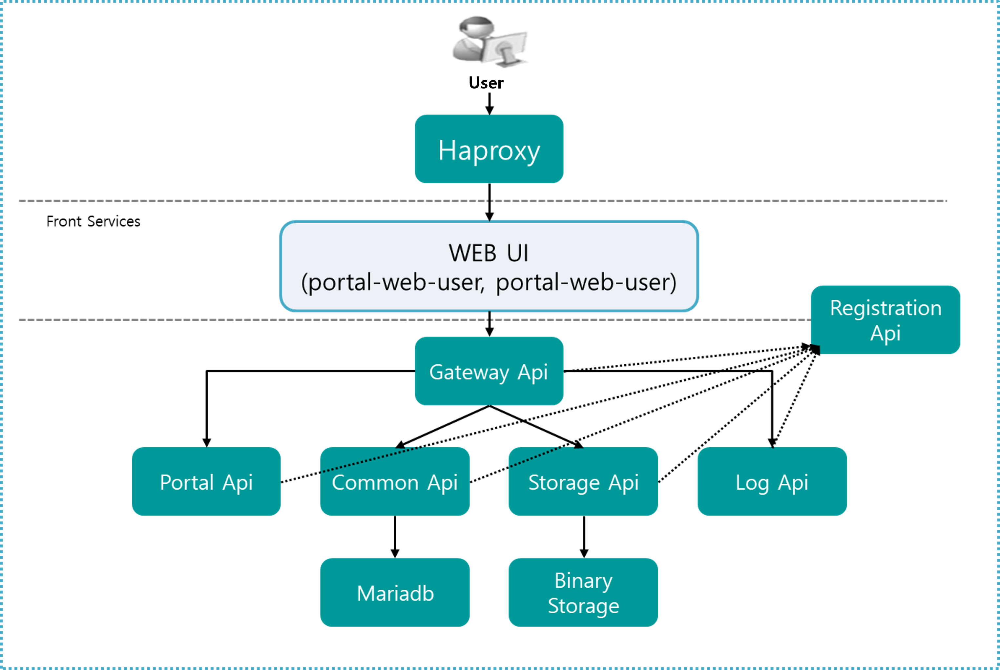

### [Index](https://github.com/PaaS-TA/Guide-eng/blob/master/README.md) > [AP Architecture](../README.md) > Portal VM Type

## Purpose
This document provides the Architecture of Application Platform (AP) Portal - VM Type.
  

## System Configuration Diagram
The AP Portal of VM Type is composed of two parts: Portal API and Portal UI. 
The configuration and specification of Portal API and Portal UI are as follows.  
 

 

| Deployment | Classification | Specification |
|------------|-------|-----|
| portal-api | binary_storage | 1vCPU / 512MB RAM / 4GB Disk 10GB(Permanent Disk) |
| portal-api | haproxy | 1vCPU / 512MB RAM / 4GB Disk|
| portal-api | mariadb | 1vCPU / 512MB RAM / 4GB Disk +10GB(Permanent Disk) |
| portal-api | paas-ta-portal-registration | 1vCPU / 512MB RAM / 4GB Disk |
| portal-api | paas-ta-portal-gateway | 1vCPU / 512MB RAM / 4GB Disk |
| portal-api | paas-ta-portal-api | 1vCPU / 1GB RAM / 4GB Disk |
| portal-api | paas-ta-portal-common-api | 1vCPU / 512MB RAM / 4GB Disk |
| portal-api | paas-ta-portal-log-api | 1vCPU / 512MB RAM / 4GB Disk |
| portal-api | paas-ta-portal-storage-api | 1vCPU / 512MB RAM / 4GB Disk |
| portal-ui | haproxy | 1vCPU / 512MB RAM / 4GB Disk|
| portal-ui | mariadb | 1vCPU / 512MB RAM / 4GB Disk +10GB(Permanent Disk) |
| portal-ui | paas-ta-portal-webadmin | 1vCPU / 512MB RAM / 4GB Disk |
| portal-ui | paas-ta-portal-webuser | 1vCPU / 512MB RAM / 4GB Disk|
 

### [Index](https://github.com/PaaS-TA/Guide-eng/blob/master/README.md) > [AP Architecture](../README.md) > Portal VM Type
