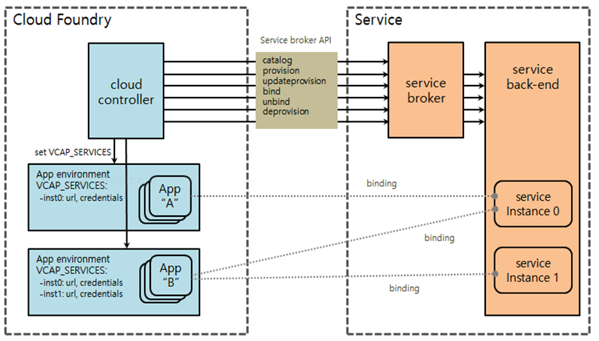
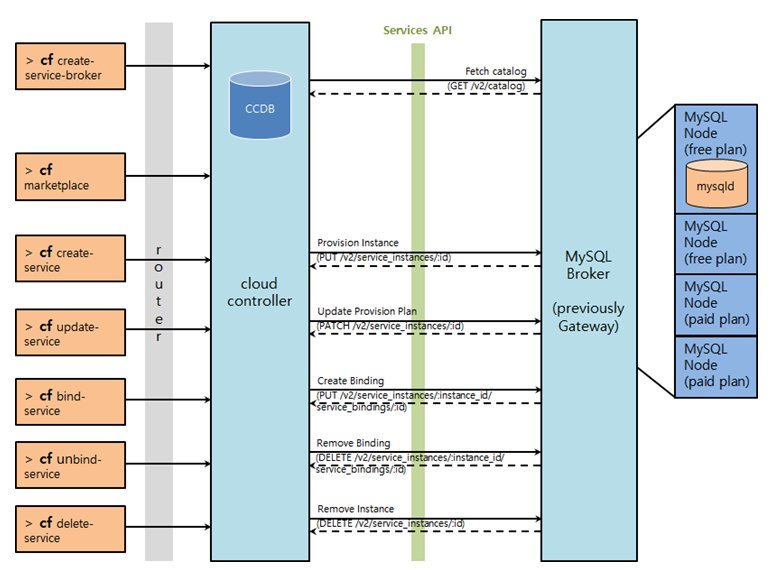

### [Index](https://github.com/PaaS-TA/Guide-eng/blob/master/README.md) > [AP Architecture](../README.md) > Open Service Broker

## Purpose

This document briefly introduces the concept of Open service broker.

## Service Architecture
The service broker discloses a service catalog based on service offering and service plan. Service provisioning, service binding, service binding, service binding, and provisioning release requests are performed according to the user's behavior.
 
In general, 'provision' preempts resources in the service, and 'bind' delivers the information needed to access those resources to the app. Preempted resources are called service instances.
 
What the service instance represents may vary by service. For example, it may be a single database from accounts of multi-tenant servers, dedicated clusters, and web apps.

## Service Broker API Architecture
The Open Service Broker API defines the protocol between the Cloud Controller and the Service Broker. Broker is implemented in HTTP (or HTTPS) endpoints URI format. One or more services may be provided by one broker, and may be provided with horizontal scalability to enable load balancing.

## References
http://docs.cloudfoundry.org/services/  
https://github.com/openservicebrokerapi  
https://github.com/cloudfoundry/pxc-release  
https://github.com/PaaS-TA/OPENPAAS-SERVICE-JAVA-BROKER-MYSQL