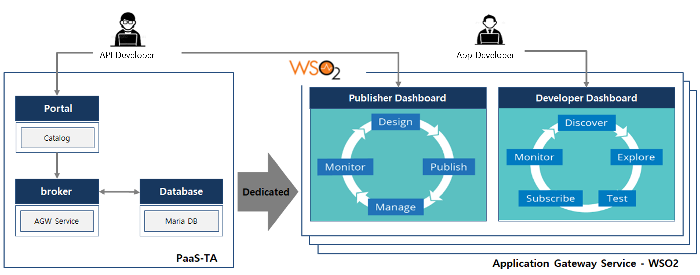

### [Index](https://github.com/K-PaaS/Guide-eng/blob/master/README.md) > [AP Architecture](../README.md) > Gateway Service

## Purpose
This document provides the Architecture of Application Platform (AP) - Gateway Service.
  

## System Configuration Diagram
Gateway Service is an open-source API managing platform configured based on WS02.
It supports API design, publishing, access management and security application, API statistics, and API rate limiting.
It provides an API-gateway server (WSO2) dedicated to user organizations rather than a multi-tenant-based shared service.

 

| Classification | Specification |
|--------|-----|
| mariadb | 2vCPU / 4GB RAM / 10GB Extra Disk |
| service-broker | 2vCPU / 4GB RAM |
| api-gateway | 2vCPU / 4GB RAM / 20GB Extra Disk |

### [Index](https://github.com/K-PaaS/Guide-eng/blob/master/README.md) > [AP Architecture](../README.md) > Gateway Service
