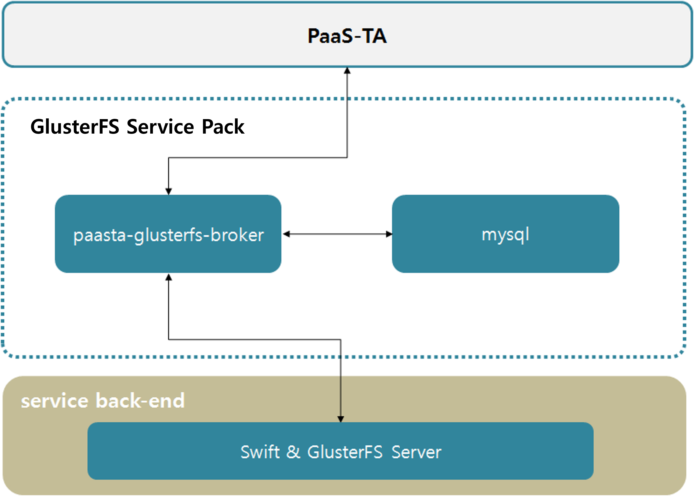

### [Index](https://github.com/K-PaaS/Guide-eng/blob/master/README.md) > [AP Architecture](../README.md) > GlusterFS Service

## Purpose
This document provides the Architecture of Application Platform (AP) - GlusterFS Service.
  

## System Configuration Diagram

 

| Classification | Specification |
|-------|-----|
| mysql | 2vCPU / 4GB RAM / 2GB Extra Disk|
| service-broker | 1vCPU / 2GB RAM / 4GB Extra Disk|

### [Index](https://github.com/K-PaaS/Guide-eng/blob/master/README.md) > [AP Architecture](../README.md) > GlusterFS Service
