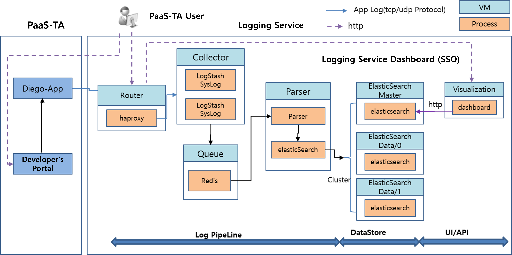

### [Index](https://github.com/PaaS-TA/Guide-eng/blob/master/README.md) > [AP Architecture](../README.md) > Logging Service

## Purpose
This document provides the Architecture of Application Platform (AP) - Logging Service.
  

## System Configuration Diagram

 

| Classification  | Specification |
|-------|----|
| fluentd | 1vCPU / 4GB RAM |
| influxdb | 4vCPU / 8GB RAM / 10GB Extra Disk |
| collector | 1vCPU / 4GB RAM |

### [Index](https://github.com/PaaS-TA/Guide-eng/blob/master/README.md) > [AP Architecture](../README.md) > Logging Service
