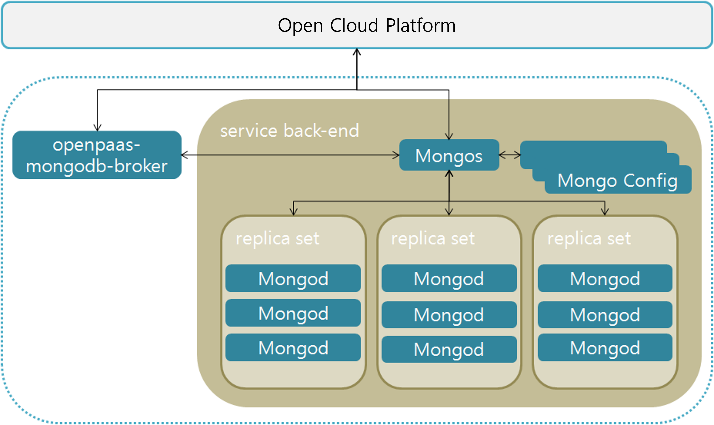

### [Index](https://github.com/K-PaaS/Guide-eng/blob/master/README.md) > [AP Architecture](../README.md) > MongoDB Service

## Purpose
This document provides the Architecture of Application Platform (AP) - MongoDB Service.
  

## System Configuration Diagram
MongoDB Service is a configuration that deploys and stores data in multiple Replica Sets.
MongoDB uses Sharding to support the configuration required for very large datasets and high-throughput tasks.
MongoDB's Replica Set is a group of MongoDB processes that maintain the same dataset, providing redundancy and high availability.
The Config server stores all meta-information required by the shard cluster.

 

| Classification | Specification |
|-------|----|
| mongodb-broker | 2vCPU / 4GB RAM |
| mongodb_shard | 2vCPU / 4GB RAM |
| mongodb_config | 2vCPU / 4GB RAM / 10GB Extra Disk |
| mongodb_master | 2vCPU / 4GB RAM / 10GB Extra Disk |
| mongodb_worker | 2vCPU / 4GB RAM / 10GB Extra Disk |

### [Index](https://github.com/K-PaaS/Guide-eng/blob/master/README.md) > [AP Architecture](../README.md) > MongoDB Service
