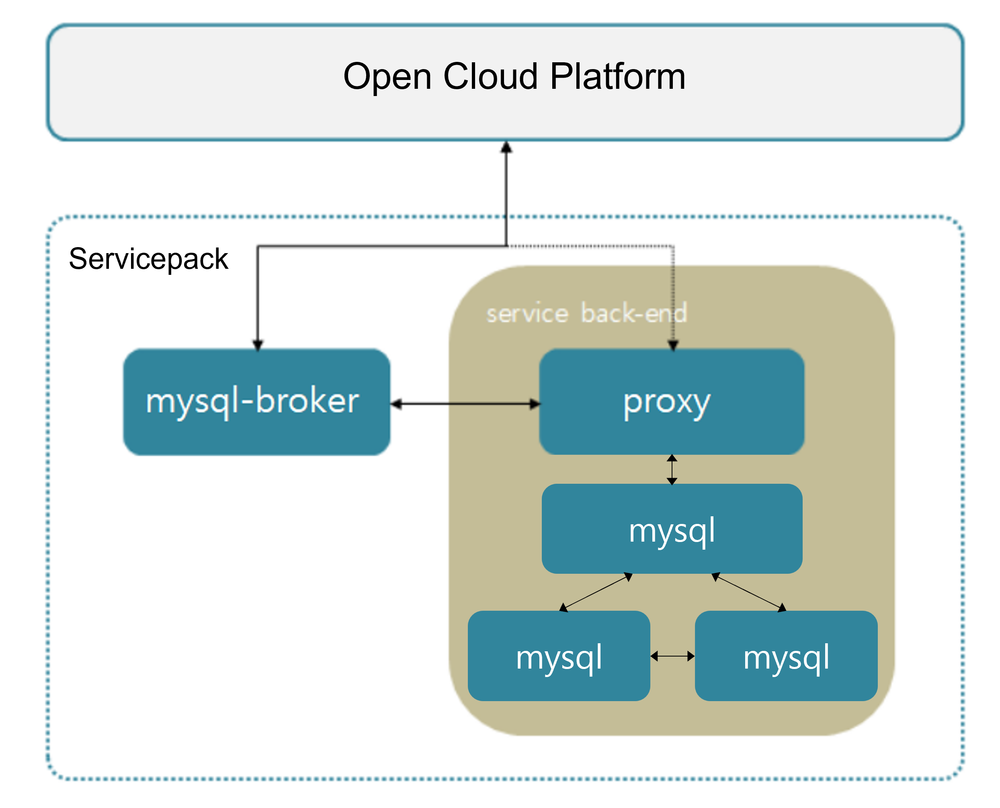

### [Index](https://github.com/PaaS-TA/Guide-eng/blob/master/README.md) > [AP Architecture](../README.md) > MySQL Service

## Purpose
This document provides the Architecture of Application Platform (AP) - MySQL Service.
  

## System Configuration Diagram
 

 

| Classification | Specification |
|-------|----|
| arbitrator | 1vCPU / 2GB RAM |
| mysql | 1vCPU / 2GB RAM / 8GB Extra Disk |
| mysql_broker | 1vCPU / 2GB RAM |
| proxy | 1vCPU / 2GB RAM |

### [Index](https://github.com/PaaS-TA/Guide-eng/blob/master/README.md) > [AP Architecture](../README.md) > MySQL Service
