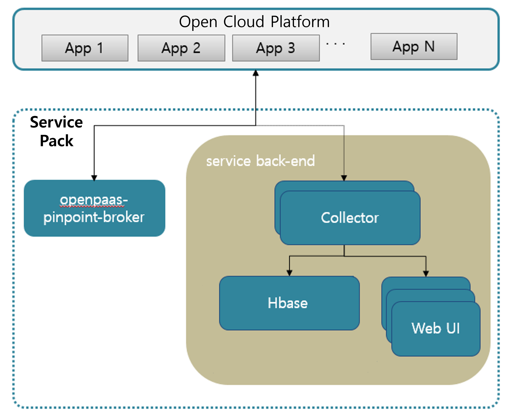

### [Index](https://github.com/PaaS-TA/Guide-eng/blob/master/README.md) > [AP Architecture](../README.md) > Pinpoint APM Service

## Purpose
This document provides the Architecture of Application Platform (AP) - Pinpoint APM Service.
  

## System Configuration Diagram
The Pinpoint APM Service provides a UI to track transaction flows between components of user applications and to collect data and visually check them to identify problem areas and potential bottlenecks.

 

| Classification | Specification |
|-------|------|
| collector | 2vCPU / 8GB RAM / 30GB Extra Disk |
| h_master | 2vCPU / 8GB RAM / 30GB Extra Disk |
| pinpoint_web | 2vCPU / 8GB RAM / 30GB Extra Disk |
| broker | 2vCPU / 8GB RAM / 30GB Extra Disk |
| haproxy_webui | 2vCPU / 8GB RAM / 30GB Extra Disk |

### [Index](https://github.com/PaaS-TA/Guide-eng/blob/master/README.md) > [AP Architecture](../README.md) > Pinpoint APM Service
