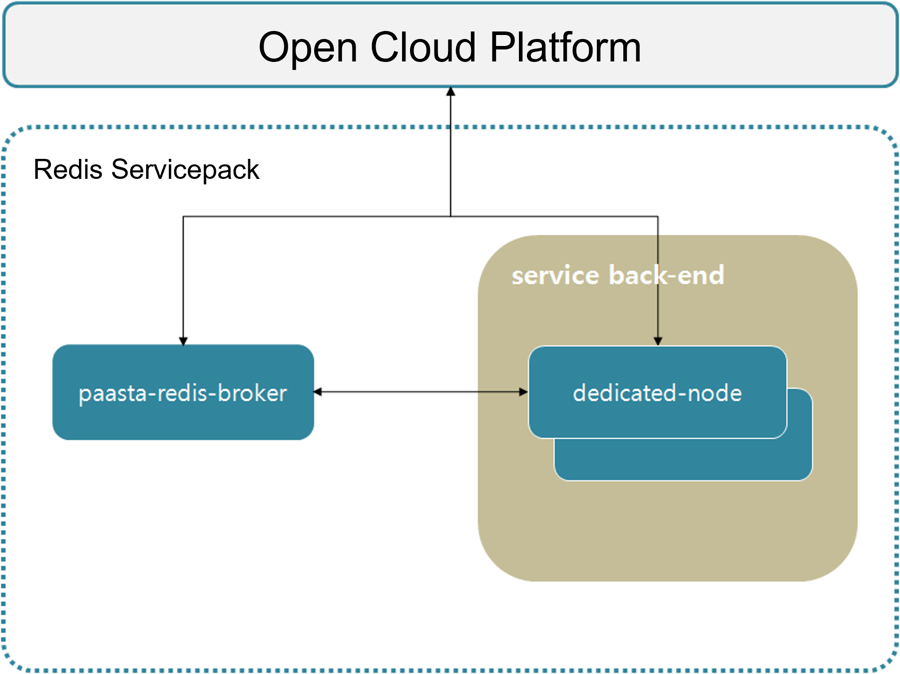

### [Index](https://github.com/PaaS-TA/Guide-eng/blob/master/README.md) > [AP Architecture](../README.md) > Redis Service

## Purpose
This document provides the Architecture of Application Platform (AP) - Redis Service.
  

## System Configuration Diagram
Redis service provides in-memory cache storage.
It provides a user on-demand Redis server rather than a multi-tenant-based shared service.

 

| Classification | Specification |
|-------|-----|
| mariadb | 2vCPU / 4GB RAM / 2GB Extra Disk |
| paas-ta-on-demand-broker | 2vCPU / 4GB RAM |
| redis | 2vCPU / 4GB RAM / 1GB Extra Disk |

### [Index](https://github.com/PaaS-TA/Guide-eng/blob/master/README.md) > [AP Architecture](../README.md) > Redis Service
