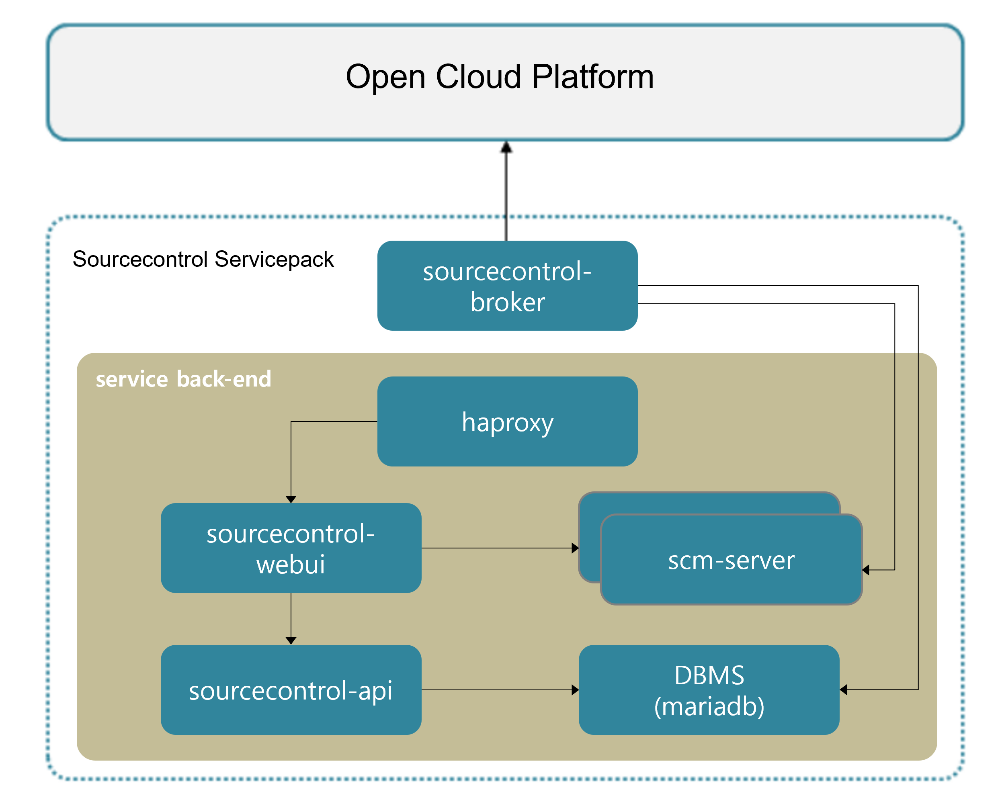

### [Index](https://github.com/K-PaaS/Guide-eng/blob/master/README.md) > [AP Architecture](../README.md) > Source Control Service

## Purpose
This document provides the Architecture of Application Platform (AP) - Source Control Service.
  

## System Configuration Diagram
The Source Control Service provides a repository for securely storing the user's source code and various files.
It provides a commit history, branch list, etc., and provides a UI that can check various information on the web.

 

| Classification | Specification |
|-------|-----|
| scm-server | 1vCPU / 2GB RAM / 30GB Extra Disk |
| mariadb | 1vCPU / 2GB RAM / 2GB Extra Disk |
| haproxy | 1vCPU / 2GB RAM / 2GB Extra Disk |
| sourcecontrol-webui | 1vCPU / 2GB RAM / 2GB Extra Disk |
| sourcecontrol-api | 1vCPU / 2GB RAM / 2GB Extra Disk |
| sourcecontrol-broker | 1vCPU / 2GB RAM / 2GB Extra Disk |

### [Index](https://github.com/K-PaaS/Guide-eng/blob/master/README.md) > [AP Architecture](../README.md) > Source Control Service
