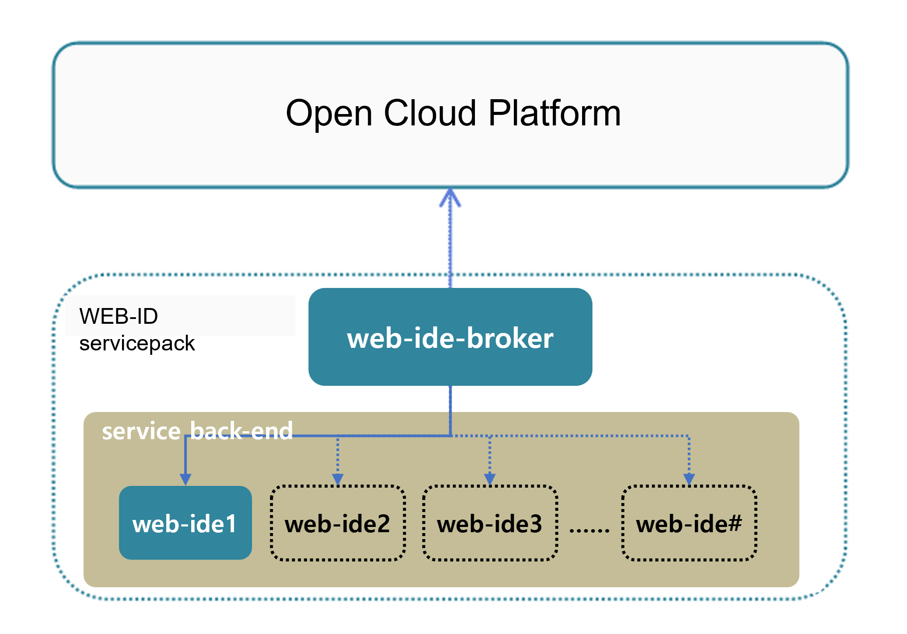

### [Index](https://github.com/K-Paas/Guide-eng/blob/master/README.md) > [AP Architecture](../README.md) > WEB IDE Service

## Purpose
This document provides the Architecture of Application Platform (AP) - WEB IDE Service.
  

## System Configuration Diagram
The WEB-IDE service provides a web-based developable IDE using eclipse che.
It provides an eclipse che server for users, not a multi-tenant-based shared service.
It is limited in workplace configuration because it is based on the stack provided by the eclipse che server

 

| Classification | Specification |
|-------|-----|
| eclipse-che | 2vCPU / 8GB RAM |
| mariadb | 1vCPU / 2GB RAM / 10GB Extra Disk |
| webide-broker | 2vCPU / 4GB RAM |

### [Index](https://github.com/K-PaaS/Guide-eng/blob/master/README.md) > [AP Architecture](../README.md) > WEB IDE Service
