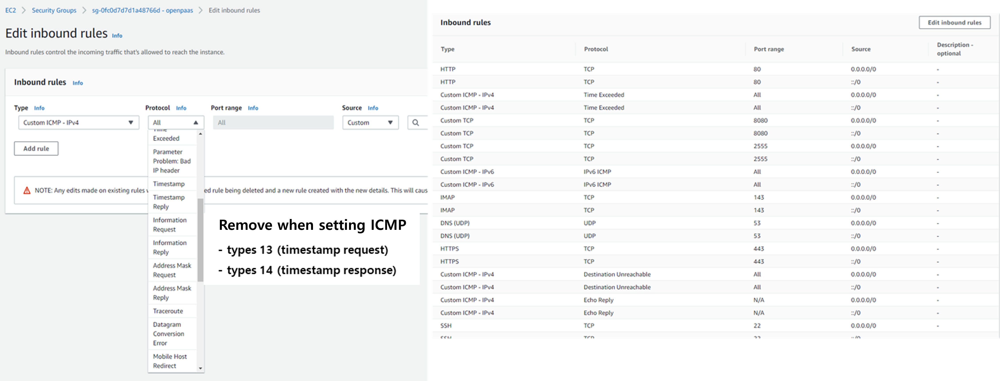

### [Index](https://github.com/K-PaaS/Guide-eng/blob/master/README.md) > [AP Install](../README.md) > BOSH

## Table of Contents

1. [Outline](#1)  
 1.1. [Purpose](#1.1)  
 1.2. [Range](#1.2)  
 1.3. [References](#1.3)  
2. [Configuring and Installing the BOSH Installation Environment](#2)  
 2.1. [BOSH Installation Procedure](#2.1)  
 2.2. [Inception Server Configuration](#2.2)  
 2.3. [BOSH Installation](#2.3)  
　2.3.1. [Prerequisite](#2.3.1)  
　2.3.2. [BOSH CLI and Dependency Installation](#2.3.2)  
　2.3.3. [Download Installation File](#2.3.3)  
　2.3.4. [BOSH Installation](#2.3.4)  
　　2.3.4.1. [BOSH Installation Variable File](#2.3.4.1)  
　　2.3.4.2. [BOSH Installation Option File](#2.3.4.2)  
　　2.3.4.3. [BOSH Installation Shell Script](#2.3.4.3)  
　2.3.5. [BOSH Installation](#2.3.5)  
　2.3.6. [BOSH Login](#2.3.6)  
3. [BOSH Option File Utilization](#3)  
 3.1. [CredHub](#3.1)   
　 3.1.1. [CredHub CLI Installation](#3.1.1)  
　 3.1.2. [CredHub Login](#3.1.2)  
 3.2. [Jumpbox](#3.2)   
4. [Others](#4)  
 4.1. [Create BOSH Login Script](#4.1)   

## Executive Summary

This document is an installation guide document for BOSH2 (hereinafter referred to as BOSH) and explains how to configure and use the environment to run BOSH.

# <div id='1'/>1. Document Outline

## <div id='1.1'/>1.1. Purpose
BOSH, which can deploy service systems to cloud environments, is an open-source project that integrates release engineering, development, and software lifecycle management. The purpose of this document is to install BOSH in an Inception environment (installation environment).

## <div id='1.2'/>1.2. Range
This document was written based on installing and configuring packages and libraries for BOSH installation based on Linux environments (Ubuntu 18.04) and using them to install BOSH.
BOSH supports IaaS such as VMware vSphere, Google Cloud Platform, Amazon Web Services EC2, OpenStack, and Microsoft Azure, and the IaaS environment verified is OpenStack, and vSphere environments.

## <div id='1.3'/>1.3. References

This document was prepared by referring to Cloud Foundry's BOSH Document and Cloud Foundry Document.

BOSH Document: [http://bosh.io](http://bosh.io)  
BOSH Deployment: [https://github.com/cloudfoundry/bosh-deployment](https://github.com/cloudfoundry/bosh-deployment)  
Cloud Foundry Document: [https://docs.cloudfoundry.org](https://docs.cloudfoundry.org)  


# <div id='2'/>2. Configuring and Installing the BOSH Installation Environment 

## <div id='2.1'/>2.1. BOSH Installaion Procedure
Inception (a K-PaaS installation) is an installation environment for installing BOSH and K-PaaS, either VM or server equipment. 
OS Version is based on Ubuntu 18.04. Inception VM must be created manually in IaaS.

Inception VM recommends Ubuntu 18.04, vCPU 2 Core, Memory 4G, and Disk 100G or higher.

## <div id='2.2'/>2.2.  Inception Server Configuration

The Inception server is a deployment job execution server that has the necessary environment for installing BOSH and K-PaaS, such as packages, libraries, and Manifest files.
The Inception server should be capable of external communication.

The components to be configured on the Inception server for BOSH and Application Platform (hereinafter AP) installation are as follows.

- BOSH CLI 6.1.x and above
- BOSH Dependency : ruby, ruby-dev, openssl etc.
- BOSH Deployment: Manifest deployment for BOSH installation
- AP Deployment : Manifest deployment for Application Platform installation

## <div id='2.3'/>2.3.  BOSH Installation

### <div id='2.3.1'/>2.3.1.    Prerequisite

- This installation guide is based on Ubuntu 18.04.

- Set which ports should be opened for IaaS security groups.

|Port|Remarks|
|---|---|
|22|Use BOSH|
|6868|Use BOSH|
|25555|Use BOSH|
|53|Use AP|
|68|Use AP|
|80|Use AP|
|443|Use AP|
|4443|Use AP|


- Disable the ICMP types 13 (timestamp request) and types 14 (timestamp response) rule in the inbound of the IaaS security group. (CVE-1999-0524 ICMP timestamp response security issue applied)

  Ex. - AWS security group config)  
 


### <div id='2.3.2'/>2.3.2.    BOSH CLI and Dependency Installation

- BOSH Dependency Installation (Ubuntu 18.04)

```
$ sudo apt-get update
$ sudo apt install -y build-essential zlibc zlib1g-dev ruby ruby-dev openssl libxslt1-dev libxml2-dev libssl-dev libreadline7 libreadline-dev libyaml-dev libsqlite3-dev sqlite3
```

- BOSH Dependency Installation (Ubuntu 16.04)

```
$ sudo apt-get update
$ sudo apt install -y libcurl4-openssl-dev gcc g++ build-essential zlibc zlib1g-dev ruby ruby-dev openssl libxslt-dev libxml2-dev libssl-dev libreadline6 libreadline6-dev libyaml-dev libsqlite3-dev sqlite3
```

- BOSH CLI Installation

```
$ mkdir -p ~/workspace
$ cd ~/workspace
$ sudo apt update
$ curl -Lo ./bosh https://github.com/cloudfoundry/bosh-cli/releases/download/v6.4.7/bosh-cli-6.4.7-linux-amd64
$ chmod +x ./bosh
$ sudo mv ./bosh /usr/local/bin/bosh
$ bosh -v
```

The BOSH2 CLI has the function of generating BOSH certificate information when installing BOSH.
Cloud Foundry's default BOSH CLI has a certificate limited for a year.
The BOSH certificate requires communication between BOSH internal components.
After a year of installing BOSH, the certification has to be renewed.  
- Certificate renew guide video - [Link](https://youtu.be/zn8VO-fHAFE?t=1994)

### <div id='2.3.3'/>2.3.3.    Download Installation FIle

- Download if deployment for installing BOSH does not exist.
```
$ mkdir -p ~/workspace
$ cd ~/workspace
$ git clone https://github.com/K-PaaS/ap-deployment.git -b v5.8.8
```

- Check the folders under ap-deployment

```
$ cd ~/workspace/ap-deployment
$ ls
README.md  bosh  cloud-config  ap
```

<table>
<tr>
<td>bosh</td>
<td>Folder containing manifest and installation files for BOSH installation exist</td>
</tr>
<tr>
<td>cloud-config</td>
<td>Folder containing IaaS network, storage, vm-specific settings files for VM deployment exist</td>
</tr>
<tr>
<td>ap</td>
<td>Folder containing manifest and installation files for AP installation</td>
</tr>
</table>


### <div id='2.3.4'/>2.3.4.    BOSH Installation File

~/workspace/ap-deployment/bosh contains IaaS-specific Shell Script files for BOSH installation.

Use Shell Script to intall BOSH.
File name was made as deploy-{IaaS}.sh . 
Modification can be done by {IaaS}-vars.yml to set the variables to be applied during BOSH installation.

<table>
<tr>
<td>aws-vars.yml</td>
<td>The file for variable setting to be applied when installing BOSH in a AWS environment</td>
</tr>
<tr>
<td>openstack-vars.yml</td>
<td>The file for variable setting to be applied when installing BOSH in a OpenStack environment</td>
</tr>
<tr>
<td>vsphere-vars.yml</td>
<td>The file for variable setting to be applied when installing BOSH in a vSphere environment</td>
</tr>
<tr>
<td>deploy-aws.sh</td>
<td>Shell Script File for BOSH Installing in AWS Environment</td>
</tr>
<tr>
<td>deploy-openstack.sh</td>
<td>Shell Script File for BOSH Installing in OpenStack</td>
</tr>
<tr>
<td>deploy-vsphere.sh</td>
<td>Shell Script File for BOSH Installing in vSphere</td>
</tr>
<tr>
<td>bosh.yml</td>
<td>Manifest file to create BOSH</td>
</tr>
</table>


#### <div id='2.3.4.1'/>2.3.4.1. BOSH Installation Variable File Settings

Set variable file according to IaaS environment where BOSH is installed.

- When installing AWS environment 

> $ vi ~/workspace/ap-deployment/bosh/aws-vars.yml
```
# BOSH VARIABLE
bosh_client_admin_id: "admin"				# Bosh Client Admin ID
private_cidr: "10.0.1.0/24"				# Private IP Range
private_gw: "10.0.1.1"					# Private IP Gateway
bosh_ip: "10.0.1.6"					# Private IP
director_name: "micro-bosh"				# BOSH Director Name
access_key_id: "XXXXXXXXXXXXXXX"			# AWS Access Key
secret_access_key: "XXXXXXXXXXXXX"			# AWS Secret Key
region: "ap-northeast-2"				# AWS Region
az: "ap-northeast-2a"					# AWS AZ Zone
default_key_name: "aws-ap"			# AWS Key Name
default_security_groups: ["bosh"]			# AWS Security-Group
subnet_id: "ap-subnet"				# AWS Subnet
private_key: "~/.ssh/aws-ap.pem"			# SSH Private Key Path (Path to a private key with access to corresponding IaaS)

# MONITORING VARIABLE(When installing K-PaaS Monitoring, pre-modify the value of the VM to be installed ahead of time)
metric_url: "10.0.161.101"          # influxdb IP
syslog_address: "10.0.121.100"      # td-agent IP
syslog_port: "2514"                 # td-agent Port
syslog_transport: "udp"             # td-agent Logging Protocol
```

- When installing OpenStack environment

> $ vi ~/workspace/ap-deployment/bosh/openstack-vars.yml
```
# BOSH VARIABLE
director_name: "micro-bosh"					# BOSH Director Name
private_cidr: "10.0.1.0/24"					# Private IP Range
private_gw: "10.0.1.1"							# Private IP Gateway
bosh_ip: "10.0.1.6"									# Private IP 
auth_url: "http://XX.XXX.XX.XX:XXXX/v3/"	# Openstack Keystone URL
az: "nova"													# Openstack AZ Zone
default_key_name: "ap"							# Openstack Key Name
default_security_groups: ["ap"]			# Openstack Security Group
net_id: "XXXXXXXX-XXXX-XXXX-XXXX-XXXXXXXXXXXX"	# Openstack Network ID
openstack_password: "XXXXXX"				# Openstack User Password
openstack_username: "XXXXXX"				# Openstack User Name
openstack_domain: "XXXXXXX"					# Openstack Domain Name
openstack_project: "ap"							# Openstack Project
private_key: "~/.ssh/id_rsa.pem"		# Openstack Region
region: "RegionOne"									# SSH Private Key Path

# MONITORING VARIABLE(When installing K-PaaS Monitoring, pre-modify it to the value of the VMs to be installed ahead of time)
metric_url: "10.0.161.101"          # influxdb IP
syslog_address: "10.0.121.100"      # td-agent IP
syslog_port: "2514"                 # td-agent Port
syslog_transport: "udp"             # td-agent Logging Protocol
```

- When installing vSphere environment

> $ vi ~/workspace/ap-deployment/bosh/vsphere-vars.yml
```
# BOSH VARIABLE
bosh_client_admin_id: "admin"				# Bosh Client Admin ID
director_name: "micro-bosh"					# BOSH Director Name
private_cidr: "10.0.1.0/24"					# Private IP Range
private_gw: "10.0.1.1"							# Private IP Gateway
bosh_ip: "10.0.1.6"									# Private IP 
network_name: "AP"									# Private Network Name (vCenter)	
vcenter_dc: "AP-DC"									# vCenter Data Center Name
vcenter_ds: "AP-Storage"						# vCenter Data Storage Name
vcenter_ip: "XX.XX.XXX.XX"					# vCenter Private IP
vcenter_user: "XXXXX"								# vCenter User Name
vcenter_password: "XXXXXX"					# vCenter User Password
vcenter_templates: "AP_Templates"		# vCenter Templates Name
vcenter_vms: "AP_VMs"								# vCenter VMS Name
vcenter_disks: "AP_Disks"						# vCenter Disk Name
vcenter_cluster: "AP"								# vCenter Cluster Name
vcenter_rp: "AP_Pool"								# vCenter Resource Pool Name

# MONITORING VARIABLE(Modify when installing K-PaaS Monitoring)
metric_url: "10.0.161.101"          # influxdb IP
syslog_address: "10.0.121.100"      # td-agent IP
syslog_port: "2514"                 # td-agent Port
syslog_transport: "udp"             # td-agent Logging Protocol
```


#### <div id='2.3.4.2'/>2.3.4.2. BOSH Installation Option file

The option files used in the installation Shell Script are as follows.

<table>
<tr>
<td>File Name</td>
<td>Description</td>
</tr>
<tr>
<td>uaa.yml</td>
<td>For applying the UAA</td>
</tr>
<tr>
<td>credhub.yml</td>
<td>For applying CredHub</td>
</tr>
<tr>
<td>jumpbox-user.yml</td>
<td>For creating BOSH Jumpbox user</td>
</tr>
<tr>
<td>cce.yml</td>
<td>For taking action for CCE</td>
</tr>
</table>


#### <div id='2.3.4.3'/>2.3.4.3. BOSH Installation Shell Script

BOSH installation command starts with create-env.
BOSH Command can execute instead of Shell. Options may vary depending on the IaaS environment installed.
Installed BOSH can be deleted using the delete-env command.

BOSH Installation Options are as follows.

<table>
<tr>
<td>--state</td>
<td>IaaS configuration information of the installed BOSH will be stored in the file generated when executing the BOSH installation command. (Backup needed)</td>
</tr>
<tr>
<td>--vars-store</td>
<td>certificates and authentication information used by the internal components of the installed BOSH will be stored in the file generated when executing a BOSH installation command. (Backup needed)</td>
</tr>   
<tr>
<td>-o</td>
<td>Used when setting the operation file to be applied when installing BOSH. <br> Each IaaS may apply settings such as CPI or Jumpbox-user, CreditHub, etc.</td>
</tr>
<tr>
<td>-v</td>
<td>Used when setting variables in the operation file or variables applied when installing BOSH. <br>It can be divided into mandatory or optional items depending on the operation file properties.</td>
</tr>
<tr>
<td>-l, --var-file</td>
<td>Used to read variables written in YAML files.</td>
</tr>
</table>

If the options in the installed Shell Scripts need to be changed, run the corresponding command

- When installing AWS environment

> $ vi ~/workspace/ap-deployment/bosh/deploy-aws.sh
```
bosh create-env bosh.yml \                         
	--state=aws/state.json \			# BOSH Latest Running State, Create at installation, Backup needed
	--vars-store=aws/creds.yml \			# BOSH Credentials and Certs, Create at installation, Backup needed
	-o aws/cpi.yml \				# AWS CPI applied
	-o uaa.yml \					# UAA applied  
	-o credhub.yml \				# CredHub applied    
	-o jumpbox-user.yml \				# Jumpbox-user applied  
	-o cce.yml \					# Took action for CCE
 	-l aws-vars.yml					# The file for variable setting to be applied when installing BOSH in a AWS environment
```

- When installing OpenStack environment

> $ vi ~/workspace/ap-deployment/bosh/deploy-openstack.sh
```
bosh create-env bosh.yml \                       
	--state=openstack/state.json \			# BOSH Latest Running State, Create at installation, Backup needed
	--vars-store=openstack/creds.yml \		# BOSH Credentials and Certs, Create at installation, Backup needed
	-o openstack/cpi.yml \				# Openstack CPI applied
	-o uaa.yml \					# UAA applied
	-o credhub.yml \				# CredHub applied
	-o jumpbox-user.yml \				# Jumpbox-user applied
	-o cce.yml \					# Took action for CCE
	-o openstack/disable-readable-vm-names.yml \	# VM name applied as UUIDs
	-l openstack-vars.yml				# The file for variable setting to be applied when installing BOSH in a OpenStack environment
```

- When installing vSphere environment

> $ vi ~/workspace/ap-deployment/bosh/deploy-vsphere.sh
```
bosh create-env bosh.yml \
	--state=vsphere/state.json \			# BOSH Latest Running State, Create at installation, Backup needed
	--vars-store=vsphere/creds.yml \		# BOSH Credentials and Certs, Create at installation, Backup needed
	-o vsphere/cpi.yml \				# vSphere CPI applied
	-o vsphere/resource-pool.yml  \				# Enable vSphere resouce-pool
	-o uaa.yml  \					# UAA applied
	-o credhub.yml  \				# CredHub applied
	-o jumpbox-user.yml  \				# Jumpbox-user applied
	-o cce.yml \					# Took action forCCE
	-l vsphere-vars.yml				# The file for variable setting to be applied when installing BOSH in a vSphere Environment
```


- Grant execution permissions to Shell Script files

```
$ chmod +x ~/workspace/paasta-deployment/bosh/*.sh  
```


### <div id='2.3.5'/>2.3.5. BOSH Installation

After setting up Variable File and Installation Shell Script, proceed with the installation using the following command. 

- Run BOSH Installation Shell Script File

```
$ cd ~/workspace/ap-deployment/bosh
$ ./deploy-{iaas}.sh
```

- BOSH Installation Complete

```
  Compiling package 'uaa_utils/90097ea98715a560867052a2ff0916ec3460aabb'... Skipped [Package already compiled] (00:00:00)
  Compiling package 'davcli/f8a86e0b88dd22cb03dec04e42bdca86b07f79c3'... Skipped [Package already compiled] (00:00:00)
  Updating instance 'bosh/0'... Finished (00:01:44)
  Waiting for instance 'bosh/0' to be running... Finished (00:02:16)
  Running the post-start scripts 'bosh/0'... Finished (00:00:13)
Finished deploying (00:11:54)

Stopping registry... Finished (00:00:00)
Cleaning up rendered CPI jobs... Finished (00:00:00)

Succeeded
```


### <div id='2.3.6'/>2.3.6. BOSH Login
{iaas}/creds.yml file is created below the BOSH installation folder when BOSH is installed.  
Creds.yml has BOSH authentication information and logs in to BOSH using creds.yml.
After logging in to BOSH, AP may be installed using the BOSH CLI command.
**To deploy VMs using BOSH, you MUST login to BOSH.**  
BOSH Login command are as follows.  

```
$ cd ~/workspace/ap-deployment/bosh
$ export BOSH_CA_CERT=$(bosh int ./{iaas}/creds.yml --path /director_ssl/ca)
$ export BOSH_CLIENT=admin
$ export BOSH_CLIENT_SECRET=$(bosh int ./{iaas}/creds.yml --path /admin_password)
$ bosh alias-env {director_name} -e {bosh_url} --ca-cert <(bosh int ./{iaas}/creds.yml --path /director_ssl/ca)
$ bosh -e {director_name} env
```

## <div id='3'/> 3.Utilize BOSH Option File
### <div id='3.1'/>3.1. CredHub
CreditHub is a repository of authentication information. 
When installing BOSH, apply credhub.yml as an operation file, and store the credentials (certificate, password) used by Deployment generated through BOSH in the CredHub.
When authentication information is required, you can login to CredHub through the CredHub CLI to inquire, modify, and delete authentication information.

#### <div id='3.1.1'/>3.1.1 CredHub CLI Installation
Install CredHub CLI in Inception where BOSH is installed.

```
$ wget https://github.com/cloudfoundry-incubator/credhub-cli/releases/download/2.9.0/credhub-linux-2.9.0.tgz
$ tar -xvf credhub-linux-2.9.0.tgz
$ chmod +x credhub
$ sudo mv credhub /usr/local/bin/credhub
$ credhub --version
```
#### <div id='3.1.2'/>3.1.2. CredHub Login
To log in to CredHub, log in using the creds.yml in the bosh-deployment directory where BOSH was installed.

```
$ cd ~/workspace/paasta-deployment/bosh
$ export CREDHUB_CLIENT=credhub-admin
$ export CREDHUB_SECRET=$(bosh int --path /credhub_admin_client_secret {iaas}/creds.yml)
$ export CREDHUB_CA_CERT=$(bosh int --path /credhub_tls/ca {iaas}/creds.yml)
$ credhub login -s https://{bosh_url}:8844 --skip-tls-validation
```

### <div id='3.2'/>3.2. Jumpbox
When jumpbox-user.yml is applied as an operation file during BOSH installation, Jumpbox user is created in the BOSH VM and can access the BOSH VM.
The authentication key for access is generated by the BOSH itself, and the BOSH VM may be accessed through the authentication key.
You can access the BOSH VM using Jumpbox when there is an abnormality in the BOSH VM or when checking its status.

**💥 When cce.yml is added when installing BOSH, the password for BOSH's Jumpbox account is set to 90 days.**  
**You must reconnect to the BOSH and change the password to manage it before the password gets expired  (Jumpbox account gets locked if not changed)**

```
$ cd ~/workspace/ap-deployment/bosh
$ bosh int {iaas}/creds.yml --path /jumpbox_ssh/private_key > jumpbox.key
$ chmod 600 jumpbox.key
$ ssh jumpbox@{bosh_url} -i jumpbox.key
```

```
ubuntu@inception:~/workspace/ap-deployment/bosh$ ssh jumpbox@10.0.1.6 -i jumpbox.key
Unauthorized use is strictly prohibited. All access and activity
is subject to logging and monitoring.
Welcome to Ubuntu 18.04.6 LTS (GNU/Linux 4.15.0-54-generic x86_64)

 * Documentation:  https://help.ubuntu.com
 * Management:     https://landscape.canonical.com
 * Support:        https://ubuntu.com/advantage
Last login: Thu Oct 17 03:57:48 UTC 2019 from 10.0.0.9 on pts/0
Last login: Fri Oct 25 07:05:42 2019 from 10.0.0.9
bosh/0:~$
```


## <div id='4'/>4. Others
### <div id='4.1'/>4.1. Create BOSH login script

Provides creating BOSH login script form AP 5.5.
Can save the BOSH_DEPLOYMENT_PATH, CURRENT_IAAS, BOSH_IP, BOSH_CLIENT_ADMIN_ID, BOSH_ENVIRONMENT, BOSH_LOGIN_PATH, BOSH_LOGIN_FILE_PATH, and change the BOSH_LOGIN_FILE_ME script at the preferred location.

- Modify settings in the Create BOSH Login Script

> $ vi ~/workspace/ap-deployment/bosh/create-bosh-login.sh
```
#!/bin/bash

BOSH_DEPLOYMENT_PATH="<BOSH_DEPLOYMENT_PATH>" 	# (e.g. ~/workspace/ap-deployment/bosh)
CURRENT_IAAS="aws"				# (e.g. aws/azure/gcp/openstack/vsphere/bosh-lite)
BOSH_IP="10.0.1.6"				# (e.g. 10.0.1.6)
BOSH_CLIENT_ADMIN_ID="admin"			# (e.g. admin)
BOSH_ENVIRONMENT="micro-bosh"			# (e.g. micro-bosh)
BOSH_LOGIN_FILE_PATH="/home/ubuntu/.env"	# (e.g. /home/ubuntu/.env)
BOSH_LOGIN_FILE_NAME="micro-bosh-login-env"	# (e.g. micro-bosh-login-env)

mkdir -p ${BOSH_LOGIN_FILE_PATH}
echo 'export CRED_PATH='${BOSH_DEPLOYMENT_PATH}'
export CURRENT_IAAS='${CURRENT_IAAS}'
export BOSH_CA_CERT=$(bosh int $CRED_PATH/$CURRENT_IAAS/creds.yml --path /director_ssl/ca)
export BOSH_CLIENT='${BOSH_CLIENT_ADMIN_ID}'
export BOSH_CLIENT_SECRET=$(bosh int $CRED_PATH/$CURRENT_IAAS/creds.yml --path /admin_password)
export BOSH_ENVIRONMENT='${BOSH_ENVIRONMENT}'


bosh alias-env $BOSH_ENVIRONMENT -e '${BOSH_IP}' --ca-cert <(bosh int $CRED_PATH/$CURRENT_IAAS/creds.yml --path /director_ssl/ca)

credhub login -s https://'${BOSH_IP}':8844 --skip-tls-validation --client-name=credhub-admin --client-secret=$(bosh int --path /credhub_admin_client_secret $CRED_PATH/$CURRENT_IAAS/creds.yml)


' > ${BOSH_LOGIN_FILE_PATH}/${BOSH_LOGIN_FILE_NAME}
```

- Run Creating BOSH Login Script

```
$ cd ~/workspace/ap-deployment/bosh
$ source create-bosh-login.sh
```


- Run BOSH Login using the created Script 

```
$ source {BOSH_LOGIN_FILE_PATH}/{BOSH_LOGIN_FILE_NAME}
```


### [Index](https://github.com/K-PaaS/Guide-eng/blob/master/README.md) > [AP Install](../README.md) > BOSH
