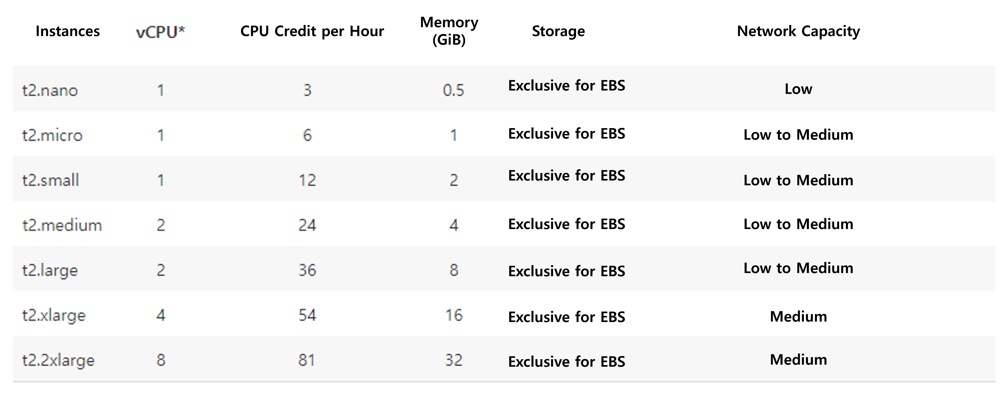

### [Index](https://github.com/PaaS-TA/Guide-eng/blob/master/README.md) > [AP Install](../README.md) > PaaS-TA AP - min

## Table of Contents

1. [Outline](#1)  
 1.1. [Purpose](#1.1)  
 1.2. [Range](#1.2)  
 1.3. [References](#1.3)  
2. [PaaS-TA AP min Installaion](#2)  
 2.1. [Prerequisite](#2.1)  
 2.2. [Download the installation file](#2.2)  
 2.3. [Stemcell Upload](#2.3)  
 2.4. [Runtime Config Setting](#2.4)  
 2.5. [Cloud Config Setting](#2.5)  
 2.6. [PaaS-TA AP min Installation File](#2.6)  
　2.6.1. [PaaS-TA AP min Installation Variable File](#2.6.1)    
　2.6.2. [PaaS-TA AP min Operation File](#2.6.2)  
　2.6.3. [PaaS-TA AP min Installation Shell Scripts](#2.6.3)  
 2.7. [PaaS-TA AP min Installation](#2.7)  
 2.8. [PaaS-TA AP min Login](#2.8)   

# <div id='1'/>1.  Document Outline

## <div id='1.1'/>1.1. Outline
The purpose of this document is to provide a guide for manually installing PaaS-TA Application Platform lightening (hereinafter referred to as PaaS-TA AP min) without monitoring.

<br>

## <div id='1.2'/>1.2. Range
PaaS-TA AP min is installed in a BOSH environment based on bosh-deployment, and a guide was written based on the installation of paasta-deployment v5.8.5-min.
PaaS-TA AP min supports IaaS such as VMware vSphere, Google Cloud Platform, Amazon Web Services EC2, OpenStack, and Microsoft Azure. The IaaS environment verified by paasta-deployment v5.8.5-min is OpenStack, and vSphere environment.

<br>

## <div id='1.3'/>1.3. Refrences

This document was prepared by referring to Cloud Foundry's BOSH Document and Cloud Foundry Document.

BOSH Document: [http://bosh.io](http://bosh.io)  
Cloud Foundry Document: [https://docs.cloudfoundry.org](https://docs.cloudfoundry.org)  
BOSH Deployment: [https://github.com/cloudfoundry/bosh-deployment](https://github.com/cloudfoundry/bosh-deployment)  
CF Deployment: [https://github.com/cloudfoundry/cf-deployment](https://github.com/cloudfoundry/cf-deployment)  

<br><br>

# <div id='2'/>2. PaaS-TA AP min Installation
## <div id='2.1'/>2.1. Prerequisite

- Install BOSH based on BOSH2.
- PaaS-TA AP min installation works in Inception where BOSH is installed.
- BOSH LOGIN is performed for PaaS-TA AP min installation.
- The tasks performed in the BOSH folder in the guide use to paasta-deployment download from the BOSH installation guide.

<br>

## <div id='2.2'/>2.2. Download the installation file
- Download when deployment for installing PaaS-TA AP min does not exist.

```
$ mkdir -p ~/workspace
$ cd ~/workspace
$ git clone https://github.com/PaaS-TA/common.git
$ cd ~/workspace
$ git clone https://github.com/PaaS-TA/paasta-deployment.git -b v5.8.5-min paasta-deployment-min
```

<br>

## <div id='2.3'/>2.3. Stemcell Upload
Stemcell is a VM Base OS image that is created during deployment.  
Paasta-deployment v5.8.5-min is based on Ubuntu bionic stemcell 1..171.
The basic Stemcell upload commands are as follows. 
```                     
$ bosh -e ${BOSH_ENVIRONMENT} upload-stemcell {URL}
```

Paasta-deployment supports Stemcell upload scripts from v5.5.0. After logging in to BOSH, perform the following commands to upload Stemcells.
BOSH_ENVIRONMENT is the Director name used when installing BOSH, and CURRENT_IAAS is entered according to the deployed environment IaaS (aws, azure, gcp, openstack, vsphere, and other input bosh-lite).
<br>(BOSH_ENVIRONMENT and CURRENT_IAAS are automatically entered during BOSH LOGIN using create-bosh-login.sh provided by paasta-deployment.)

- Modify the settings of the Stemcell upload script (Modify BOSH_ENVIRONMENT)

> $ vi ~/workspace/paasta-deployment/bosh/upload-stemcell.sh
```                     
#!/bin/bash
STEMCELL_VERSION=1.171
CURRENT_IAAS="${CURRENT_IAAS}"				# IaaS Information (When not using create-bosh-login.sh provided by PaaS-TA, enter aws/azure/gcp/openstack/vsphere/bosh-lite)
BOSH_ENVIRONMENT="${BOSH_ENVIRONMENT}"			# bosh director alias name (When not using create-bosh-login.sh provided by PaaS-TA, check and enter name from bosh envs)

if [[ ${CURRENT_IAAS} = "aws" ]]; then
        bosh -e ${BOSH_ENVIRONMENT} upload-stemcell https://storage.googleapis.com/bosh-core-stemcells/${STEMCELL_VERSION}/bosh-stemcell-${STEMCELL_VERSION}-aws-xen-hvm-ubuntu-bionic-go_agent.tgz -n
elif [[ ${CURRENT_IAAS} = "azure" ]]; then
        bosh -e ${BOSH_ENVIRONMENT} upload-stemcell https://storage.googleapis.com/bosh-core-stemcells/${STEMCELL_VERSION}/bosh-stemcell-${STEMCELL_VERSION}-azure-hyperv-ubuntu-bionic-go_agent.tgz -n
elif [[ ${CURRENT_IAAS} = "gcp" ]]; then
        bosh -e ${BOSH_ENVIRONMENT} upload-stemcell https://storage.googleapis.com/bosh-core-stemcells/${STEMCELL_VERSION}/bosh-stemcell-${STEMCELL_VERSION}-google-kvm-ubuntu-bionic-go_agent.tgz -n
elif [[ ${CURRENT_IAAS} = "openstack" ]]; then
        bosh -e ${BOSH_ENVIRONMENT} upload-stemcell https://storage.googleapis.com/bosh-core-stemcells/${STEMCELL_VERSION}/bosh-stemcell-${STEMCELL_VERSION}-openstack-kvm-ubuntu-bionic-go_agent.tgz -n
elif [[ ${CURRENT_IAAS} = "vsphere" ]]; then
        bosh -e ${BOSH_ENVIRONMENT} upload-stemcell https://storage.googleapis.com/bosh-core-stemcells/${STEMCELL_VERSION}/bosh-stemcell-${STEMCELL_VERSION}-vsphere-esxi-ubuntu-bionic-go_agent.tgz -n
elif [[ ${CURRENT_IAAS} = "bosh-lite" ]]; then
        bosh -e ${BOSH_ENVIRONMENT} upload-stemcell https://storage.googleapis.com/bosh-core-stemcells/${STEMCELL_VERSION}/bosh-stemcell-${STEMCELL_VERSION}-warden-boshlite-ubuntu-bionic-go_agent.tgz -n
else
        echo "plz check CURRENT_IAAS"
fi

```

- Run Stemcell upload script

```
$ cd ~/workspace/paasta-deployment/bosh
$ source upload-stemcell.sh
```

<br>

## <div id='2.4'/>2.4. Runtime Config Setting
Runtime config is a setting that applies to VMs deployed in BOSH collectively.
The basic Runtime Config setting command is as follows.
```                     
$ bosh -e ${BOSH_ENVIRONMENT} update-runtime-config {PATH} --name={NAME}
```

The Runtime Config applied in PaaS-TA AP min is as follows.

- DNS Runtime Config
  BOSH DNS distribution should precede communication between PaaS-TA AP components.

- OS Configuration Runtime Config  
  BOSH Linux OS configuration release is used to configure sysctl

Paasta-deployment supports the Runtime Config configuration script from v5.5.0. After logging in to BOSH, run the following commands to configure Runtime Config.

  - Modify Runtime Config Update Script (Modify BOSH_ENVIRONMENT)
> $ vi ~/workspace/paasta-deployment/bosh/update-runtime-config.sh
```                     
#!/bin/bash

BOSH_ENVIRONMENT="${BOSH_ENVIRONMENT}"			 # bosh director alias name (When not using create-bosh-login.sh provided by PaaS-TA, check and enter name from bosh envs)

bosh -e ${BOSH_ENVIRONMENT} update-runtime-config -n runtime-configs/dns.yml
bosh -e ${BOSH_ENVIRONMENT} update-runtime-config -n --name=os-conf runtime-configs/os-conf.yml
```
- Runtime Config Update Run Script
```                     
$ cd ~/workspace/paasta-deployment/bosh
$ source update-runtime-config.sh
```

  - Runtime Config Check  
  ```  
  $ bosh -e ${BOSH_ENVIRONMENT} runtime-config
  $ bosh -e ${BOSH_ENVIRONMENT} runtime-config --name=os-conf
  ```

<br>

## <div id='2.5'/>2.5. Cloud Config Setting

When deploying VMs through BOSH, IaaS-related network, storage, and VM-related settings are defined as Cloud Config.
After downloading the deployment installation file, you can see examples of IaaS-specific CloudConfig under the ~/workspace/paasta-deployment-min/cloud-config directory, and modify cloud-config.yml to fit IaaS. 
Cloud Config should be applied to BOSH prior to PaaS-TA AP min deployment.

- An example based on AWS [cloud-config.yml](https://github.com/PaaS-TA/paasta-deployment/blob/master/cloud-config/aws-cloud-config.yml) 

```
## azs :: Defines Availability Zone
azs:
- cloud_properties:
    availability_zone: ap-northeast-2a
  name: z1
- cloud_properties:
    availability_zone: ap-northeast-2a
  name: z2

... ((Skip)) ...

## compilation :: Defines available area and type of virtual machine in which the compile virtual machine will be created.
compilation:
  az: z4
  network: default
  reuse_compilation_vms: true
  vm_type: xlarge
  workers: 5

## disk_types :: Defines disk type (Persistent Disk).
disk_types:
- disk_size: 1024
  name: default
- disk_size: 1024
  name: 1GB
  
... ((Skip)) ...

## networks :: Defines network. (For AWS, set up Subnet and Security Groups, DNS, Gateway, etc.)
networks:
- name: default
  subnets:
  - az: z1
    cloud_properties:
      security_groups: paasta-v50-security
      subnet: subnet-XXXXXXXXXXXXXXXXX
    dns:
    - 8.8.8.8
    gateway: 10.0.1.1
    range: 10.0.1.0/24
    reserved:
    - 10.0.1.2 - 10.0.1.9
    static:
    - 10.0.1.10 - 10.0.1.120

... ((Skip)) ...

## vm_extentions :: Defines a virtual machine configuration that specifies any specific IaaS configuration (such as Security Groups and Load Balancers)
vm_extensions:
- name: cf-router-network-properties
- name: cf-tcp-router-network-properties
- name: diego-ssh-proxy-network-properties
- name: cf-haproxy-network-properties
- cloud_properties:
    ephemeral_disk:
      size: 51200
      type: gp2
  name: 50GB_ephemeral_disk

... ((Skip)) ...

## vm_type :: Defines virtual machine type (VM Type). (For AWS, set Instance type)
vm_types:
- cloud_properties:
    ephemeral_disk:
      size: 3000
      type: gp2
    instance_type: t2.small
  name: minimal
- cloud_properties:
    ephemeral_disk:
      size: 10000
      type: gp2
    instance_type: t2.small
  name: small
  
... ((Skip)) ...
```

- AZs

Cloud Config examples provided in PaaS-TA are set from z1 to z6.
Z1 to z3 are zones where PaaS-TA AP min VMs are installed, and z4 to z6 are defined as zones where services are installed.
The reason for setting in three unit is for service tripleization, It may be set differently depending on the installation environment.

- VM Types

A VM Type is a VM Type defined in IaaS.

※ Following are the Instance Type defined by AWS.



- Compilation

When PaaS-TA AP min and services are installed, BOSH creates a Compile task VM to compile the source, and then installs the compiled file on the destination VM and deletes the Compile task VM (the number of workers is the number of Compile VMs, the faster the compilation)

- Disk Size

Disk size is persistent disk size of the VM where PaaS-TA AP min and services are installed.

- Networks

Networks defines subnet networks, DNS, security groups, and network IDs for each AZ.
Typically, a Range Cider is defined so that 256 IPs can be defined for each AZ.

<br>

- Cloud Config Update

```
$ bosh -e ${BOSH_ENVIRONMENT} update-cloud-config ~/workspace/paasta-deployment-min/cloud-config/{iaas}-cloud-config.yml
```

- Cloud Config Check

```
$ bosh -e ${BOSH_ENVIRONMENT} cloud-config  
```

<br>

## <div id='2.6'/>2.6.  PaaS-TA AP min Installation File

common_vars.yml file and vars.yml can be modified to set the variables to be applied when installing PaaS-TA AP min.

<table>
<tr>
<td>common_vars.yml</td>
<td>Common variable setting file to apply when installing PaaS-TA AP and various services</td>
</tr>
<tr>
<td>min-vars.yml</td>
<td>Variable setting file to apply when installing PaaS-TA AP min</td>
</tr>
<tr>
<td>deploy-aws-4vms.sh</td>
<td>Shell Script File for PaaS-TA AP min 4vm Installation in AWS Environment</td>
</tr>
<tr>
<td>deploy-aws-7vms.sh</td>
<td>Shell Script File for PaaS-TA AP min 7vm Installation in AWS Environment</td>
</tr>
<tr>
<td>deploy-openstack-4vms.sh</td>
<td>Shell Script File for PaaS-TA AP min 4vm Installation in OpenStack Environment</td>
</tr>
<tr>
<td>deploy-openstack-7vms.sh</td>
<td>Shell Script File for PaaS-TA AP min 7vm Installation in OpenStack Environment</td>
</tr>
<tr>
<td>deploy-vsphere-4vms.sh</td>
<td>Shell Script File for PaaS-TA AP min 4vm Installation in vSphere Environment</td>
</tr>
<tr>
<td>deploy-vsphere-7vms.sh</td>
<td>Shell Script File for PaaS-TA AP min 7vm Installation in vSphere Environment</td>
</tr>
<tr>
<td>deploy-azure-4vms.sh</td>
<td>Shell Script File for PaaS-TA AP min 4vm Installation in Azure Environment</td>
</tr>
<tr>
<td>deploy-azure-7vms.sh</td>
<td>Shell Script File for PaaS-TA AP min 7vm Installation in Azure Environment</td>
</tr>
<tr>
<td>deploy-gcp-4vms.sh</td>
<td>Shell Script File for PaaS-TA AP min 4vm Installation in GCP Environment</td>
</tr>
<tr>
<td>deploy-gcp-7vms.sh</td>
<td>Shell Script File for PaaS-TA AP min 7vm Installation in GCP Environment</td>
</tr>
<tr>
<td>min-paasta-deployment.yml</td>
<td>Manifest files that deploy PaaS-TA AP min</td>
</tr>
</table>

<br>

### <div id='2.6.1'/>2.6.1. PaaS-TA AP min Installation Variable File


- common_vars.yml  

[common_vars.yml] (https://github.com/PaaS-TA/common/blob/master/common_vars.yml)in ~/workspace/common folder has a common variable setting to apply when installing PaaS-TA AP min and various services.
When installing PaaS-TA AP min, change the values of system_domain, paasta_admin_username, paasta_admin_password, paasta_database_port, paasta_cc_db_password, paasta_ua_db_password, ua_db_password, ua_client_secet_rset to install.

> $ vi ~/workspace/common/common_vars.yml

```
... ((Skip)) ...

system_domain: "xx.xx.xxx.xxx.nip.io"			# Domain (Same as HAProxy Public IP when using nip.io)
paasta_admin_username: "admin"				# PaaS-TA Admin Username
paasta_admin_password: "admin"				# PaaS-TA Admin Password
paasta_database_port: 5524				# PaaS-TA Database Port (e.g. 5524(postgresql)/13307(mysql)) -- Do Not Use "3306"&"13306" in mysql
paasta_cc_db_password: "cc_admin"			# CCDB Password(e.g. "cc_admin")
paasta_uaa_db_password: "uaa_admin"			# UAADB Password(e.g. "uaa_admin")
uaa_client_admin_secret: "admin-secret"			# Secret variables for accessing the UAAC Admin Client
uaa_client_portal_secret: "clientsecret"		# Secret variables for accessing the UAAC Portal Client
... ((Skip)) ...
```

- min-vars.yml

Can change the various variable values applied when installing PaaS-TA AP min or the settings of the VM to be deployed.

> $ vi ~/workspace/paasta-deployment-min/paasta/min-vars.yml
```
# SERVICE VARIABLE
deployment_name: "paasta"		# Deployment Name
network_name: "default"			# Default Network Name not specified separately for VM
releases_dir: "/home/ubuntu/workspace/paasta-5.5.1/release"	# Release Directory (Download and enable the release offline)
haproxy_public_ip: "52.78.32.153"	# HAProxy IP (Required for Public IP, HAproxy VM deployment)
haproxy_public_network_name: "vip"	# PaaS-TA Public Network Name
haproxy_private_network_name: "private" # PaaS-TA Private Network Name (vSphere use-haproxy-public-network-vsphere.yml inclusive Deployment requires setup)
cc_db_encryption_key: "db-encryption-key"	# Database Encryption Key (Same KEY Required for Version Upgrade)
cert_days: 3650				# PaaS-TA Certificate expiration date
private_ip: "10.244.0.34"   # Proxy IP (Private IP, BOSH-LITE requires setup)
uaa_login_logout_redirect_parameter_disable: "false"	
uaa_login_logout_redirect_parameter_whitelist: ["http://portal-web-user.15.165.2.88.xip.io","http://portal-web-user.15.165.2.88.xip.io/callback","http://portal-web-user.15.165.2.88.xip.io/login"]	# UAA Redirect Whitelist Registration Variables for Moving Portal Pages
uaa_login_branding_company_name: "PaaS-TA R&D"	# UAA Page Title
uaa_login_branding_footer_legal_text: "Copyright © PaaS-TA R&D Foundation, Inc. 2017. All Rights Reserved."	# UAA Pafe bottom area
uaa_login_branding_product_logo: "iVBORw0KGgoAAAANSUhEUgAAAM0AAAAdCAYAAAAJguhGAAAAGXRFWHRTb2Z0d2FyZQBBZG9iZSBJbWFnZVJlYWR5ccllPAAAAyJpVFh0WE1MOmNvbS5hZG9iZS54bXAAAAAAADw/eHBhY2tldCBiZWdpbj0i77u/IiBpZD0iVzVNME1wQ2VoaUh6cmVTek5UY3prYzlkIj8+IDx4OnhtcG1ldGEgeG1sbnM6eD0iYWRvYmU6bnM6bWV0YS8iIHg6eG1wdGs9IkFkb2JlIFhNUCBDb3JlIDUuMy1jMDExIDY2LjE0NTY2MSwgMjAxMi8wMi8wNi0xNDo1NjoyNyAgICAgICAgIj4gPHJkZjpSREYgeG1sbnM6cmRmPSJodHRwOi8vd3d3LnczLm9yZy8xOTk5LzAyLzIyLXJkZi1zeW50YXgtbnMjIj4gPHJkZjpEZXNjcmlwdGlvbiByZGY6YWJvdXQ9IiIgeG1sbnM6eG1wPSJodHRwOi8vbnMuYWRvYmUuY29tL3hhcC8xLjAvIiB4bWxuczp4bXBNTT0iaHR0cDovL25zLmFkb2JlLmNvbS94YXAvMS4wL21tLyIgeG1sbnM6c3RSZWY9Imh0dHA6Ly9ucy5hZG9iZS5jb20veGFwLzEuMC9zVHlwZS9SZXNvdXJjZVJlZiMiIHhtcDpDcmVhdG9yVG9vbD0iQWRvYmUgUGhvdG9zaG9wIENTNiAoV2luZG93cykiIHhtcE1NOkluc3RhbmNlSUQ9InhtcC5paWQ6QUNDMTA1MTZCRDNBMTFFNjkzMTVEQjMxRkE5QjkxNUMiIHhtcE1NOkRvY3VtZW50SUQ9InhtcC5kaWQ6QUNDMTA1MTdCRDNBMTFFNjkzMTVEQjMxRkE5QjkxNUMiPiA8eG1wTU06RGVyaXZlZEZyb20gc3RSZWY6aW5zdGFuY2VJRD0ieG1wLmlpZDpBQ0MxMDUxNEJEM0ExMUU2OTMxNURCMzFGQTlCOTE1QyIgc3RSZWY6ZG9jdW1lbnRJRD0ieG1wLmRpZDpBQ0MxMDUxNUJEM0ExMUU2OTMxNURCMzFGQTlCOTE1QyIvPiA8L3JkZjpEZXNjcmlwdGlvbj4gPC9yZGY6UkRGPiA8L3g6eG1wbWV0YT4gPD94cGFja2V0IGVuZD0iciI/Piy2YkgAAA9pSURBVHja7FwJeBRFFq7umUwmkJCIIJADEKLgrqyi6+qCt/speC4iC154oOCBB7viuQsq4se63y6IiojIIYrueoIsKiphPZFL1nNBVEhCEghHQJJJZqan9n89ryc1nZ4jpwmm+B5V3VVd3V39/nrv/VUZTdiSb1aeV9PEcEEixAnIe0DoX7kQ8nvkH6J+Keo+Sh1TLEV7ak8/s6RFA6bnxQDGDIAiD4d7ZEirRt5Nc0mX0NHYJaXQ5U7UlwItpZpLrED9XM+V2w+0D2V7+tmBxvdEz4k4egSgEcLQKmWN1hEgEcKFyjBgzLKZ6xI5zrvMfBOO70P51ZThZe2Wpz39PEDje7zn2Si9ZTphIVkjD+ipZo2rFixOwLGdKwBwxgI4W9qHtT0d1KABYDzINwEkvQkoslITslqLAks0eKKsDB9HgFOF8zcDOAvah7Y9HayJIDES0ts6IWvwn4Hc0MxchOzHABXlBufmcbhOBrUOIqjND7zcfXbgle4p7cPbng7G5IZcEnXGX8sNSNNfk9HHkqxK+KyG/6QkS8PH+D98jRgHi3MkgHMJrM6etjAQ1XPyOiFLxwuUe8cVBZqq33PPu+BoZF1iVO+GbF/+7zf2tHVFwnu6+D1Jp3bhnWqaot9bbp1A36VPAy+nKX/zYzOnVye4Byn9cfQ90HZrMu5ZKfLuZgxDBmO7bnIBYRcsOpZxOtYotnGpLpsa65gU9TAA5/PW9pFrnskdALwPx7ueiacdiDydZwaSr/H/c8jneG8s2t0IRboO2dNJNP0CMg8yF8p2oA0BhbSGliZugAyGeJXq/0GWQZ7AO21tIGA6I6MY+ZBGPOZmSH+AQca5z/3IJkNosjwWbb9O5J51i0KRB6oUtFywMFYjrpnDcbjMLhpdF4w67oP2q2FxRrcKoMzPddfMy70SgFmLw895oE4xLUx0+gXkYchW36y8Cb5ZPV0NvOXgJNsNgEyHfAtFPK2NAKYjsrcgL0HOsgGGUn/IHaS0aPunBt4ms5GAodQTkhIHMGQd7+RDajcpGUtjmOBhSyOC8oBR6E4PEwCwHG6FDNAVixNh0aKJgjqWh4/RjmbSW2F1KlscLAtyyHMchaebgryv5XFKyZbFZEAiPmhUWYbrV6A8LO3mwqp6KhYRIlfx4Ty2KOqERR/sRMjpfGw9wUjMzi+1ctAsQXahcmoT5BMIjVEPyO8gGUr9FLzTpPreB0p9AbLjY1RPVsoPONTTWK6A5fgkTv9TkP3Zds3R8awNgaYIeW4ENLgmVK4H5X7dLVSWzNUA4OjRLBvKNLCXAjiftRhgFuYMwCvNhgyKgKP+oKHyEoDm940AzTAozesx2uUzqE7hUz7IUWi/rZUChp7zfT6sYpAvc7BE90LuYc1ajTa/bcrngMJHXC4oudaA67OQFTl4GgvR39Xx3LNP7SddXUMh4ZbsgimuGrljIcVVCwp2x4TFnoXPRVy2aJYN5X4orYG7dn9zs2v+Z3PcAAz5qhsgg5qgy4swwQxpjmeFMm3hmfldPpUGeag1GxqlfI8dMPxOlZD72HV7QhA51PrSLQpgvmTigNKVAFR+PNAsqWt/hMeVa+w3YRwUHKtY5Xh0dG3ZzG30NIPJzWZ1PYAzqFkAsyinF7L/8H3cTdj15c319aBgfmRjlA83gmfr1ph6KOWPErxXAWQ8pFWRQQAFgeWPNgC9qOBiYqxrSaFeY+rz0CjcpIhO7jyjIljkytKMMJLChLLludjoaMnHMlxn+jU4J1y1rg65b0xJk6tGwe+HAM585PfBZStrIsBcjOwZSFYSzctFSF8l/V6fCHoQdOqdhDvo0txV2UIznGaaI5vzQ0KxCgGUj1E8GZIK6cuEher2kBUiYuUipkkJWMS4rYe8DFkM6cWu0afoc3YMF4vIDmL3zobksMNdCFlJriKu24g2ZB3IpZqK42+Vy3fYrM560fbSeEVHPoU7tgpA2knhA7uT1+J4Ks4X1rE0aeMLacAfcwx4vDLL3cvYI4mFjlicsAtmuWMR9yzEx8ksgrL7Zj0csUbssnVpMFiey9Yg5I69kgRgvpTVKTOMHZ23Gns6j5CV6aNlIPUiGUw9Q/rTTw1Vd8sXRsd9DtdVtcDHVCnuTjZFJxeO6FsCwlBmPmnG7A45D0IT0Lc8BuSTP4lr+tr68EKeZHdkAuSXPF4ZXKYZ9zO0eZ3vQzHZ32zPqMZmD6LtfI7L2kQCGGjiURm9+zku+prZQMugTIzlngkelK2OwEmVnVP6BPcij8Q2YTrZ2T2ru3tAq3XvjKjdA+Z5Nlbp7EptBXCmQQ6rF2Cezya68182NsUp7ZAB113B7Vklxp7022EJT4jVUAazMhVXyUotQWAco5RLFGUfQUwQRB2bLRyQb7dRrAOU4wylD9oy9bYIr6tYTgMt/K2BrOVyJIZTylk2i0hs1BTl1NVMl6+D3MsLuq05jRO1C87rAZa3lLppSnksANbDETSwNjSDXq/wRnYn7hB3X6NG7xw6IA3Vyog6JIDTcZg8UC2PpsQ/mnpXcjXughQDOC9DhkDirpH4F2eTctNLX5JgoBYaxR2nGaXpk9glScTG47lcmo2KfK6ZWalhonZL0zYo5/cKu/a8oujkQvVH/RGQ0yC57Eb9N8EtHoGcyuUAW5osXH8i5Dfsot/J0WsiV5LG8RrIXuU0UcNTiVrHM/8AmQbp18qsDE0cdyunoggXAIgmxqV8SG3viGVpRNrNhcTcPBznfqmu7ka6Oz9YKtwIWAx215JdBA3FXQS1z+nErNFK85uQMgBnAW3JgXS3AaY3z7TxFgT34z6jAt9leGVAn87ATCJREGaoJ2ZjctnQjIA5jt0rK82wfViLbVxOoIfSbrIp8WpmCTfE6P9wdr2sCeB8XDND3e6CchWEvI4LY06g0fdcwJaNLNcHtmt68wT4De69GHJoK8HNtaJ2Qf9zRyIs2oreyAugUUSAmsi9Odpmmu3uWo+UI4KhUIVeYux05ZgAsBMEMkwIUGgZIQxkeOJW9qdFSjIyhUoFxpHUhf1qc70DwKGPM1L69cG0zUXEXzHeLA+4LgtuT3sU/Q6u19C6KqUys6+2+cBNCRbaVzWWmRwLGKT4j3M9gXyYouzjoKxGDCWuQvsb2N2ypxHKJPkC2q6IA4Y30c+LHBQnAg7FxE+R4JrDOLYi/TlHhHcJaNzPINSfhPZlyqyfwy6vx9YtTaFDMOuvaWIrQ+P7FxUcTttrcG4d2q5gj8SKf+5xBE3aTYWGb1beZSi+I+Kvbeh6VihHPyTkD+3XS0Plek+4appmB4oD02aVnYHDrJvLcZKrMj+Ooc1HrDQzCXfsA6Mk5dbQPs8LUJX+9RpdWBjNva8KD9WRFXgoLLGvkd/sGSjN47ZzGfZgn2e/IVAuy0XqoyjVOpwvTqDEa3GfUhstLDjIdwrkY6XXkgGN7d472VrOZ7BfwVayCzN6jzF41Zjt6higaQ6KmpYMsq0JFfJqnLaTFTd+PED0V4CpwsnSADhFVdVP5p3LccJJCR7Co2eGeumZhpR+bUtot95B+vTsOpS0ZEqawWCWAY6w5eGd0jgnXRFCWgXON5BnAZR3MJRXoa+1TMfGS3MC36TOlYa+HIDpUa9h1YNCT91Nv4fQleOIcZhMmmLrT+cE9RSE02QwybZDWF2t3pvkvfY7gKaDrT6ZPhpDn1ey9VnOjB59s/NtM7pkd7MlYhm3jSiajPuHYrVH3Wpc8z7HgPQNbrdYNt3pAu+NRUS3nsUBZ1JzM9y2fFeOke3OD1S4c4Mr9YzQEuj/e4hnttVzERTttSUoTwBATkY+FXIag+WWBIAhV2G0f2PqSzKgveugOPFfwuML6B3KfUIL7SK/HuNwBSaRptort4dZLku2MWP1T/KbIXlQtLscttQXKeVf8xb8eO5epnDeSq9aqIFJPO/AOPfom2yMgvcpUtg9L68z/RRphEKybFWoZZHA2ljpdl4Qjb1a7r0BFmd23lDm6q+px8NlAUBnurxG+A9uwhv5FsmQtk34tQoZ1AImN6OJAADjM/9WVEdk5JY+zQPIuGQe6o4FSEZC/h4L2A6J3KhRNRs83dDfShFnZ2tdsNSEtLSqXUI3NuJwFmQZ3t9o4o82JtbeswRKVwxFI2t7FFur6ziGiJUmxnj3t3m2NBWA1mrQ974YoMgS0avlwkZ9E71/AOXBiVb60aYbu2bmxIH2vpZGC5Rdt6wEpwdgSRJ+X17w/JhDFZqMaEF0WtwtJlAc2tpxbfWcvALkj4qGbdPuBxD002gvm5sJA41Mk8VQKeG21qDf5fAzzTnNc0WJ/8cJh9OsNpQJjSOZ3aEAtasCQLIkZZo7WK518O/TUoJvCldwlXdsUY1onekRhVmbCUUsg/ItcVBQWn+4N0YfFKd+xbENKfJStL8Y/ey29dGFGaWuMfrJV9zGArQfhT7eiWP1FovafSHLf6LxGy5qd3MU1XPpYAqzuOaEBBA9mtS+LCjTouqn84hNmF7f4LCZ0yqiOz2Xl0To14zpPxBh8B7LwZIWsntxLgfNr0Mh32blLmO3g77LCXEsloFraPvNx+zikq/+Hc7NJYKBpy76M4Uxou6uXzXN5HsNYMu3An3Qd6AtPLSuRJakO8fDxHhaC6Pk5k5q6YHjv8pUt/4/DAsSTPZ6WvhEH2t5bOl9xyXr+gjv9UU7vNcXE7N2XAxuuyUTbXe40HNZyRmQTeIgT1B4yaBRx/0cdiWJAfqHDTA1MfrZwFa4gk9lMp36AluE2xTA+G1slhrgU7y7Wqk/XYQpcrIkBdzfbQpgfqTvhWt/+AmG70zIrxS2bl4D+lDXbe7W63u197riz1LHFNPflfRnt2FHCw4AfXT6IZABnktL3mgD+v6djV5tDHDIgtJ6zWhmo5wSbZykhcm7lftvtvVTwC7aUyJ624yVfFxHGzqtn+NaauujXIQ3ld5kIyrsqZJj4n64ZmUzjO8XttwpqRPIg7Ac/gbcZ5moXTQOaI196pr5ubQyMxjG/TyIGUtoGjPHVoyixi2JYhrr2PpjMKl9zzPYopQ/lK4RbSjBbUlhV6Ys3mJiA/vOZxcpky3HRvVv8VFPMUkFzgXi9JHKbpS1y5kYvXUMUKon95222eyK0wd9rWMYZNlMLu3l+GltU/3ARgzXi2Js2j70CcCwN047miQOQ5uCRt6LJooPtaZ+kZqFORkAxEAo/vEAwRGmvx3+TTW6KS3mdbSB5kdTaCbWZBnK9GMcW1D1FWRjyoiyNv9LLe3p4Er/F2AAB6uWe3ERzfoAAAAASUVORK5CYII="	 # UAA Page logo image (Base64)
uaa_login_branding_square_logo: "iVBORw0KGgoAAAANSUhEUgAAACAAAAAgCAYAAABzenr0AAAAGXRFWHRTb2Z0d2FyZQBBZG9iZSBJbWFnZVJlYWR5ccllPAAAAyhpVFh0WE1MOmNvbS5hZG9iZS54bXAAAAAAADw/eHBhY2tldCBiZWdpbj0i77u/IiBpZD0iVzVNME1wQ2VoaUh6cmVTek5UY3prYzlkIj8+IDx4OnhtcG1ldGEgeG1sbnM6eD0iYWRvYmU6bnM6bWV0YS8iIHg6eG1wdGs9IkFkb2JlIFhNUCBDb3JlIDUuNi1jMTMyIDc5LjE1OTI4NCwgMjAxNi8wNC8xOS0xMzoxMzo0MCAgICAgICAgIj4gPHJkZjpSREYgeG1sbnM6cmRmPSJodHRwOi8vd3d3LnczLm9yZy8xOTk5LzAyLzIyLXJkZi1zeW50YXgtbnMjIj4gPHJkZjpEZXNjcmlwdGlvbiByZGY6YWJvdXQ9IiIgeG1sbnM6eG1wTU09Imh0dHA6Ly9ucy5hZG9iZS5jb20veGFwLzEuMC9tbS8iIHhtbG5zOnN0UmVmPSJodHRwOi8vbnMuYWRvYmUuY29tL3hhcC8xLjAvc1R5cGUvUmVzb3VyY2VSZWYjIiB4bWxuczp4bXA9Imh0dHA6Ly9ucy5hZG9iZS5jb20veGFwLzEuMC8iIHhtcE1NOkRvY3VtZW50SUQ9InhtcC5kaWQ6QkIwMjA5M0U5NEQ0MTFFNjk1M0FFQ0UxNkIxNEZFNjciIHhtcE1NOkluc3RhbmNlSUQ9InhtcC5paWQ6QkIwMjA5M0Q5NEQ0MTFFNjk1M0FFQ0UxNkIxNEZFNjciIHhtcDpDcmVhdG9yVG9vbD0iQWRvYmUgUGhvdG9zaG9wIENDIDIwMTUuNSAoV2luZG93cykiPiA8eG1wTU06RGVyaXZlZEZyb20gc3RSZWY6aW5zdGFuY2VJRD0ieG1wLmlpZDpEMzRGNDdCNTgxNEIxMUU2QjJFODk1MEQzM0EzNkMxOSIgc3RSZWY6ZG9jdW1lbnRJRD0ieG1wLmRpZDpEMzRGNDdCNjgxNEIxMUU2QjJFODk1MEQzM0EzNkMxOSIvPiA8L3JkZjpEZXNjcmlwdGlvbj4gPC9yZGY6UkRGPiA8L3g6eG1wbWV0YT4gPD94cGFja2V0IGVuZD0iciI/Psx4+gAAAASbSURBVHja7FZ9aFVlGP8973vOud9Tt7nl1lzNOWailKkV/iEohYn2Vx/QHxKCQkUUmEFhREXQvxJGhSFRlERFhEk1K9PUjJk0dZJzzuGc+3B3997tfp3zfvScu0X4T1AQ/nPP5eGce17e5/l9PO9zL1lrcTMvgZt8VQFUAVQBVAE4KHbDZIYWq1P7dpiJwQ7HdYxZsOyiXLzmYxGvOwJZD6ICDFxQKQeKNgEyi6A8BYcUSE0CJKCpDkExikgyBmTLQJzXhIaVSejxfsjaZtDkeaD3M9iVu6ByKbiNc+GYsUtt5R/fPIzxoSaSUZhIADM9sN5c/WG707Z2r+jc8gJFvAz0/zOyhTrf9RImBptsOQ4bSA4P0Alma8hcOLAtOPnaT7pwbQXJ2H+vQsRaRzkis8+ci5wZAHb4+EYpErBFbgdWzpYJ1p8NHQeNnVuuj7/epca6N89spH9ZOAb+vZsf9B18Juj97osgkznk9+zfY0ojbeEaFd9tT0OV55lhycwJFGOpoxbkcoSAIxZClmHiXkCdD7/qLtr6BkSa/Z74xx6gFBOwvtSXf9mp+r5+mrJDt5IRMNIB+T5MtHHUXfvyFvnKltUbbP7KbRRzoDMSxHBp9hNetnLnTaE/6d/XmdLwUjuvuRtOKiNCALpQYWopDqMcOB43q/Zggusd6rf3PjF9X26ncr5GOGyxGwUZJiq4TmkyqXOjHXLXi8/l7eCRR0WUi3gWekowKxGaMyvjXzd+z0wp27tUjZ18TFiboljdALleNlTAEjdw4MKJp2CvdW/2T+/5VEz03FmRee4S8NECpljSUqTiv5U+53N9spM/o3TsrYN06dCDSDCLPCcb4apBaAdXjhkg3OOZmYgISLfMCdiWRPN1arz7Qzm//aCNd5wIVEPeyXZvs6d2v0N+UZhIDUztWqgreYjRiywk53QjHFzD9oI6H/mIrD4Pk0svKH+zo8tJX1hqonwCmLyeZFlzrET4pVJYQ3isgxf2iOZ3mokXWBkNlWyHbX3oLBVL31P//mcpKMFG50PVb4Y+fQZycoDJJBkAd75gFeU4bFPT2ei6nRvJls9W5qEZOrYoOLHvADIXOxHzWB62RGnoosfyJhlAimW07CNHRCK0TM6tBSX4BAlen7gASp8GBQo62XLF1G4S9ujRZuQGYNkWwX1C0Qh0jeu7i5Z/7tz7xPNCmOEZAIbP3/QgjK9a/F/3vY+x7vtlCMrjQoI3Oi4XTUE5c2CcGsDlo8XKRHhC2uJViOkxBltkLdirhnu+dToff0qd6LnDz11/wHHVLcKUha5bOCXdfA9aFh7y6u46g4aFQG4QfwPI9LGsNbD5aaHT57bq/sNPYuryCjLTDEJUpLbcmCTNjC0cllvFWrYHcWbd2idvX/+2bNq0m8HY4PhRFNrXYI6bBQpp2LZVMP2HYVIJuBEe541tQP4qnBsGh1FhIeO0rN6L1pUfmNFz99HIHxtsYXCZ1qoO0taTKgs+a4xAjguZmaLaVSNINHS5NUu+Eqn6HFTAeYIQGdtRRGW6KR/w+VkrXtM3zqrq3/IqgCqAKoCbDeBPAQYAvdcfKsxKtoUAAAAASUVORK5CYII="	# UAA Page title logo image (Base64)
uaa_login_links_passwd: "http://portal-web-user.15.165.2.88.xip.io/resetpasswd"	# Link address when Reset Password clicked in UAA page
uaa_login_links_signup: "http://portal-web-user.15.165.2.88.xip.io/createuser"	# Link address when Create Account clicked in UAA page
uaa_client_portal_redirect_uri: "http://portal-web-user.15.165.2.88.xip.io,http://portal-web-user.15.165.2.88.xip.io/callback"	# Redirect URI designated variable in UAA Portal Client, the URI path that moves if you click the Login button on the portal and successfully log in from the UAA page

syslog_custom_rule: 'if ($msg contains "DEBUG") then stop'      # [MONITORING] Custom Rules to be sent by PaaS-TA Logging Agent
syslog_fallback_servers: []             # [MONITORING] PaaS-TA Syslog Fallback Servers


# STEMCELL
stemcell_os: "ubuntu-bionic"		# Stemcell OS
stemcell_version: "1.171"		# Stemcell Version

# SMOKE-TEST
smoke_tests_azs: ["z1"]			# Smoke-Test Available Zone
smoke_tests_instances: 1		# Smoke-Test Number of Instances
smoke_tests_vm_type: "minimal"		# Smoke-Test VM Type
smoke_tests_network: "default"		# Smoke-Test Network

# ROTATE-CC-DATABASE-KEY
rotate_cc_database_key_azs: ["z1"] 	# Rotate-CC-Database-Key Available Zone
rotate_cc_database_key_instances: 1 	# Rotate-CC-Database-Key Number of Instances
rotate_cc_database_key_vm_type: "minimal" # Rotate-CC-Database-Key VM Type
rotate_cc_database_key_network: "default" # Rotate-CC-Database-Key Network


## 4VM

# DATABASE
database_azs: ["z1"]      		# Database Available Zone
database_instances: 1     		# Database Number of Instances
database_vm_type: "small"   		# Database VM Type
database_network: "default"   		# Database Network
database_persistent_disk_type: "100GB"  # Database Permanent Disk Type

# CONTROL
control_azs: ["z1"]  	    		# Control Available Zone
control_instances: 1     		# Control Number of Instances
control_vm_type: "small-highmem-16GB"   # Control VM Type
control_network: "default"   		# Control Network
control_vm_extensions: ["diego-ssh-proxy-network-properties"] # Control VM Expansion

# ROUTER
router_azs: ["z1"]    			# Router Available Zone
router_instances: 1     		# Router Number of Instances
router_vm_type: "minimal"   		# Router VM Type
router_network: "default"   		# Router Network
router_vm_extensions: ["cf-router-network-properties"]  # Router VM Expansion

# COMPUTE
compute_azs: ["z1"]    			# COMPUTE Available Zone
compute_instances: 1     		# COMPUTE Number of Instances
compute_vm_type: "small-highmem-16GB"  	# COMPUTE VM Type
compute_network: "default"   		# COMPUTE Network
compute_vm_extensions: ["100GB_ephemeral_disk"]  # COMPUTE VM Expansion


## 7VM

# SINGLETON-BLOBSTORE
singleton_blobstore_azs: ["z1"]   	# Singleton-Blobstore Available Zone
singleton_blobstore_instances: 1  	# Singleton-Blobstore Number of Instances
singleton_blobstore_vm_type: "small"  	# Singleton-Blobstore VM Type
singleton_blobstore_network: "default"  # Singleton-Blobstore Network
singleton_blobstore_persistent_disk_type: "100GB" # Singleton-Blobstore Permanent Disk Type

# TCP-ROUTER
tcp_router_azs: ["z1"]    		# TCP-Router Available Zone
tcp_router_instances: 1     		# TCP-Router Number of Instances
tcp_router_vm_type: "minimal"   	# TCP-Router VM Type
tcp_router_network: "default"   	# TCP-Router Network
tcp_router_vm_extensions: ["cf-tcp-router-network-properties"]  # TCP-Router VM Expansion

# HAPROXY
haproxy_azs: ["z7"]     		# HAProxy Available Zone
haproxy_instances: 1      		# HAProxy Number of Instances
haproxy_vm_type: "minimal"    		# HAProxy VM Type
haproxy_network: "default"    		# HAProxy Network
```

The following is a description of the variables associated with UAA.

1. uaa_login_logout_redirect_parameter_whitelist : UAA Redirect Whitelist Registration Variables for Moving Portal Pages
```
ex) uaa_login_logout_redirect_parameter_whitelist=["{PaaS-TA PORTAL URI}","{PaaS-TA PORTAL URI}/callback","{PaaS-TA PORTAL URI}/login"]
```

2. uaa_login_links_signup : Link address to be moved when the Create Account button is clicked on the UAA page

```
ex) uaa_login_links_signup="{PaaS-TA PORTAL URI}/createuser"
```

![UAA_Login_Create_Account]

3. uaa_login_links_passwd : Link address when Reset Password clicked in UAA page

```
ex) uaa_login_links_passwd="{PaaS-TA PORTAL URI}/resetpasswd"
```

![UAA_Login_Reset_Password]


4. uaa_client_portal_redirect_uri : Redirect URI designated variable in UAAC Portal Client, URI that moves when login is successful on UAA page after clicking the login button on the portal

```
ex) uaa_client_portal_redirect_uri="{PaaS-TA PORTAL URI}, {PaaS-TA PORTAL URI}/callback"
```

5. uaa_client_portal_secret : Secret variables for accessing the UAAC Portal Client

```
ex) uaa_client_portal_secret="portalclient"
```

6. uaa_client_admin_secret : Secret variables for accessing the UAAC Admin Client

```
ex) uaa_client_admin_secret="admin-secret"
```

Refer to the other CLI in the User Guide for how to use UAAC after installing PaaS-TA AP min.

<br>

### <div id='2.6.2'/>2.6.2. PaaS-TA AP min Operation File

<table>
<tr>
<td>File Name</td>
<td>Description</td>
<td>Requirements</td>
</tr>
<tr>
<td>operations/min-use-postgres.yml</td>
<td>Install Database as Postgres <br>
    - When min-use-postgres.yml cannot be applied, install MySQL<br>
    - Required for Migration from versions earlier than 3.5 
</td>
<td></td>
</tr>
<tr>
<td>operations/min-use-haproxy.yml</td>
<td>Apply HAProxy <br>
    - When installing PaaS-TA AP min using LB provided by IaaS, the operation file will be removed and be installed.
</td>
<td>Requires operation file: use-haproxy-public-network.yml <br>
    Requires value :  -v haproxy_private_ip
</td>
</tr>
<tr>
<td>operations/use-haproxy-public-network.yml</td>
<td>HAProxy Public Network Setting <br>
    - When installing PaaS-TA AP min using LB provided by IaaS, the operation file will be removed and be installed.
</td>
<td>Requires: use-haproxy.yml <br>
    Requires Value :  <br>
    -v haproxy_public_ip <br>
    -v haproxy_public_network_name
</td>
</tr>
<tr>
<td>operations/min-use-router-public-network.yml</td>
<td>Modify the router to allow external access</td>
<td>Use when deploying 4VMs</td>
</tr>
<tr>
<td>operations/min-create-vm-singleton-blobstore.yml</td>
<td>Deploy singleton-blobstore of database used by 4VMs as a single VM.</td>
<td>Requires: min-use-haproxy.yml <br>
Use when deploying 7VMs <br>
Requires operation file: min-option-network-and-deployment.yml</td>
</tr>
<tr>
<td>operations/min-create-vm-tcp-router.yml</td>
<td>Deploy tcp-router of router used by 4VMs as a single VM.</td>
<td>Use when deploying 7VMs</td>
</tr>
<tr>
<td>operations/min-cce.yml</td>
<td>Apply CCE when installing.</td>
<td></td>
</tr>
</table>

<br>

### <div id='2.6.3'/>2.6.3.   PaaS-TA AP min Installation Shell Scripts
min-paasta-deployment.yml file is a Manifest file that deploys PaaS-TA AP min, which defines the installation of PaaS-TA AP min VMs.

**※ When installing PaaS-TA AP min, use BOSH deploy. (Options vary by IaaS environment)**

Example of PaaS-TA AP min deployment BOSH command

```
$ bosh -e ${BOSH_ENVIRONMENT} -d paasta deploy min-paasta-deployment.yml
```

When deploying PaaS-TA AP min, installation options must be added. The description of the installation options are as follows.

<table>
<tr>
<td>-e</td>
<td>BOSH Director Name</td>
</tr>
<tr>
<td>-d</td>
<td>Deployment Name (Default paasta, modification affects other PaaS-TA services.)</td>
</tr>   
<tr>
<td>-o</td>
<td>The option file applied when installing PaaS-TA provides attributes for each IaaS, whether or not to use Haproxy, and database setting functions.
</td>
</tr>
<tr>
<td>-v</td>
<td>It is used to set variables in the option file or variables applied when installing PaaS-TA. <br> Option Categorized into required or optional items according to file properties.</td>
</tr>
<tr>
<td>-l, --var-file</td>
<td>Used to read variables written in YAML file.</td>
</tr>
</table>

- When installing AWS environment 4vm

```
$ vi ~/workspace/paasta-deployment-min/paasta/deploy-aws-4vms.sh

BOSH_ENVIRONMENT="${BOSH_ENVIRONMENT}"                   # bosh director alias name (When Create-bosh-login provided by PaaS-TA.If sh is not used, check and enter the name in bosh envs)

bosh -e ${BOSH_ENVIRONMENT} -d paasta -n deploy min-paasta-deployment.yml \	# PaaS-TA-min Manifest File
        -o operations/min-aws.yml \					# AWS Setting
	-o operations/min-use-router-public-network.yml \		# Router external access setting
	-o operations/min-use-router-public-network-aws.yml \
        -o operations/min-use-postgres.yml \				# Database Type Setting (Requiring for Migration from versions lower than 3.5)
        -o operations/min-rename-network-and-deployment.yml \		# Rename Network and Deployment
	-o operations/min-cce.yml \					# CCE applied
        -l min-vars.yml \						# Variable settings file to apply when installing PaaS-TA-min
        -l ../../common/common_vars.yml					# Common variable settings file to apply when installing PaaS-TA and various services
```

- When installing AWS environment 7vm

```
$ vi ~/workspace/paasta-deployment-min/paasta/deploy-aws-7vms.sh

BOSH_ENVIRONMENT="${BOSH_ENVIRONMENT}"                   # bosh director alias name (When Create-bosh-login provided by PaaS-TA.If sh is not used, check and enter the name in bosh envs)

bosh -e ${BOSH_ENVIRONMENT} -d paasta -n deploy min-paasta-deployment.yml \	# PaaS-TA-min Manifest File
        -o operations/min-aws.yml \					# AWS Setting
        -o operations/min-create-vm-singleton-blobstore.yml \		# singleton-blobstore VM Deployment
        -o operations/min-create-vm-tcp-router.yml \			# tcp-router VM Deployment
        -o operations/min-use-haproxy.yml \				# HAProxy Applied
        -o operations/use-haproxy-public-network.yml \			# HAProxy Public Network Applied
        -o operations/min-use-postgres.yml \				# Database Type Setting (Requiring for Migration from versions lower than 3.5)
        -o operations/min-rename-network-and-deployment.yml \		# Rename Network and Deployment
        -o operations/min-option-network-and-deployment.yml \		# singleton-blobstore Rename Network and Deployment
	-o operations/min-cce.yml \					# CCE Applied
        -l min-vars.yml \						# Variable settings file to apply when installing PaaS-TA-min
        -l ../../common/common_vars.yml					# Common variable settings file to apply when installing PaaS-TA and various services
```

- When installing 4vm in an Openstack environment

```
$ vi ~/workspace/paasta-deployment-min/paasta/deploy-openstack-4vms.sh

BOSH_ENVIRONMENT="${BOSH_ENVIRONMENT}"                   # bosh director alias name (Create-bosh-login provided by PaaS-TA.If sh is not used, check and enter the name in bosh envs)

bosh -e ${BOSH_ENVIRONMENT} -d paasta -n deploy min-paasta-deployment.yml \	# PaaS-TA-min Manifest File
        -o operations/min-openstack.yml \					# Openstack Setting
	-o operations/min-use-router-public-network.yml \			# Router external access setting
        -o operations/min-use-postgres.yml \					# Database Type Setting (Requiring for Migration from versions lower than 3.5)
        -o operations/min-rename-network-and-deployment.yml \			# Rename Network and Deployment
	-o operations/min-cce.yml \						# CCE Applied
        -l min-vars.yml \							# Variable settings file to apply when installing PaaS-TA-min
        -l ../../common/common_vars.yml						# Common variable settings file to apply when installing PaaS-TA and various services
```

- When installing 7vm in an Openstack environment

```
$ vi ~/workspace/paasta-deployment-min/paasta/deploy-openstack-7vms.sh

BOSH_ENVIRONMENT="${BOSH_ENVIRONMENT}"                   # bosh director alias name (When Create-bosh-login provided by PaaS-TA.If sh is not used, check and enter the name in bosh envs)

bosh -e ${BOSH_ENVIRONMENT} -d paasta -n deploy min-paasta-deployment.yml \	# PaaS-TA-min Manifest File
        -o operations/min-openstack.yml \					# Openstack Setting
        -o operations/min-create-vm-singleton-blobstore.yml \		# singleton-blobstore VM Deployment
        -o operations/min-create-vm-tcp-router.yml \			# tcp-router VM Deployment
        -o operations/min-use-haproxy.yml \				# HAProxy Applied
        -o operations/use-haproxy-public-network.yml \			# HAProxy Public Network Applied
        -o operations/min-use-postgres.yml \				# Database Type Setting (Requiring for Migration from versions lower than 3.5)
        -o operations/min-rename-network-and-deployment.yml \		# Rename Network and Deployment
        -o operations/min-option-network-and-deployment.yml \		# singleton-blobstore Rename Network and Deployment
	-o operations/min-cce.yml \					# CCE Applied
        -l min-vars.yml \						# Variable settings file to apply when installing PaaS-TA-min
        -l ../../common/common_vars.yml					# Common variable settings file to apply when installing PaaS-TA and various services
```

- When installing 4vm in an vSphere environment

```
$ vi ~/workspace/paasta-deployment-min/paasta/deploy-vsphere-4vms.sh
BOSH_ENVIRONMENT="${BOSH_ENVIRONMENT}"                   # bosh director alias name (When Create-bosh-login provided by PaaS-TA.If sh is not used, check and enter the name in bosh envs)

bosh -e ${BOSH_ENVIRONMENT} -d paasta -n deploy min-paasta-deployment.yml \	# PaaS-TA-min Manifest File
	-o operations/min-use-router-public-network.yml \			# Router external access setting
        -o operations/min-use-router-public-network-vsphere.yml \
        -o operations/min-use-postgres.yml \					# Database Type Setting (Requiring for Migration from versions lower than 3.5)
        -o operations/min-rename-network-and-deployment.yml \			# Rename Network and Deployment
	-o operations/min-cce.yml \						# CCE Applied
        -l min-vars.yml \							# Variable settings file to apply when installing PaaS-TA-min
        -l ../../common/common_vars.yml						# Common variable settings file to apply when installing PaaS-TA and various services
```

- When installing 7vm in an vSphere environment

```
$ vi ~/workspace/paasta-deployment-min/paasta/deploy-vsphere-7vms.sh
BOSH_ENVIRONMENT="${BOSH_ENVIRONMENT}"                   # bosh director alias name (When Create-bosh-login provided by PaaS-TA.If sh is not used, check and enter the name in bosh envs)
bosh -e ${BOSH_ENVIRONMENT} -d paasta -n deploy min-paasta-deployment.yml \	# PaaS-TA-min Manifest File
        -o operations/min-create-vm-singleton-blobstore.yml \		# singleton-blobstore VM Deployment
        -o operations/min-create-vm-tcp-router.yml \			# tcp-router VM Deployment
        -o operations/min-use-haproxy.yml \				# HAProxy Applied
        -o operations/use-haproxy-public-network-vsphere.yml \			# HAProxy Public Network Applied
        -o operations/min-use-postgres.yml \				# Database Type Setting (Requiring for Migration from versions lower than 3.5)
        -o operations/min-rename-network-and-deployment.yml \		# Rename Network and Deployment
        -o operations/min-option-network-and-deployment.yml \		# singleton-blobstore Rename Network and Deployment
	-o operations/min-cce.yml \					# CCE Applied
        -l min-vars.yml \						# Variable settings file to apply when installing PaaS-TA-min
        -l ../../common/common_vars.yml					# Common variable settings file to apply when installing PaaS-TA and various services
```

- When installing 4vm in an Azure environment

```
$ vi ~/workspace/paasta-deployment-min/paasta/deploy-azure-4vms.sh
BOSH_ENVIRONMENT="${BOSH_ENVIRONMENT}"                   # bosh director alias name (When Create-bosh-login provided by PaaS-TA.If sh is not used, check and enter the name in bosh envs)
bosh -e ${BOSH_ENVIRONMENT} -d paasta -n deploy min-paasta-deployment.yml \	# PaaS-TA-min Manifest File
        -o operations/min-azure.yml \					        # Azure Setting
	-o operations/min-use-router-public-network.yml \			# Router external access setting
        -o operations/min-use-postgres.yml \					# Database Type Setting (Requiring for Migration from versions lower than 3.5)
        -o operations/min-rename-network-and-deployment.yml \			# Rename Network and Deployment
	-o operations/min-cce.yml \						# CCE Applied
        -l min-vars.yml \							# Variable settings file to apply when installing PaaS-TA-min
        -l ../../common/common_vars.yml						# Common variable settings file to apply when installing PaaS-TA and various services
```

- When installing 7vm in an Azure environment

```
$ vi ~/workspace/paasta-deployment-min/paasta/deploy-azure-7vms.sh
BOSH_ENVIRONMENT="${BOSH_ENVIRONMENT}"                   # bosh director alias name (When Create-bosh-login provided by PaaS-TA.If sh is not used, check and enter the name in bosh envs)
bosh -e ${BOSH_ENVIRONMENT} -d paasta -n deploy min-paasta-deployment.yml \	# PaaS-TA-min Manifest File
        -o operations/min-azure.yml \					# Azure Setting
        -o operations/min-create-vm-singleton-blobstore.yml \		# singleton-blobstore VM Deployment
        -o operations/min-create-vm-tcp-router.yml \			# tcp-router VM Deployment
        -o operations/min-use-haproxy.yml \				# HAProxy Applied
        -o operations/use-haproxy-public-network.yml \			# HAProxy Public Network Applied
        -o operations/min-use-postgres.yml \				# Database Type Setting (Requiring for Migration from versions lower than 3.5)
        -o operations/min-rename-network-and-deployment.yml \		# Rename Network and Deployment
        -o operations/min-option-network-and-deployment.yml \		# singleton-blobstore Rename Network and Deployment
	-o operations/min-cce.yml \					# CCE Applied
        -l min-vars.yml \						# Variable settings file to apply when installing PaaS-TA-min
        -l ../../common/common_vars.yml					# Common variable settings file to apply when installing PaaS-TA and various services
```

- When installing 4vm in an GCP environment

```
$ vi ~/workspace/paasta-deployment-min/paasta/deploy-gcp-4vms.sh
BOSH_ENVIRONMENT="${BOSH_ENVIRONMENT}"                   # bosh director alias name (When Create-bosh-login provided by PaaS-TA.If sh is not used, check and enter the name in bosh envs)
bosh -e ${BOSH_ENVIRONMENT} -d paasta -n deploy min-paasta-deployment.yml \	# PaaS-TA-min Manifest File
	-o operations/min-use-router-public-network.yml \			# Router external access setting
        -o operations/min-use-postgres.yml \					# Database Type Setting (Requiring for Migration from versions lower than 3.5)
        -o operations/min-rename-network-and-deployment.yml \			# Rename Network and Deployment
	-o operations/min-cce.yml \						# CCE Applied
        -l min-vars.yml \							# Variable settings file to apply when installing PaaS-TA-min
        -l ../../common/common_vars.yml						# Common variable settings file to apply when installing PaaS-TA and various services
```

- When installing 7vm in an GCP environment

```
$ vi ~/workspace/paasta-deployment-min/paasta/deploy-gcp-7vms.sh
BOSH_ENVIRONMENT="${BOSH_ENVIRONMENT}"                   # bosh director alias name (When Create-bosh-login provided by PaaS-TA.If sh is not used, check and enter the name in bosh envs)
bosh -e ${BOSH_ENVIRONMENT} -d paasta -n deploy min-paasta-deployment.yml \	# PaaS-TA-min Manifest File
        -o operations/min-create-vm-singleton-blobstore.yml \		# singleton-blobstore VM Deployment
        -o operations/min-create-vm-tcp-router.yml \			# tcp-router VM Deployment
        -o operations/min-use-haproxy.yml \				# HAProxy Applied
        -o operations/use-haproxy-public-network.yml \			# HAProxy Public Network Applied
        -o operations/min-use-postgres.yml \				# Database Type Setting (Requiring for Migration from versions lower than 3.5)
        -o operations/min-rename-network-and-deployment.yml \		# Rename Network and Deployment
        -o operations/min-option-network-and-deployment.yml \		# singleton-blobstore Rename Network and Deployment
	-o operations/min-cce.yml \					# CCE Applied
        -l min-vars.yml \						# Variable settings file to apply when installing PaaS-TA-min
        -l ../../common/common_vars.yml					# Common variable settings file to apply when installing PaaS-TA and various services
```


- Grant execution permissions to Shell script files

```
$ chmod +x ~/workspace/paasta-deployment-min/paasta/*.sh
```

<br>

## <div id='2.7'/>2.7.  PaaS-TA AP min Installation
- Modify common_vars.yml and min-vars.yml to match your server environment, and then modify the settings in the Deploy script file.

- When Deploying 4VM
```
$ vi ~/workspace/paasta-deployment-min/paasta/deploy-aws-4vms.sh

BOSH_ENVIRONMENT="${BOSH_ENVIRONMENT}"                   # bosh director alias name (When Create-bosh-login provided by PaaS-TA.If sh is not used, check and enter the name in bosh envs)

bosh -e ${BOSH_ENVIRONMENT} -d paasta -n deploy min-paasta-deployment.yml \	# PaaS-TA-min Manifest File
        -o operations/min-aws.yml \					# AWS Setting
	-o operations/min-use-router-public-network.yml \		# Router External Access Settings
	-o operations/min-use-router-public-network-aws.yml \
        -o operations/min-use-postgres.yml \				# Database Type Setting (Requiring for Migration from versions lower than 3.5)
        -o operations/min-rename-network-and-deployment.yml \		# Rename Network and Deployment
	-o operations/min-cce.yml \					# CCE Applied
        -l min-vars.yml \						# Variable settings file to apply when installing PaaS-TA-min
        -l ../../common/common_vars.yml					# Common variable settings file to apply when installing PaaS-TA and various services
```


- When Deploying 7VM
```
$ vi ~/workspace/paasta-deployment-min/paasta/deploy-aws-7vms.sh

BOSH_ENVIRONMENT="${BOSH_ENVIRONMENT}"                   # bosh director alias name When Create-bosh-login provided by PaaS-TA.If sh is not used, check and enter the name in bosh envs)

bosh -e ${BOSH_ENVIRONMENT} -d paasta -n deploy min-paasta-deployment.yml \	# PaaS-TA-min Manifest File
        -o operations/min-aws.yml \					# AWS Setting
        -o operations/min-create-vm-singleton-blobstore.yml \		# singleton-blobstore VM Deployment
        -o operations/min-create-vm-tcp-router.yml \			# tcp-router VM Deployment
        -o operations/min-use-haproxy.yml \				# HAProxy Applied
        -o operations/use-haproxy-public-network.yml \			# HAProxy Public Network Applied
        -o operations/min-use-postgres.yml \				# Database Type Setting (Requiring for Migration from versions lower than 3.5)
        -o operations/min-rename-network-and-deployment.yml \		# Rename Network and Deployment
        -o operations/min-option-network-and-deployment.yml \		# singleton-blobstore Rename Network and Deployment
	-o operations/min-cce.yml \					# CCE Applied
        -l min-vars.yml \						# Variable settings file to apply when installing PaaS-TA-min
        -l ../../common/common_vars.yml					# Common variable settings file to apply when installing PaaS-TA and various services
```

- Run the Shell Script file when installing PaaS-TA AP min (Requireds BOSH Login)

```
$ cd ~/workspace/paasta-deployment-min/paasta
$ ./deploy-{IaaS}-{VMs_Number}.sh
```

- PaaS-TA AP min Installation Check

> $ bosh -e ${BOSH_ENVIRONMENT} vms -d paasta

```
ubuntu@inception:~$ bosh -e micro-bosh vms -d paasta
Using environment '10.0.1.6' as client 'admin'

Task 134. Done

Deployment 'paasta'

Instance                                       Process State  AZ  IPs          VM CID               VM Type             Active  Stemcell  
compute/e154dcdc-a2c1-4a85-86b7-607a02a30acf   running        z1  10.0.31.235  i-0f92f55575bf2567e  small-highmem-16GB  true    bosh-aws-xen-hvm-ubuntu-bionic-go_agent/1.171 
control/a18f5e97-098c-47ab-9147-77f594571bd6   running        z1  10.0.31.234  i-053cd8f71d99f1a15  small-highmem-16GB  true    bosh-aws-xen-hvm-ubuntu-bionic-go_agent/1.171 
database/7ea28d82-5d5b-471f-bde6-a65d4809062e  running        z1  10.0.31.233  i-0b2e54deaf0734f59  small               true    bosh-aws-xen-hvm-ubuntu-bionic-go_agent/1.171 
router/c01b1aa4-43c9-42f6-9003-cf8f8664d142    running        z7  10.0.30.204  i-0a449def3351877b3  minimal             true    bosh-aws-xen-hvm-ubuntu-bionic-go_agent/1.171 
                                                                  54.180.53.80                                                 

4 vms

Succeeded
```
```
ubuntu@inception:~$ bosh -e micro-bosh vms -d paasta
Using environment '10.0.1.6' as client 'admin'

Task 134. Done

Deployment 'paasta'

Instance                                                  Process State  AZ  IPs             VM CID               VM Type             Active  Stemcell  
compute/c3f53aed-469f-47ab-aa9b-94be30ca3687              running        z1  10.0.21.156     i-0617a496567bd859e  small-highmem-16GB  true    bosh-aws-xen-hvm-ubuntu-bionic-go_agent/1.171   
control/acd880a6-b309-452e-b996-0ef4252f8dd3              running        z1  10.0.21.153     i-0d9fbf3f662dec9a0  small-highmem-16GB  true    bosh-aws-xen-hvm-ubuntu-bionic-go_agent/1.171   
database/c92fd45f-1165-4d71-8df4-9b4270abdd0a             running        z1  10.0.21.151     i-0ead4f61c9be951b9  small               true    bosh-aws-xen-hvm-ubuntu-bionic-go_agent/1.171   
haproxy/5ccc73dd-cf7e-4f4c-a204-1e933eddfcf8              running        z7  10.0.20.151     i-02e5277d6fd829f34  minimal             true    bosh-aws-xen-hvm-ubuntu-bionic-go_agent/1.171      
                                                                             54.180.53.80                                             
router/4f58af5a-529c-41f7-866c-e2327978ea99               running        z1  10.0.21.154     i-0b5f2d42d2c2b9d06  minimal             true    bosh-aws-xen-hvm-ubuntu-bionic-go_agent/1.171   
singleton-blobstore/5ed376fe-1d84-45c8-a6e8-f938b7320a36  running        z1  10.0.21.152     i-08a432269ffb76663  small               true    bosh-aws-xen-hvm-ubuntu-bionic-go_agent/1.171   
tcp-router/f8fe5974-8340-4d16-ae02-0b7150828388           running        z1  10.0.21.155     i-04a845c8e7fc7cfb4  minimal             true    bosh-aws-xen-hvm-ubuntu-bionic-go_agent/1.171   
   


7 vms

Succeeded
```

<br>

## <div id='2.8'/>2.8.  PaaS-TA AP min Login

Install CF CLI and log in to PaaS-TA AP min.  
Install CF CLI by selecting between v6 and v7.  
The CF API uses the System Domain name specified during PaaS-TA AP min deployment.

- CF CLI v6 Installation

```
$ wget -q -O - https://packages.cloudfoundry.org/debian/cli.cloudfoundry.org.key | sudo apt-key add -
$ echo "deb https://packages.cloudfoundry.org/debian stable main" | sudo tee /etc/apt/sources.list.d/cloudfoundry-cli.list
$ sudo apt update
$ sudo apt install cf-cli -y
$ cf --version
```

- CF CLI v7 Installation (PaaS-TA AP min 5.1.0 above)

```
$ wget -q -O - https://packages.cloudfoundry.org/debian/cli.cloudfoundry.org.key | sudo apt-key add -
$ echo "deb https://packages.cloudfoundry.org/debian stable main" | sudo tee /etc/apt/sources.list.d/cloudfoundry-cli.list
$ sudo apt update
$ sudo apt install cf7-cli -y
$ cf --version
```

- CF API URL Setting

> $ cf api api.{system_domain} --skip-ssl-validation

```
ubuntu@inception:~$ cf api api.54.180.53.80.nip.io --skip-ssl-validation
Setting api endpoint to api.54.180.53.80.nip.io...
OK

api endpoint:   https://api.54.180.53.80.nip.io
api version:    3.87.0
```

- PaaS-TA AP min Login

> $ cf login

```
ubuntu@inception:~$ cf login
API endpoint: https://api.54.180.53.80.nip.io

Email> admin

Password>
Authenticating...
OK

Select an org (or press enter to skip):
```

[PaaSTa_FLAVOR_Image]:./images/ap/aws-vmtype.png
[UAA_Login_Create_Account]:./images/ap/uaa-login-2.png
[UAA_Login_Reset_Password]:./images/ap/uaa-login.png

### [Index](https://github.com/PaaS-TA/Guide-eng/blob/master/README.md) > [AP Install](../README.md) > PaaS-TA AP - min
