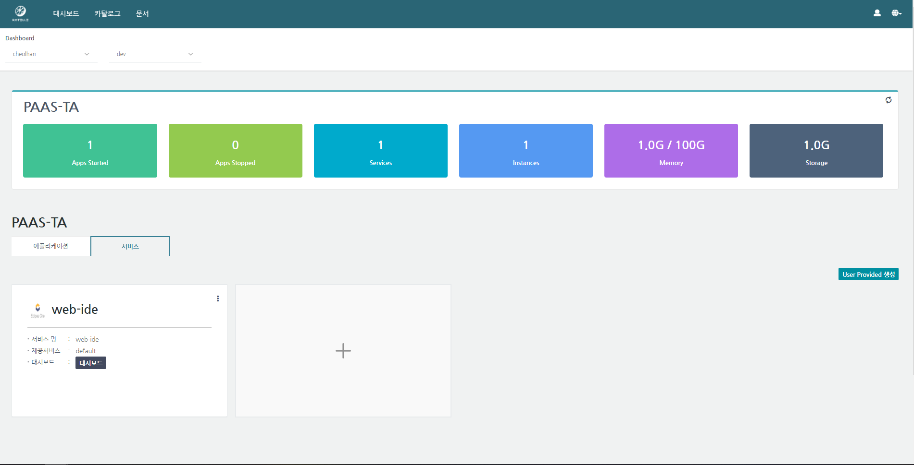
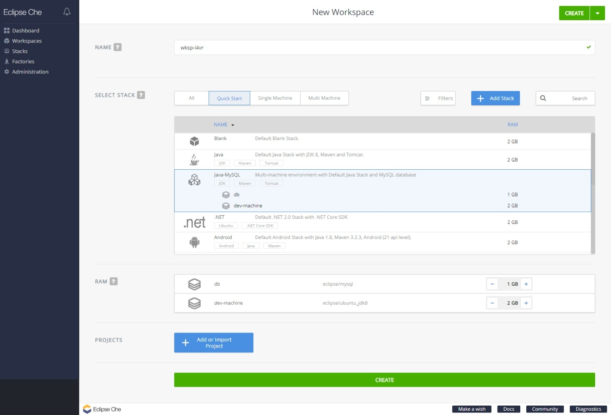
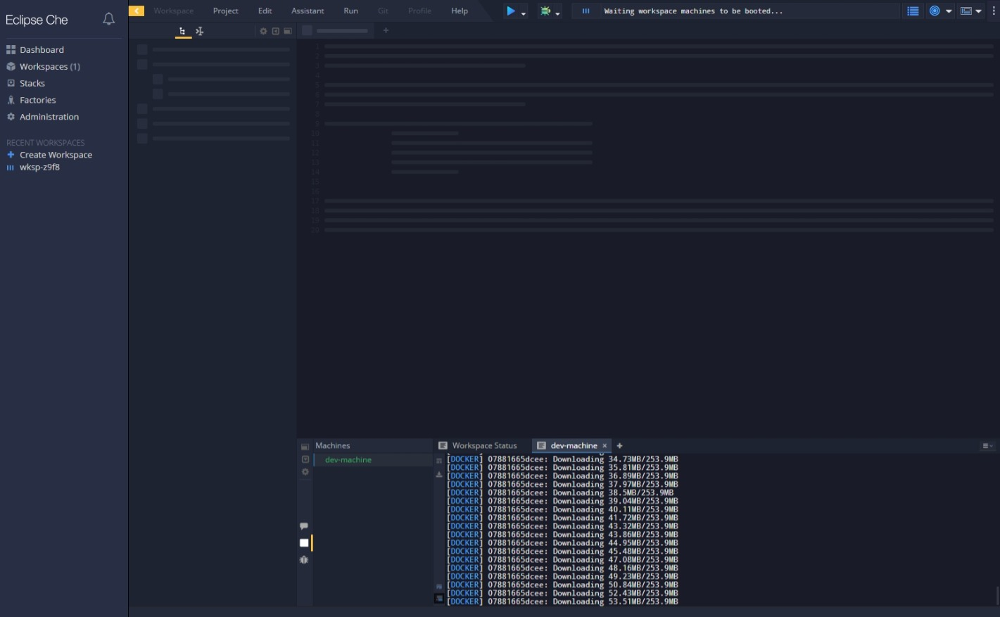
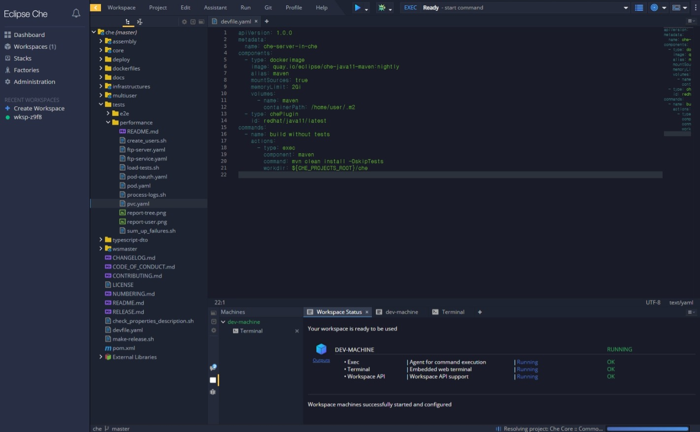
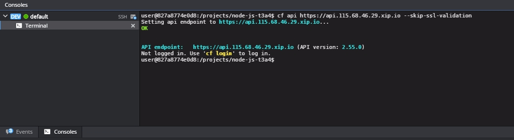
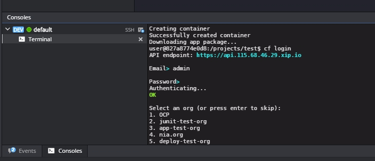
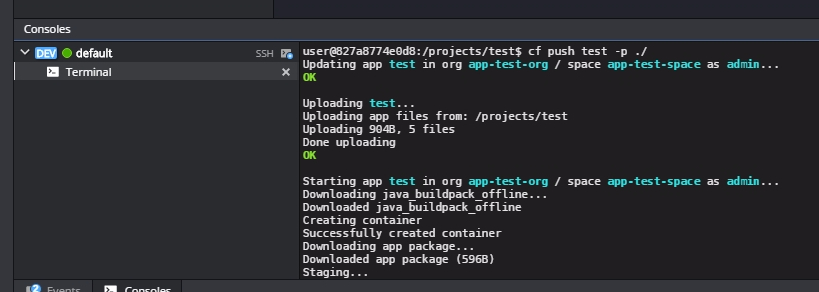

### [Index](https://github.com/PaaS-TA/Guide-eng/blob/master/README.md) > [AP Install](../README.md) > WEB IDE Service

## Table of Contents
1. [Document Outline](#1)  
  1.1. [Purpose](#1.1)  
  1.2. [Range](#1.2)    
  1.3. [References](#1.3)  

2. [WEB IDE Installation](#2)  
  2.1. [Prerequisite](#2.1)   
  2.2. [Stemcell Check](#2.2)    
  2.3. [Deployment Download](#2.3)   
  2.4. [Deployment File Modification](#2.4)  
  2.5. [Service Installation](#2.5)    
  2.6. [Service Installation Check](#2.6)  

3. [Web-IDE's PaaS-TA Portal Site Interworking](#3)  
 3.1. [WEB-IDE Service Broker Registration](#3.1)  
 3.2. [Application for service](#3.2)  
　3.2.1. [Application for service - Portal](#3.2.1)   
　3.2.2. [Application for service - CLI](#3.2.2)   

4. [Use guide of CF CLI in WEB-IDE](#4)  
  4.1. [WEB-IDE New Project Screen](#4.1)  
  4.2. [WEB-IDE Workspace Screen](#4.2)  
  4.3. [Run the CF CLI on the WEB-IDE Terminal](#4.3)  

5. [WEB IDE IP Expansion](#5)  
  5.1. [Service Check](#5.1)   
  5.2. [Deployment File Modification](#5.2)   
  5.3. [Service reinstallation](#5.3)    
  5.4. [Service Installation Check](#5.4)    


## <div id="1"/> 1. Document Outline

### <div id='1.1'/>1.1. Purpose

This document (WEB-IDE service pack installation guide) describes how to install the WEB-IDE service pack, which is a service pack provided by PaaS-TA, using Bosh.

### <div id='1.2'/> 1.2. Range
The installation range was prepared based on the basic installation to verify the use of WEB-IDE.


### <div id='1.3'/>1.3. References
BOSH Document: [http://bosh.io](http://bosh.io)  
Cloud Foundry Document: [https://docs.cloudfoundry.org](https://docs.cloudfoundry.org)  
Eclipse Che Technology: [https://www.eclipse.org/che/technology/](https://www.eclipse.org/che/technology/)  


## <div id='2'/> 2. WEB IDE Installation  

### <div id="2.1"/> 2.1. Prerequisite 

This installation guide is based on installing in a Linux environment. 
In order to install the service pack, BOSH CLI v2 must be installed and logged in to BOSH.  
If BOSH CLI v2 is not installed, you should first refer to the BOSH 2.0 installation guide document to install BOSH CLI v2 and familiarize with the usage.

### <div id="2.2"/> 2.2. Stemcell Check  

Check the Stemcell list to make sure that the Stemcell required for service installation is uploaded. 
The Stemcell of this guide uses ubuntu-bionic 1.76. 

> $ bosh -e ${BOSH_ENVIRONMENT} stemcells

```
Using environment '10.0.1.6' as client 'admin'

Name                                       Version   OS             CPI  CID  
bosh-openstack-kvm-ubuntu-bionic-go_agent  1.76      ubuntu-bionic  -    ce507ae4-aca6-4a6d-b7c7-220e3f4aaa7d

(*) Currently deployed

1 stemcells

Succeeded
```

If the corresponding Stemcell is not uploaded, copy the Stemcell link to the corresponding IaaS environment and version from [bosh.io Stemcell](https://bosh.io/stemcells/) and run the following command.

```
# Example of Stemcell Upload Command
$ bosh -e ${BOSH_ENVIRONMENT} upload-stemcell -n {STEMCELL_URL}
```

### <div id="2.3"/> 2.3. Deployment Download

Download the deployment needed from Git Repository and place the file at the service installation directory.  

- Service Deployment Git Repository URL : https://github.com/PaaS-TA/service-deployment/tree/v5.1.5

```
# Deployment File Download , make directory, change directory
$ mkdir -p ~/workspace
$ cd ~/workspace

# Deployment File Download
$ git clone https://github.com/PaaS-TA/service-deployment.git -b v5.1.5

# common_vars.yml File Download(Download if common_vars.yml doesn't exist)
$ git clone https://github.com/PaaS-TA/common.git
```

### <div id="2.4"/> 2.4. Deployment File Modification

The BOSH Deployment manifest is a YAML file that defines the properties of components elements and deployments.
Cloud config is used for network, vm_type, and disk_type used in Deployment files, and refer to the PaaS-TA AP installation guide the usage.  

- Check the Cloud config settings.   

> $ bosh -e micro-bosh cloud-config   

```
Using environment '10.0.1.6' as client 'admin'

azs:
- cloud_properties:
    availability_zone: ap-northeast-2a
  name: z1
- cloud_properties:
    availability_zone: ap-northeast-2a
  name: z2

... ((Skip)) ...

disk_types:
- disk_size: 1024
  name: default
- disk_size: 1024
  name: 1GB

... ((Skip)) ...

networks:
- name: default
  subnets:
  - az: z1
    cloud_properties:
      security_groups: paasta-security-group
      subnet: subnet-00000000000000000
    dns:
    - 8.8.8.8
    gateway: 10.0.1.1
    range: 10.0.1.0/24
    reserved:
    - 10.0.1.2 - 10.0.1.9
    static:
    - 10.0.1.10 - 10.0.1.120

... ((Skip)) ...

vm_types:
- cloud_properties:
    ephemeral_disk:
      size: 3000
      type: gp2
    instance_type: t2.small
  name: minimal
- cloud_properties:
    ephemeral_disk:
      size: 10000
      type: gp2
    instance_type: t2.small
  name: small

... ((Skip)) ...

Succeeded
```

- Modify common_vars.yml to suit the server environment. 
- The Variables used in WEB IDE are: bosh_url, bosh_client_admin_id, bosh_client_admin_secret, bosh_director_port,  bosh_oauth_port, bosh_version, system_domain, paasta_admin_username, paasta_admin_password.

> $ vi ~/workspace/common/common_vars.yml
```
... ((Skip)) ...

bosh_url: "https://10.0.1.6"			# BOSH URL (e.g. "https://00.000.0.0")
bosh_client_admin_id: "admin"			# BOSH Client Admin ID
bosh_client_admin_secret: "ert7na4jpew"		# BOSH Client Admin Secret('echo $(bosh int ~/workspace/paasta-deployment/bosh/{iaas}/creds.yml --path /admin_password)' command can be used to check)
bosh_director_port: 25555			# BOSH director port
bosh_oauth_port: 8443				# BOSH oauth port
bosh_version: 271.2				# BOSH version(can be checked through 'bosh env' command, on-demand service용, e.g. "271.2")
system_domain: "61.252.53.246.nip.io"		# Domain (Same as HAProxy Public IP when using nip.io)
paasta_admin_username: "admin"			# PaaS-TA Admin Username
paasta_admin_password: "admin"			# PaaS-TA Admin Password

... ((Skip)) ...

```


- Modify the variable files used by Deployment YAML to suit the server environment.

> $ vi ~/workspace/service-deployment/web-ide/vars.yml

```
deployment_name: "web-ide"                                                # Service Deployed Name

# STEMCELL
stemcell_os: "ubuntu-bionic"                                              # stemcell os
stemcell_version: "1.76"                                                  # stemcell version
stemcell_alias: "default"                                                 # stemcell alias

# NETWORK
private_networks_name: "default"                                          # private network name
public_networks_name: "vip"                                               # public network name

# ECLIPSE-CHE
eclipse_che_azs: [z7]                                                     # eclipse-che : azs
eclipse_che_instances: 0                                                  # eclipse-che : instances (default : 0)
eclipse_che_vm_type: "large"                                              # eclipse-che : vm type
eclipse_che_public_ips: "<ECLIPSE_CHE_PUBLIC_IPS>"                        # eclipse-che : public ips (e.g. ["00.00.00.00" , "11.11.11.11"], At initial deployment [])
eclipse_che_buffer_ips: "<ECLIPSE_CHE_BUFFER_IPS>"                        # eclipse-che : Extra public ips for On Demand


# MARIA_DB
mariadb_azs: [z4]                                                         # mariadb : azs
mariadb_instances: 1                                                      # mariadb : instances (1) 
mariadb_vm_type: "small"                                                  # mariadb : vm type
mariadb_persistent_disk_type: "10GB"                                      # mariadb : persistent disk type
mariadb_port: "<MARIADB_PORT>"                                            # mariadb : database port (e.g. 31306) -- Do Not Use "3306"
mariadb_admin_password: "<MARIADB_ADMIN_PASSWORD>"                        # mariadb : database admin password (e.g. "Paasta@2021")

# SERVICE-BROKER
broker_azs: [z4]                                                          # service-broker : azs
broker_instances: 1                                                       # service-broker : instances (1)
broker_vm_type: "medium"                                                  # service-broker : vm type
broker_port: "<BROKER_PORT>"                                              # service-broker : broker port (e.g. "8080")
serviceDefinition_id: "<SERVICE_GUID>"                                    # serviceDefinition_id : service guid (e.g. "af86588c-6212-11e7-907b-b6006ad3webide0")
serviceDefinition_name: "WEB IDE"
serviceDefinition_plan1_id: "<SERVICE_PLAN_ID>"                           # serviceDefinition_plan1_id : service plan id (e.g. "a5930564-6212-11e7-907b-b6006ad3webide1")
serviceDefinition_plan1_name: "<SERVICE_PLAN_NAME>"                       # serviceDefinition_plan1_name : service plan name (e.g. "dedicated-vm")
serviceDefinition_plan1_desc: "WEB IDE SERVICE"
serviceDefinition_bullet_name: "Web IDE OnDemand Server Use"
serviceDefinition_bullet_desc: "Web IDE Service Using a OnDemand Server"
serviceDefinition_org_limitation: "-1"                                    # serviceDefinition_org_limitation : Restrictions Service for Organizations
serviceDefinition_space_limitation: "-1"                                  # serviceDefinition_space_limitation : Restrictions Service for Spacae

# CF
cloudfoundry_sslSkipValidation: "true"
```

### <div id="2.5"/> 2.5. Service Installation

- Modify the VARIABLES settings in the Deploy script file to suit the server environment.  
  (Optional) -o operations/cce.yml (Apply CCE when installing) 

> $ vi ~/workspace/service-deployment/web-ide/deploy.sh

```
#!/bin/bash
  
# VARIABLES
COMMON_VARS_PATH="<COMMON_VARS_FILE_PATH>"       # common_vars.yml File Path (e.g. ../../common/common_vars.yml)
CURRENT_IAAS="${CURRENT_IAAS}"					 # IaaS Information (When not using create-bosh-login.sh provided by PaaS-TA, enter aws/azure/gcp/openstack/vsphere)
BOSH_ENVIRONMENT="${BOSH_ENVIRONMENT}"			 # bosh director alias name (When not using create-bosh-login.sh provided by PaaS-TA, check the name at bosh envs and enter)

# DEPLOY
bosh -e ${BOSH_NAME} -n -d web-ide deploy --no-redact web-ide.yml \
    -o operations/${IAAS}-network.yml \
    -o operations/cce.yml \
    -l ${COMMON_VARS_PATH} \
    -l vars.yml      
```

- Install Service.  
```
$ cd ~/workspace/service-deployment/web-ide
$ sh ./deploy.sh  
```  


### <div id="2.6"/> 2.6. Service Installation Check

Check the installled service.  

> $ bosh -e micro-bosh -d web-ide vms

```
Using environment '10.30.40.111' as user 'admin' (openid, bosh.admin)

Task 7872. Done

Deployment 'web-ide'

Instance                                            Process State  AZ  IPs            VM CID                                   VM Type  Active
mariadb/ec34aa5b-c7cc-4297-9e2d-babf05d83832        running        z3  10.30.56.55    vm-9e1631af-b6c8-481e-aad3-3fd713f106a9  small    true
webide-broker/a641df99-d36a-49ee-8329-018fe10fa23d  running        z3  10.30.56.56    vm-eb784964-48cd-4e4c-b080-53675d3738c2  medium   true

2 vms

Succeeded
```


## <div id='3'/> 3. Web-IDE's PaaS-TA Portal Site Interworking

### <div id='3.1'/> 3.1. WEB-IDE Service Broker Registration

- Service Broker Registration Commands
```
cf create-service-broker [SERVICE_BROKER] [USERNAME] [PASSWORD] [SERVICE_BROKER_URL]

[SERVICE_BROKER] : Service Broker Name
[USERNAME] / [PASSWORD] : User ID / PASSWORD with access to service broker
[SERVICE_BROKER_URL] : Service Broker Access URL
```

- Register a web-IDE service broker.
> $ cf create-service-broker webide-service-broker admin cloudfoundry http://<webide-broker_ip>:8080
```
$ cf create-service-broker webide-service-broker admin cloudfoundry http://10.30.56.56:8080
Creating service broker webide-service-broker as admin...
OK
```
<br>

- Check the registered WEB-IDE service broker.
> $ cf service-brokers  
```
Getting service brokers as admin...

name                          url
webide-service-broker         http://10.30.56.56:8080
```
<br>

- Check the list of accessible services.
> $ cf service-access
```
Getting service access as admin...
broker: webide-service-broker
   offering   plan           access   orgs
   webide     dedicated-vm   none      
```
<br>
Access is initially not permitted when registering as a service broker. Therefore, access is set to none.

- Assign permission to a specific organization to access the service and recheck the access service list. (Overall Organization)
> $ cf enable-service-access webide <br>
```
Enabling access to all plans of service webide for all orgs as admin...
OK
```
> $ cf service-access 
```
Getting service access as admin...

broker: webide-service-broker
   offering   plan           access   orgs
   webide     dedicated-vm   all      
```
<br>

### <div id='3.2'/> 3.2. Application for service
#### <div id='3.2.1'/> 3.2.1. Application for service - Portal

1. Access the Operator Portal go to Manage Operations > Catalog > App Service and click Register App Service.  

- Enter the following information on the detail page.

> ※ Catalog Management > App Service
> - Name : WEB IDE
> - Category :  Development Support Tools
> - Service : webide
> - Thumbnail : [WEB IDE Service Thumbnail]
> - Document URL : https://github.com/PaaS-TA/PAAS-TA-WEB-IDE-BROKER
> App bind usage : N
> - Public : Y
> - Dashboard usage : Y
> - On demand : N
> - Tag : paasta / tag6, free / tag2
> - Summary : WEB IDE
> - Description :
> WEB IDE for Web Programming - eclipse-che
>  
> ![3-2-2]

- Access the PaaS-TA User Portal, and apply for services through the catalog.   

![003]

- Access the service through the dashboard URL.    

![004]  


#### <div id="3.2.2"/>  3.2.2. Application for Service - CLI
Guide on how to apply for the WEB-IDE service through the CLI.

- Check if the service is available at PaaS-TA Marketplace.

> $ cf marketplace
```
Getting services from marketplace in org system / space dev as admin...
OK

offering   plans          description                                                                 broker
webide     dedicated-vm   A paasta web ide service for application development.provision parameters   webide-service-broker
```
<br>

- Service Instance Application Commands
```
cf create-service [SERVICE] [PLAN] [SERVICE_INSTANCE]

[SERVICE] : Name shown at the Marketplace
[PLAN] : Policies for Services
[SERVICE_INSTANCE] : Name of the service instance to create
```

-If there is a service you want on the Marketplace, apply for a service (Provision).

> $ cf create-service webide dedicated-vm webide-service  
```
Creating service instance paasta-webide-service in org system / space dev as admin...
OK

Create in progress. Use 'cf services' or 'cf service webide' to check operation status.
```
<br>

- Check the created WEB-IDE VM instance.

> bosh -e micro-bosh -d web-ide vms  
```
Using environment '10.30.40.111' as user 'admin' (openid, bosh.admin)

Task 7872. Done

Deployment 'web-ide'

Instance                                            Process State  AZ  IPs            VM CID                                   VM Type  Active
eclipse-che/ed136540-c650-47a2-918b-bb7f6020469d    running        z7  10.30.56.54    vm-5a3a2b10-d0c9-47c8-97f0-6ea64c339df8  large    true
							               115.68.46.178
mariadb/ec34aa5b-c7cc-4297-9e2d-babf05d83832        running        z3  10.30.56.55    vm-9e1631af-b6c8-481e-aad3-3fd713f106a9  small    true
webide-broker/a641df99-d36a-49ee-8329-018fe10fa23d  running        z3  10.30.56.56    vm-eb784964-48cd-4e4c-b080-53675d3738c2  medium   true

3 vms

Succeeded
```
<br>

- Check the generated WEB-IDE service instance.

> $ cf service webide-service
```
 ... (Skip) ...
 Dashboard:        http://115.68.46.178:8080
 Service broker:   webide-service-broker
 ... (Skip) ...
```
<br>


## <div id='4'/> 4. Use guide of CF CLI in WEB-IDE

### <div id='4.1'/> 4.1. WEB-IDE New Project Screen
***※ Refer to [PaaS-TA Operator Portal 4.3.3 Catalog Management Service Guide] (/use-guide/portal/PAAS-TA_ADMIN_PORTAL_USE_GUIDE_V1.1.md#4.3.3) ***  

- Select the language to be used and start a new project with Create workspace and project.



<br>


### <div id='4.2'/> 4.2. WEB-IDE Workspace Screen

- When creating WEB-IDE for the first time, a new workspace screen opens and the project is created according to the settings to proceed with the work.







<br>

### <div id='4.3'/> 4.3. Run CF CLI on the WEB-IDE Terminal

- use -cf api command to set endpoint.

> 

- Log in with the cf login command and select the organization and space.

> 

- use cf push to upload app in cf.

> 


## <div id='5'/> 2. WEB IDE IP Expansion
### <div id="5.1"/> 5.1. Service Check

Check the currently created WEB-IDE VM instance.

> bosh -e micro-bosh -d web-ide vms  
```
Using environment '10.30.40.111' as user 'admin' (openid, bosh.admin)

Task 7872. Done

Deployment 'web-ide'

Instance                                            Process State  AZ  IPs            VM CID                                   VM Type  Active
eclipse-che/ed136540-c650-47a2-918b-bb7f6020469d    running        z7  10.30.56.54    vm-5a3a2b10-d0c9-47c8-97f0-6ea64c339df8  large    true
							               115.68.46.178
mariadb/ec34aa5b-c7cc-4297-9e2d-babf05d83832        running        z3  10.30.56.55    vm-9e1631af-b6c8-481e-aad3-3fd713f106a9  small    true
webide-broker/a641df99-d36a-49ee-8329-018fe10fa23d  running        z3  10.30.56.56    vm-eb784964-48cd-4e4c-b080-53675d3738c2  medium   true

3 vms

Succeeded
```
<br>


### <div id="5.2"/> 5.2. Deployment File Modification

Change the value of eclipse_che_instances in the Deployment YAML used to install as much as the eclipse-che deployed, and enter the public IP installed in eclipse_che_public_ips.
Then add the IP to add to WEB-IDE to eclipse_che_buffer_ips.

> $ vi ~/workspace/service-deployment/web-ide/vars.yml

```
.....

# ECLIPSE-CHE
eclipse_che_azs: [z7]                                                   # eclipse-che : azs
eclipse_che_instances: 1                                                # eclipse-che : instances (1), ondemand service default 0
eclipse_che_vm_type: "large"                                            # eclipse-che : vm type
eclipse_che_public_ips: ["115.68.46.178"]                               # eclipse-che : public ips (e.g. ["00.00.00.00" , "11.11.11.11"])
eclipse_che_buffer_ips: ["115.68.46.178", "52.153.36.143"]              # eclipse-che : Extra public IPs to be used at OnDemand
eclipse_che_instance_name: "eclipse-che"                                # eclipse-che : Instance Name

........

```


### <div id="5.3"/> 5.3. Service Reinstallation

- Reinstall the Service.  
```
$ cd ~/workspace/service-deployment/web-ide
$ sh ./deploy.sh  

Using environment '10.0.1.6' as client 'admin'

Using deployment 'web-ide'

Release 'paas-ta-webide-release/2.0' already exists.

  instance_groups:
  - name: webide-broker
    properties:
      network:
        static_ips:
+       - 52.153.36.143
Task 581

Task 581 | 02:20:43 | Preparing deployment: Preparing deployment (00:00:02)
Task 581 | 02:20:45 | Preparing deployment: Rendering templates (00:00:01)
Task 581 | 02:20:46 | Preparing package compilation: Finding packages to compile (00:00:00)
Task 581 | 02:20:46 | Updating instance webide-broker: webide-broker/f47c5c19-92d3-4b84-86da-89e8e53090fc (0) (canary) (00:00:13)

Task 581 Started  Mon Jan 11 02:20:43 UTC 2021
Task 581 Finished Mon Jan 11 02:20:59 UTC 2021
Task 581 Duration 00:00:16
Task 581 done

```  


### <div id="5.4"/> 5.4. Service Installation Check

Check the installed service.  

> $ bosh -e micro-bosh -d web-ide vms

```
Using environment '10.30.40.111' as user 'admin' (openid, bosh.admin)

Task 7872. Done

Deployment 'web-ide'

Instance                                            Process State  AZ  IPs            VM CID                                   VM Type  Active
eclipse-che/ed136540-c650-47a2-918b-bb7f6020469d    running        z7  10.30.56.54    vm-5a3a2b10-d0c9-47c8-97f0-6ea64c339df8  large    true
							               115.68.46.178
mariadb/ec34aa5b-c7cc-4297-9e2d-babf05d83832        running        z3  10.30.56.55    vm-9e1631af-b6c8-481e-aad3-3fd713f106a9  small    true
webide-broker/a641df99-d36a-49ee-8329-018fe10fa23d  running        z3  10.30.56.56    vm-eb784964-48cd-4e4c-b080-53675d3738c2  medium   true

3 vms

Succeeded
```
[3-2-2]:./images/webide/adminPortal_catalogDetail.png
[003]:./images/webide/userportal_catalog.png
[004]:./images/webide/userportal_dashboard.png


### [Index](https://github.com/PaaS-TA/Guide-eng/blob/master/README.md) > [AP Install](../README.md) > WEB IDE Service
