### [Index](https://github.com/PaaS-TA/Guide-eng/blob/master/README.md) > [AP User Guide](../README.md) > Eclipse Tools for Using ClF

# Table Of Contents

1. [Document Outline](#1-문서-개요)  
     1.1. [Purpose](#11-목적)  
     1.2. [Range](#12-범위)  
     1.3. [References](#13-참고자료)  
2. [Preparations Before Installing the Development Environment](#2-개발환경-설치-전-준비사항)  
     2.1. [Preparations Before Installation](#21-설치-전-준비사항)  
     2.2. [Install JAVA Development kit](#22-자바-개발-킷-설치)  
     2.3. [Install e-Government Standard Framework](#23-전자정부-표준프레임워크-설치)  
     2.4. [Install Kepler Version of Eclipse Integrated Development Environment](#24-이클립스-통합개발환경-케플러-버전-설치)  
3. [Install Open PaaS Development Environment](#3-open-paas-개발환경-설치)  
     3.1. [Install Open PaaS Development Environment at e-Government Standard Framework](#31-전자정부-표준프레임워크에-open-paas-개발환경-설치)  
     3.2. [Install Open PaaS Development Environment at Eclipse Integrated Development Environment](#32-이클립스-통합개발환경에-open-paas-개발환경-설치)  
     3.3. [Usage of e-Government Standard Framework Development Environment with Open PaaS Development Environment included](#33-open-paas-개발환경이-포함된-전자정부-표준프레임워크-개발환경-사용)  
4. [Open Platform Server Connection Management](#4-개방형-플랫폼-서버-연결-관리)  
     4.1. [Add Server](#41-서버-추가)  
     4.2. [Register Platform Server Information](#42-플랫폼-서버-정보-등록)  
     4.3. [Replicate Server](#43-서버-복제)  
     4.4. [Modify Server](#44-서버-수정)  
5. [Application and Servicepack Management](#5-애플리케이션-및-서비스팩-관리)  
     5.1. [Application Deployment](#51-애플리케이션-배포)  
     5.2. [Application List Check](#52-애플리케이션-목록-확인)  
     5.3. [Application Route Management](#53-애플리케이션-라우트-관리)  
     5.4. [Application Instance Management](#54-애플리케이션-인스턴스-관리)  
     5.5. [Delete Application](#55-애플리케이션-삭제)  
     5.6. [Add Servicepack Instance](#56-서비스팩-인스턴스-추가)  
     5.7. [Servicepack Instance Binding](#57-서비스팩-인스턴스-바인딩)  
     5.8. [Unbind Servicepack Instance](#58-서비스팩-인스턴스-바인딩-해제)  
     5.9. [Delete Servicepack Instance](#59-서비스팩-인스턴스-삭제)  
6. [Setting through Manifest](#6-매니페스트를-통한-설정)  
     6.1. [Add Manifest](#61-매니페스트-추가)  
     6.2. [Save Manifest](#62-매니페스트-저장)  
7. [Plugin Setting(REST API Log Tracking Settings)](#7-플러그인-설정rest-api-로그-추적-설정)  
8. [Example Project Description](#8-예제-프로젝트-설명)  
     8.1. [Add dependencies](#81-의존성-추가)  
     8.2. [Add Cloud Namespace0](#82-cloud-네임스페이스-추가)  
     8.3. [Modify dataSource Setting](#83-datasource-설정-변경)  
     8.4. [Set dataSource Reset](#84-datasource-초기화-설정)  
     8.5. [Precautions for deployment](#85-배포시-주의사항)  


# Executive Summary

The purpose of this document is to provide the developers with the necessary environment and the instruction guide when they develop Open PaaS based applications as they download Open PaaS into e-Government Framework development environment. The users of the guide are assumed to have basic knowledge about JAVA and JAVA web application development.

The guide is prepared according to the 2 steps below.
* Open PaaS Development Environment Installation
* Open PaaS Development Environment Usage


# 1. Document Outline

### 1.1 Purpose
This document provides a guide on the following: install Open PaaS development environment on e-Government Standard Framework Development Environment and Eclipse IDE, manage and deploy Java Web Application to Open PaaS environment through Open PaaS Development Environment, and manage Servicepack.

### 1.2 Range
The guide provided from this document is written based from e-Government Standard Framework 3.2.0 and Kepler Version of Eclipse (Kepler, 4.3.x).

### 1.3 References
This document refered to Cloud Foundry Eclipse Pulgin Document from Cloud Foundry.  
The Cloud Froundry Eclipse Plugin Document:
http://www.eclipse.org/cft/documentation/projectPageLink/CFTProjectPagedocumentation.html

# 2. Preparations Before Installing the Development Environment

### 2.1 Preparation Before Installing

This document provides the installation guide using the 3.1.1 version of e-Government Standard Framework development environment.
The language used in e-Government Standard Framework development environment is JAVA, which means Java Development Kit (JDK) or Java Runtime Environment (JRE) should be installed for the execution.
Install JDK before installing e-Government Framework development enviroment because Open PaaS Development Environment works as a plugin form. (7 or higher version of Java is recommended.)
If you don't use the e-Government Standard Framework Development Environment, it is alright to install Eclipse instead as it is similar to Eclipse IDE Kepler.

The versions used in the guide.
* jdk-8u60
* Eclipse-jee-kepler-SR2-win32-x86\_64
* openpaas\_dev\_env.jar
* eGovFrameDev-3.1.1

### 2.2 Install JAVA Development kit

1. Access to the link below and when “JavaSE Download” page appears, click the “JDK Download” link shown at the center and it goes to lisence agreement page.
[***http://www.oracle.com/technetwork/java/javase/downloads/index.html***](http://www.oracle.com/technetwork/java/javase/downloads/index.html)
2. Agree to the lisence and download the JDK according to the development environment.
3. Run the installation file and follow the procedures shown at the screen.    
     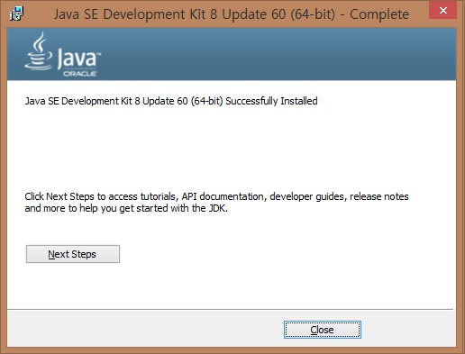

4.  Set environment variables for system properties to execute Java commands in command prompt.   

     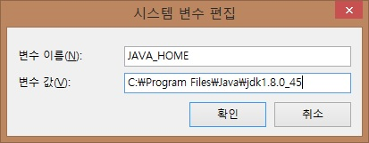  
     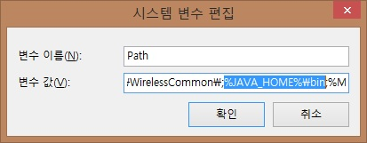  
     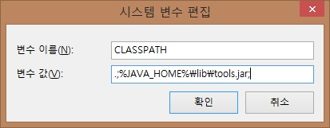

5. Run the command "java –version" at the command prompt to check if the installed JAVA Version outputs properly.  
  
     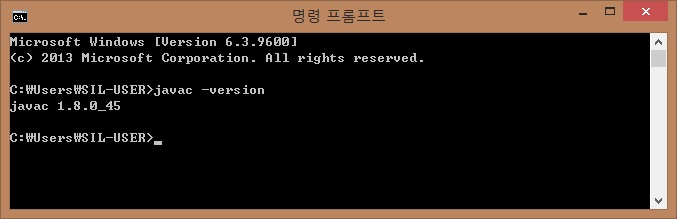

### 2.3 Install e-Government Standard Framework

For installing e-Government Standard Framework, Refer to e-Goverments Standard Framework's [Guide on installing development environment for developers](http://www.egovframe.go.kr/wiki/doku.php?id=egovframework:dev2:clntinstall).  
> **3.1.1 Version was used**

### 2.4 Install Kepler Version of Eclipse Integrated Development Environment

The installation procedure of the Kepler version of the Eclipse Integrated Development Environment is as follows.

1. Access to [Eclipse IDE Download Page](http://www.eclipse.org/downloads/) from the Eclipse's mainpage.  
     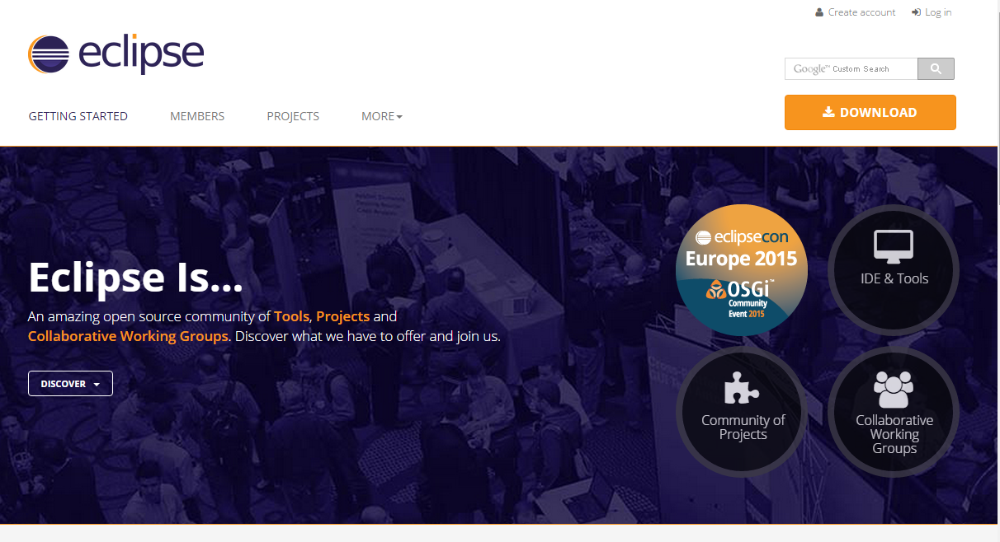

2. To download Eclipse IDE Kepler Version, click “MORE DOWNLOADS” at the sidebar on the  right side from the download page. Click “Eclipse Kepler(4.3)”.  
     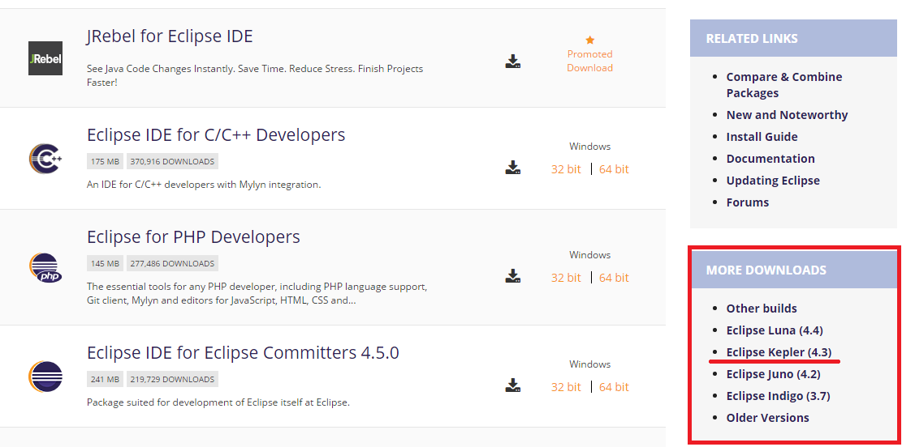

3. When the download screen appears, Download from the right side of “Eclipse IDE for Java EE Developers” by clicking the appropriate link.  
     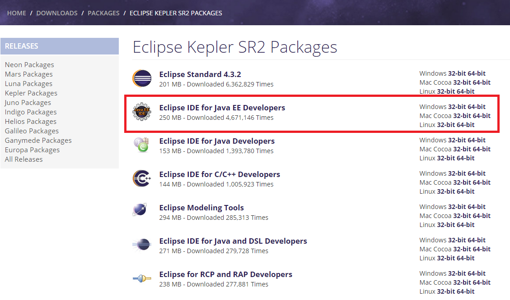

4. Unzip the downloaded file and run “eclipse.exe” file to access Eclipes without any other installation.

# 3. Install Open PaaS Development Environment

In this chapter, the procedure of installing Open PaaS development environment to the e-Government Standard Framework and Eclipse IDE will be described. If you're using the e-Government Standard Framework Development Environment which includes Open PaaS development environment, there is no need for extra installation. For Eclipse, use “openpaas_dev_env.zip” file to install Open PaaS development environment which is provided as a plugin.

### 3.1 Install Open PaaS Development Environment at e-Government Standard Framework

The procedures for installing an Open PaaS development environment in an e-government standard framework development environment are as follows:

1. Execute e-Government Standard Framework's development environment and click “Install New Software…” from the “Help” menu.  
     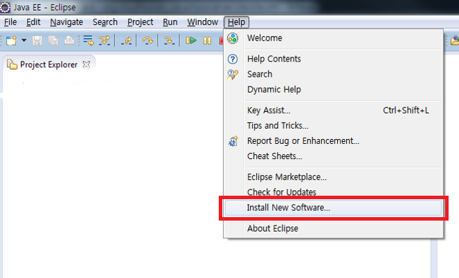

2. A “Available Software” dialog window will be displayed to proceed to installation.  
    To set the path for Open PaaS development environment, click “Add…” button.  
    Click “Cancel” to stop the process and close screen.  
     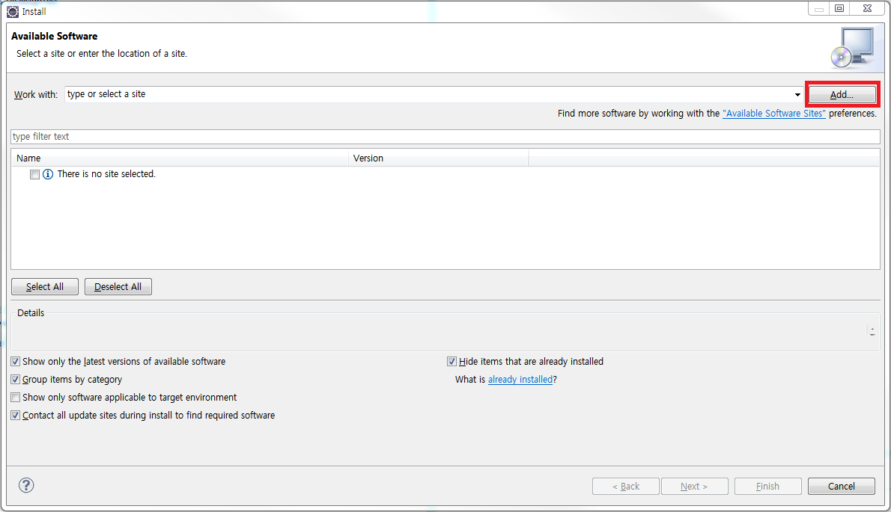

3. Enter the Open PaaS development environment in the “Name” field of the “Add Repository” dialog window
    Click “Archive” button on the right to find the “openpaas\_dev\_env.jar” file downloaded and click “OK” button from the “Add Repository” dialog box “OK”.
    Click “Cancel” to cancel the process.    
     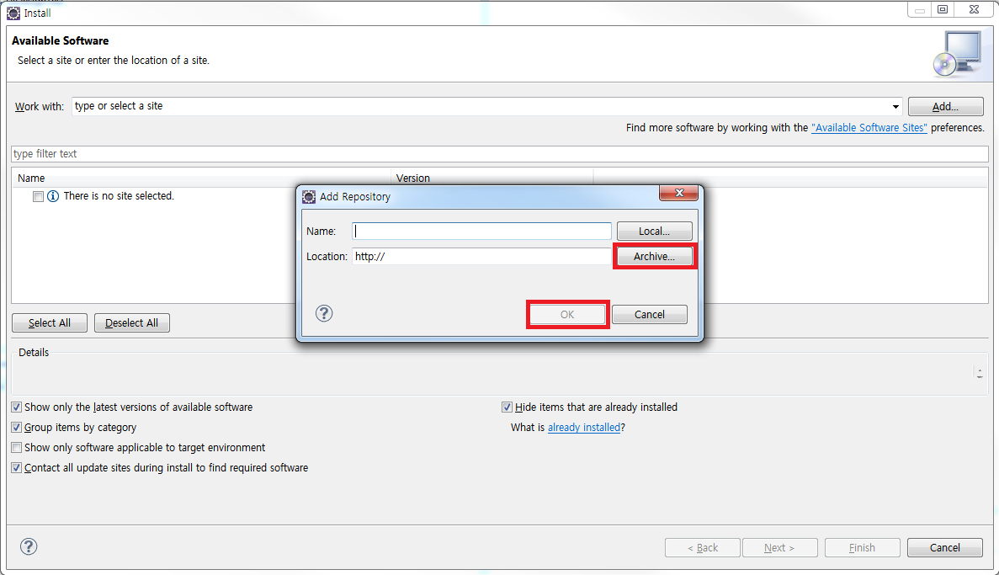

4.  As “Core / Open PaaS” catelogy appears on the dialog box,  
    Select from checkbox on the left side of the category and click “Next” to proceed to the next step.  
    Click “Cancel” button to cancel the process and exit the screen.  
     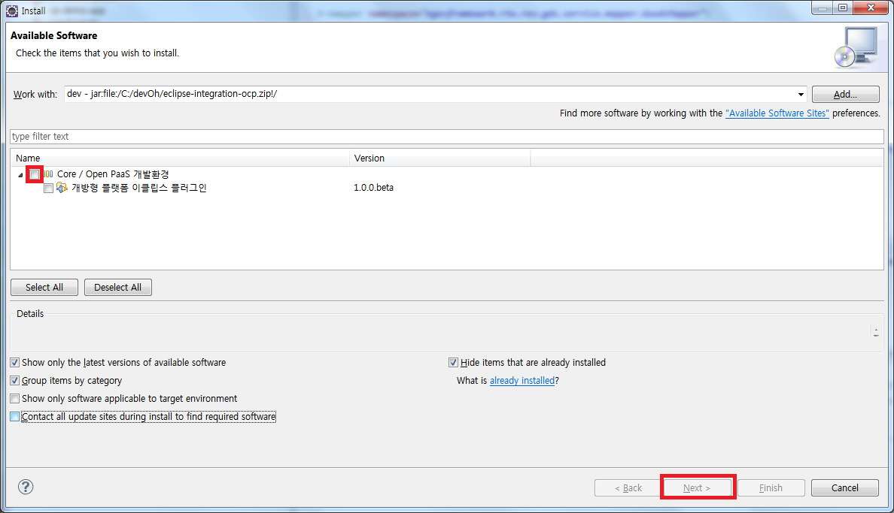

5. Information about Open PaaS Development Environment can be checked at “Install Details”. Click “Next” to proceed.  
    Click “Cancel” button to cancel the process and exit the screen.  
     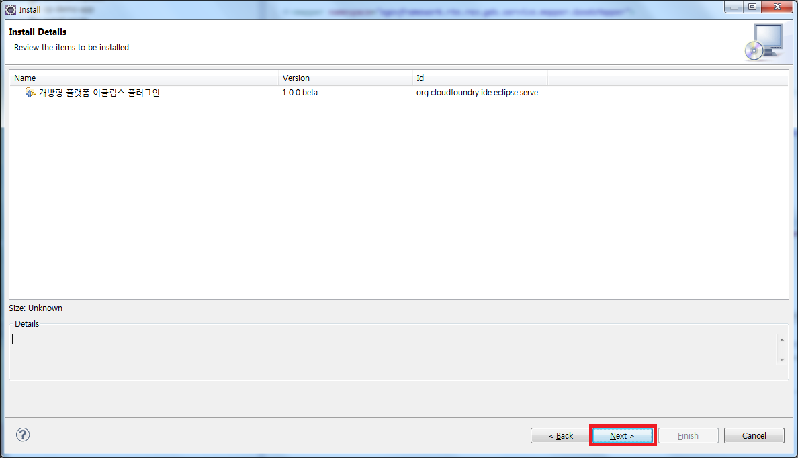

6.  License of Open PaaS Development Environment can be checked at the next page.
    Click “I accept the terms of the license agreement” after checking the lisence and click “Finish”.  
    Click “Cancel” button to cancel the process and exit the screen.  
     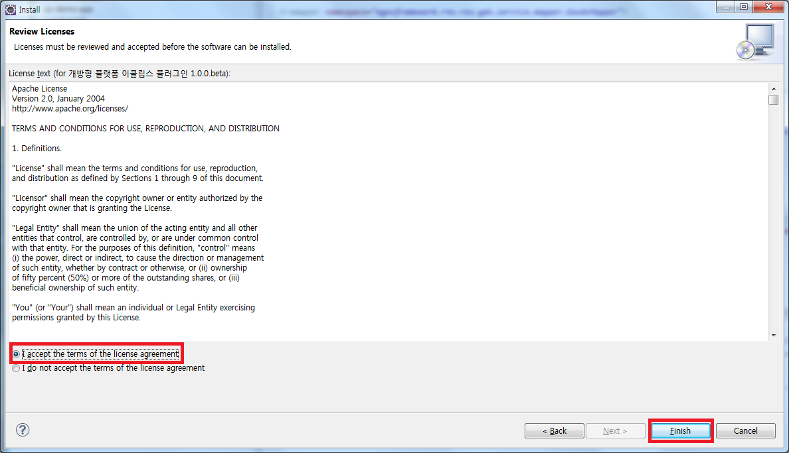

7. Installation happens with “Installing Software” dialog box.
   When “Security Warning” Caution screen appears, click “OK” to resume installation.  
   Cancel installation by clicking “Cancel” button.  
     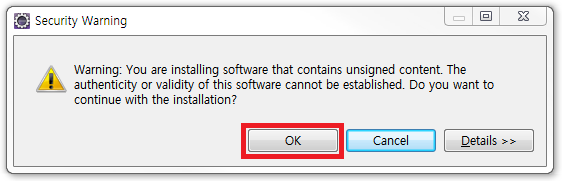

8. When the installation is completed, “Software Updates” dialog box appears.
 To let the Open PaaS development environment be applied properly, Restart is necessary.
 Click “Yes” to let the e-Government Standard Framework restart.  
 If not, click “No” button and the e-Government Standard Framework does not restarts and Open PaaS Development Environment cannot be used.  
     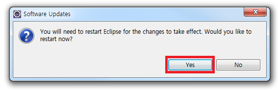

9. If restarted, the installation has been completed.

### 3.2 Install Open PaaS Development Environment at Eclipse Integrated Development Environment

For procedures of installing Open PaaS Development Environment at Eclipse IDE, refer to “3.1 Install Open PaaS Development Environment at e-Government Standard Framework”.

### 3.3 Usage of e-Government Standard Framework Development Environment with Open PaaS Development Environment included
No other installation is required since Open PaaS Development Environment is installed at e-Government Standard Framework Development Environment. It is possible to start with 4.Open Platform Server Connection Management.

# 4. Open Platform Server Connection Management

This chapter describes how to connect an open platform server.

### 4.1 Add Server

1. Click “New” – “Server” from the “Servers” tab to add a server.  
     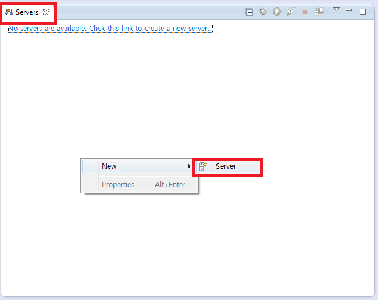

2. A “Define a New Server” dialog box appears. This dialog box is the screen to select the type and create a server.  
    Select “Open PaaS” – “Open Cloud Platform” from the list. 
    Input ”Server name”. (If there is no server name entered, the default name “Open PaaS” will be given.)  
    Click “Next” to proceed to the next page.  
    Click “Cancel” button to cancel the process and exit the screen.  
     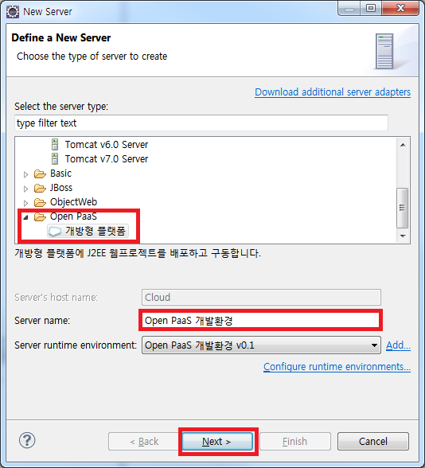

3. “Open PaaS Account” dialog box appears. This dialog box log in to Open PaaS to access to the organization and space Open PaaS.  
    Enter email and password and click the Confirm Account button to check the validity of the account.  
    When the account is successfully verified, "Next" button is activated.  
    Click “Next” to proceed to the next page.  
    Click “Cancel” button to cancel the process and exit the screen.  
    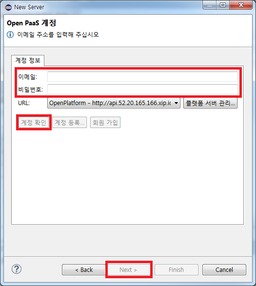

     > *The URL address shown in the "URL" column above is an arbitrary address. Must follow the procedure below to register the platform server information where the actual Open PaaS is deployed.  
     > Refer to [***4.2 Register Platform Server Information***](#42-플랫폼-서버-정보-등록).
     

4. “Organization and Space” list dialog box appears. This dialog box shows all the organization and space the corresponding account has. It can select organization and space to manage.  
    Select the organization and space to manage and click “Next” and proceed to the next page. (create organization or space if there is are none. Space and Organization cannot be created in Eclipse Development Environment as of the moment CLI has to be installed to create. Refer to [***OpenPaas CLi Guide.md***](OpenPaas CLi 가이드.md)installation and use guide of CLI.)  
    Click “Cancel” button to cancel the process and exit the screen.  
    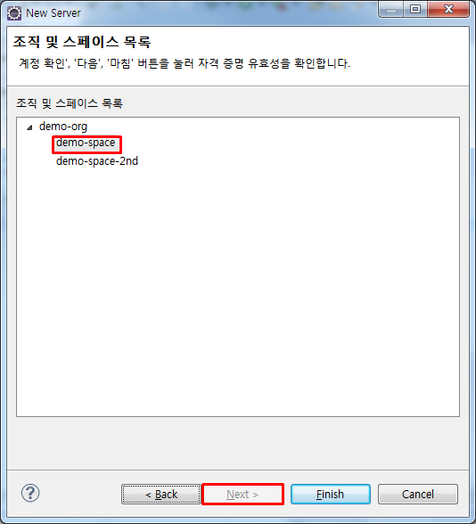

5. “Add and Remove” Screen appears.  
    This dialog box purpose is deploy or delete application to an Open PaaS Environment.  
    List of applications that can be deployed are marked as “Available”. “Configured” for applications that are already or expected to be deployed.  
    Click the application to deploy from “Available”.   
    Click “Add” to move to “Configured” and click “Finish” to complete
    application deployment.  
    When the application deployment is finished, the server to manage will be added.  
    Click “Cancel” button to cancel the process and exit the screen.  
    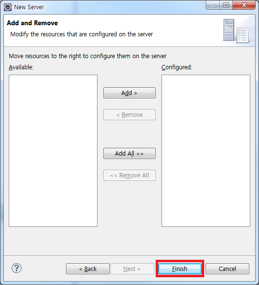

### 4.2 Register Platform Server Information

1. Click “Manage Platform Server…” and execute “Manage Platform Server URL” dialog box.  
  Click “Add” button to add Platform Server URL.    
    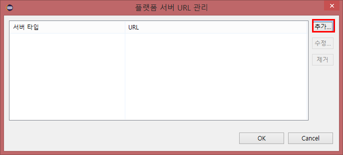

2. The Add and Platform URL Validation dialog window is displayed.  
  Enter server name and URL of the selected platform and click “Finish”.  
  Click “Cancel” button to cancel the process and exit the screen.    
     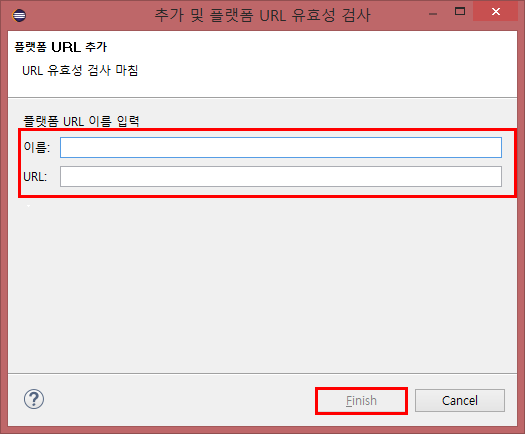

3. The added Platform Server URL are not reflected in the current state.
  Click “Finish” from the “Manage Platform Server URL” dialog box to complete the process.
  Click “Cancel” button to cancel the process and exit the screen.    
     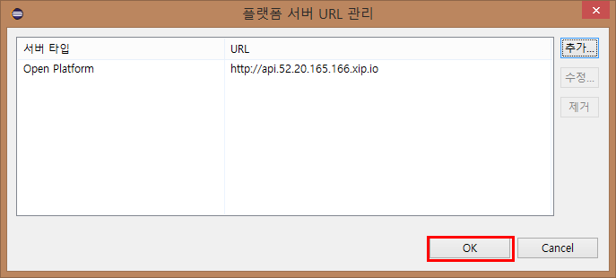


### 4.3 Replicate Server

Targeted Space cannot be modified from Open Platfrom Server Connection Information.
To change from the same open platform server to a different target space,
space must be reset by replicating Open Platform Server Connection Information.

1. Select the server to replicate from the “Servers” tab,
    right click and click “Replicate Server”.  
     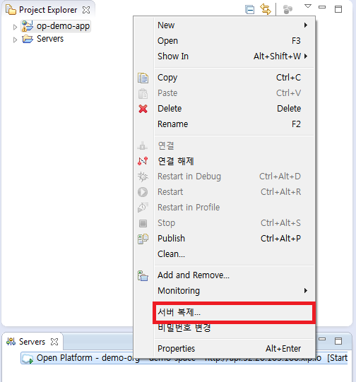

2. “Organization and Space List” dialog box appears. The purpose of this dialog box is to select the organization and space to replicate.  
    Select the space to replicate and click “Finish”.  
    Click “Cancel” to quit replicating spcae from the organization.  
     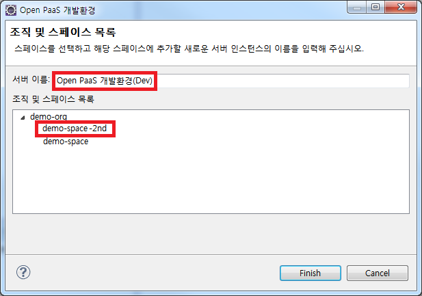

3. The selected space will be replicated with the name of its own and will be added to the list of “Servers” tab.  
    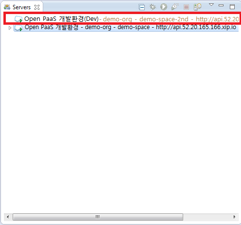

### 4.4 Modify Server

Server modification can only modify the management server name

1. Double click the management server name to modify from the “Servers” tab.  
     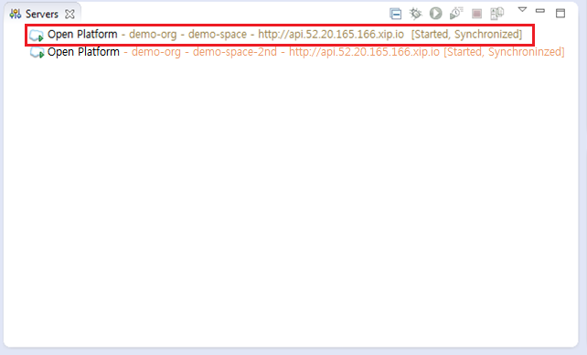

2. “Outline” dialog box appears. The purpose of this dialog box is to check server and account's information, and manage server status.  
    Modify the server's name and click “File” – “Save” from the menu.  
     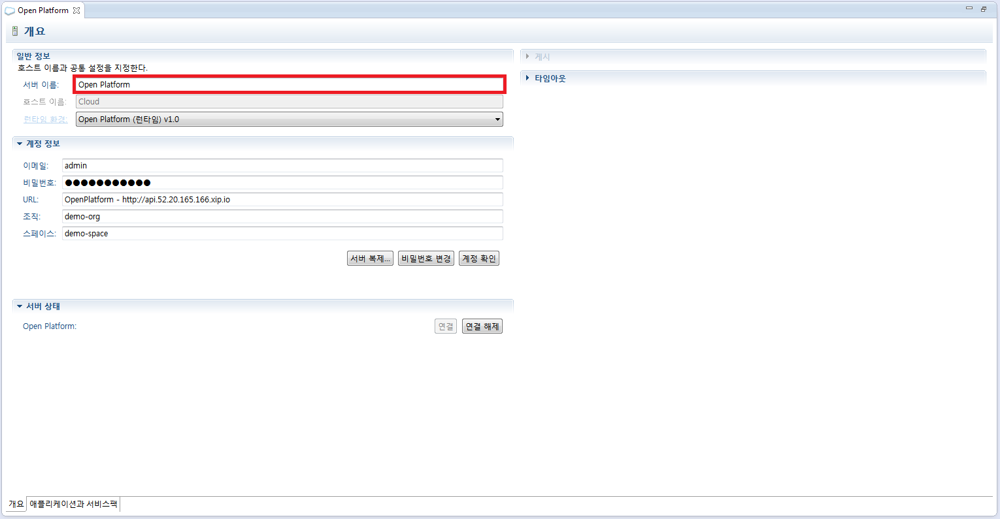

# 5. Application and Servicepack Management

This chapter describes the procedure for managing applications and service packs in an Open PaaS Development Environment.

### 5.1 Application Deployment

#####  Add by “Add and Remove”

1. Select the management server for application deployment from the “Servers” tab, right click and click “Add and Remove”.    
     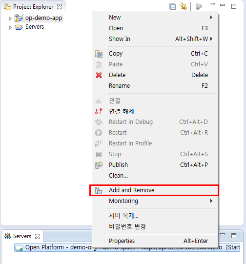

2. “Add and Remove” dialog box appears. This dialog box allows to deploy and delete applications in an Open PaaS environment.  
    List of applications that can be deployed are marked as “Available”. “Configured” for applications that are already or expected to be deployed.  
    Click the application to deploy from “Available”.   
    Click “Add” to move to “Configured” and click “Finish” to complete application deployment.  
    For first deployment, there are several settings to do.  
    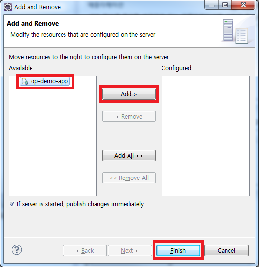

3. (For first deployment ONLY)  
    “Application Detailed Information” dialog box appears. This dailog box allows to set the name of the application, the build pack URL, and whether to save the manifest file.  
    Enter the name at “Name” input box. (Default name is the current project name.)  
    “Buildpack URL” can be used as an registered option when you want to use a buildpack that is not supported in the platform. It can be left as a blank when there is no buildpack to use.  
    Check “Save Manifest File” checkbox.  
    Click “Next” button to proceed to the next page.  
    Click “Finish” button to reflect the current status and deploy.  
    Click "Cancel” to cancel deployment.  
    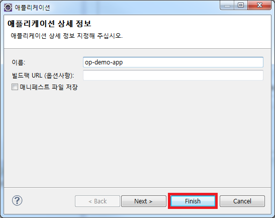

4. “Execute Deployment” dialog box appears. This dialog box specifies the domain and subdomain of the application, checks the "Deployed URL", and sets the memory limit and whether the deployed application should be started.  
    Enter the “Subdomain” name.(Default name is the current project name.)  
    Select Domain.  
    “Deployed URL” will be automatically be combine the subdomain and domain.  
    Enter the memory limit at the memory limit input box. (Default value is 512.)  
    After setting, click “Next” to proceed to the next page.  
    Click “Finish” button to reflect the current status and deploy.  
    Click "Cancel” to cancel deployment.  
    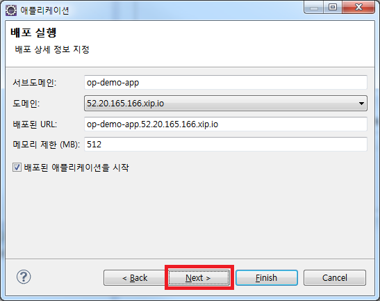

5. “Select Servicepack” dialog box appears. This dialog box can add or bind a service pack instance to bind to the application.  
      Select the service pack instance to bind with the application.  
      If there is no wanted service instance, click “Add Servicepack” icon and create servicepack instance.  
      Refer to [***5.6 Add Servicepack Instance***](#56-서비스팩-인스턴스-추가) for instructions on how to add servicepack instance.  
      Select the servicepack instance of your choice and click “Next” to proceed to the next page.  
      Click “Finish” button to reflect the current status and deploy.  
      Click "Cancel” to cancel deployment.  
    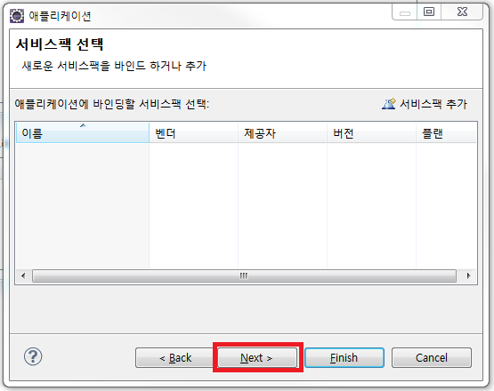

6. “Environment Variables” dialog box appears. This dialog box allows to add, modify, and delete environment variables in an application.  
      Refer to [***5.4 Application Instance Management***](#54-애플리케이션-인스턴스-관리) for environment variable add, delete, and modify.  
      Click “Finish” button to reflect the current status of modifying the environment variable and deploying.  
      Click "Cancel” to cancel deployment.  
    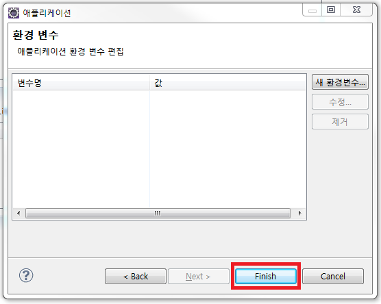

7. Once the deployment is complete, the deployed applications can be checked from the "Applications and Service Packs" tab of the Server Editor.  
    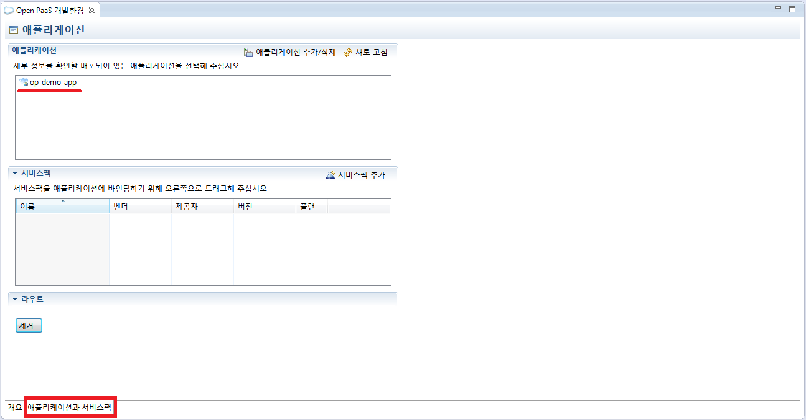

##### Add by dragging

1. Double-click the open platform server to deploy the application to run the server editor.  
      Drag the project you want to deploy to the application section to complete the deployment.  
      If deployment is done for the first time, next step must be taken to set up for deployment.  
    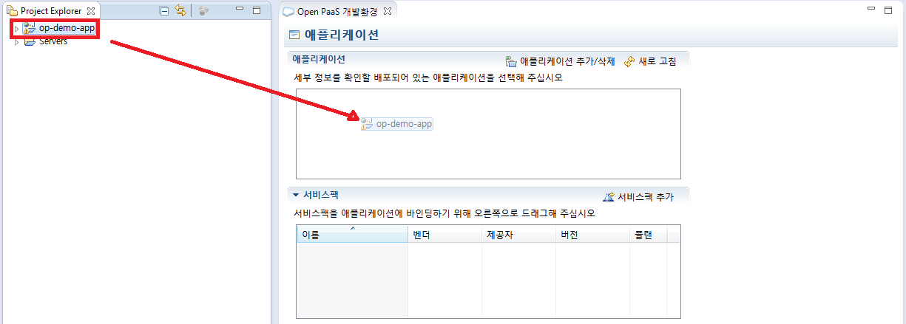

2. Has the same procedure as [***“Add and Remove”***](#51-애플리케이션-배포). Refer from number 2 of the chapter.

##### Add with Application Add/Delete button

1.    Double-click the open platform server to deploy the application to run the server editor.  
      Click the Add/Delete Application button to deploy the application..  
    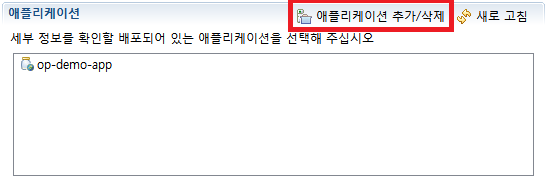

2. Refer to [***“Add and Remove”***](#51-애플리케이션-배포) for the procedures.

##### Add by project context menu

1. Select a project to deploy from “Package Explorer” and select “Run As” – “Run on Server” by right clicking .  
    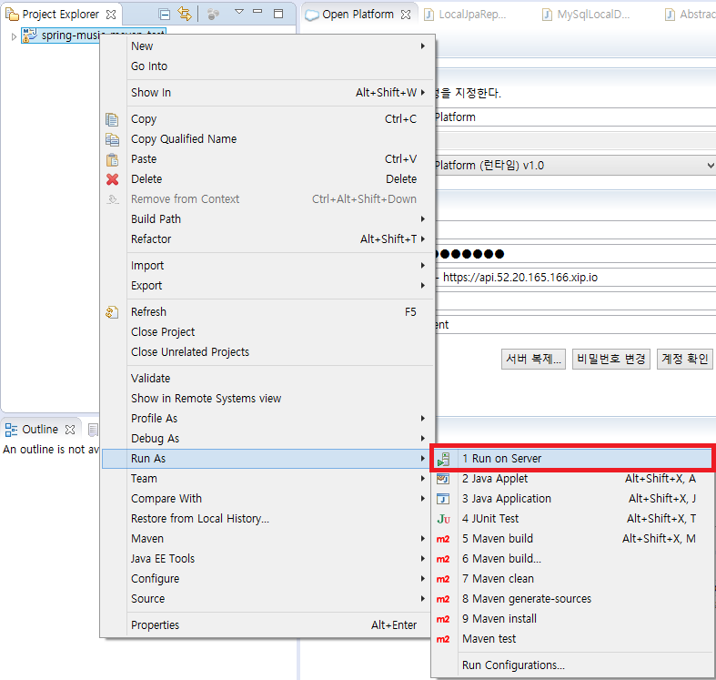

2. "Run On Server” dialog box appears. This dialog box allows to select the server to depoy.  
      From “Servers”list, select “Cloud” – “Open PaaS”.(If “Cloud” – “Open PaaS” cannot be found from the list, add server or click “Choose an existing server” from “How do you want to select the server?” radio button.)  
      Click “Next” button to start deployment.  
      Click Finish” button to complete deployment.  
    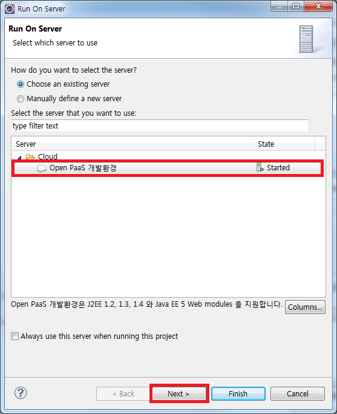

3. Refer to [***“Add and Remove”***](#51-애플리케이션-배포) for the next procedures.

##### Add when adding a server

[***“서버 추가”***](#41-서버-추가) 과정과 동일하므로 해당 내용 참고


### 5.2 애플리케이션 목록 확인

애플리케이션 목록 조회를 원하는 개방형 플랫폼 서버를 더블 클릭하여 서버 편집기를 실행한다.  
편집기에서 애플리케이션이라는 목록을 찾으면 아래에 리스트로 배포되어 있는 애플리케이션 목록을 확인 할 수 있다.  
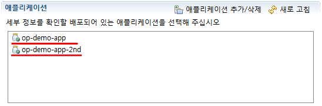

### 5.3 애플리케이션 라우트 관리

1. 애플리케이션 라우트 관리를 원하는 개방형 플랫폼 서버를 더블 클릭하여
    서버 편집기를 실행한다.  
    편집기에서 라우트라는 목록을 찾는다.  
    “제거…” 버튼을 클릭한다.  
    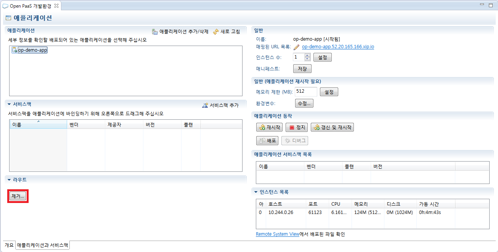

2.  “클라우드 라우트 목록” 대화창이 표시된다. 이 대화창은 클라우드 라우트 목록을 조회 또는 제거 할 수 있는
    대화창이다.  
    제거를 원하는 라우트를 클릭 한 뒤, “제거”를 클릭하고 “Finish” 버튼을
    클릭하면 라우트가 삭제된다.  
    “Cancel” 버튼을 클릭하면 삭제될 라우트들이 복구된다.  
    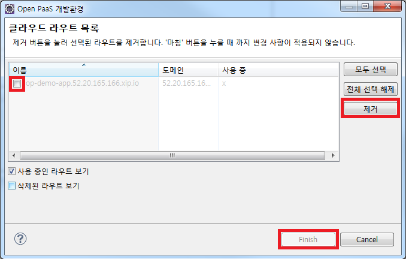

### 5.4 애플리케이션 인스턴스 관리

애플리케이션 라우트 관리를 원하는 개방형 플랫폼 서버를 더블 클릭하여
서버 편집기를 실행한다.  
편집기에서 애플리케이션 목록을 찾아 인스턴스 관리를 원하는
애플리케이션을 리스트에서 찾아 클릭한다.  


편집기의 오른쪽 화면에 애플리케이션 인스턴스에 대한 다양한 정보들이
표시된다.  
표시되는 정보는 아래와 같다.
* 일반 : 이름, 시작 상태, 매핑된 URL, 인스턴스 수, 매니페스트
* 일반(애플리케이션 재시작 필요) : 메모리 제한, 환경 변수
* 애플리케이션 동작 : 재시작, 정지, 갱신 및 재시작, 배포, 디버그
* 애플리케이션 서비스팩 목록 : 이름 ,벤더, 플랜, 버전
* 인스턴스 목록 : 호스트, 포트, CPU, 메모리, 디스크, 가동 시간

##### 매핑된 URL 목록 조회

1. 일반 섹션에서 매핑된 URL 목록 항목을 찾는다.  
      “연필” 모양의 아이콘을 클릭한다.  
     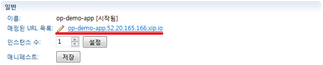

2. “매핑된 URL 설정” 대화창이 표시된다.  
      이 대화창은 ”매핑된 URL”을 관리 할 수 있는 대화창이다.  
      이 대화창의 첫 페이지에서 “매핑된 URL” 목록을 확인 할 수 있다.

##### 매핑된 URL 추가

1. [***“매핑된 URL 목록 조회”***](#매핑된-url-목록-조회) 과정을 진행한다.

2. “매핑할 URL”을 추가하기 위해 오른쪽에 “추가” 버튼을 클릭한다.  
    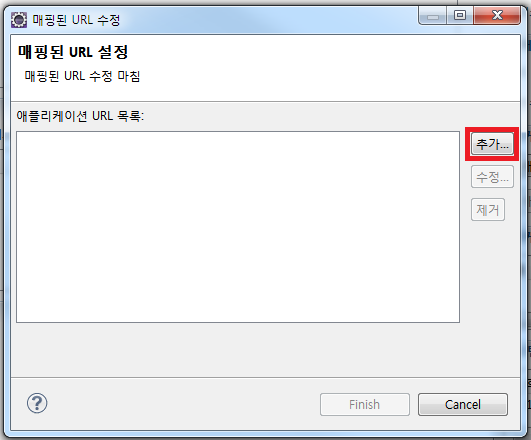

3. “추가 또는 애플리케이션 URL 수정” 대화창이 표시된다. 이 대화창은 애플리케이션을 추가 할 수 있는 대화창이다.  
      원하는 서브도메인을 작성하고, 도메인을 선택하면 “배포된 URL”이 자동으로 작성된다.  
      작성이 완료 되었으면 “Finish” 버튼을 클릭한다.  
      "Cancel” 버튼을 클릭하면 종료된다.    
     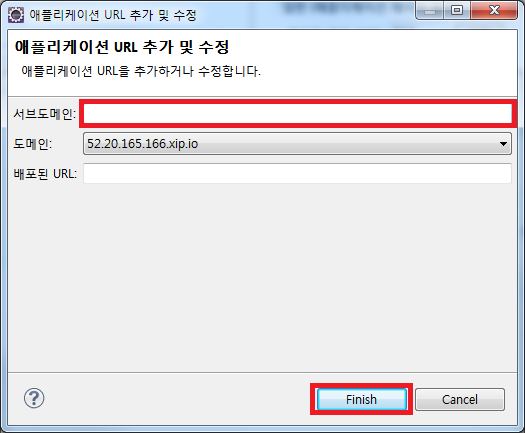

4. 현재 상태에서는 “매핑된 URL” 추가 사항이 플랫폼 서버에 반영되지 않았으므로 “매핑된 URL” 설정 대화창에서 “Finish” 버튼을 눌러야 최종 완료가 된다. 만약 “Cancel” 버튼을 클릭하면 지금까지 진행한 모든 작업들이 취소된다.  
    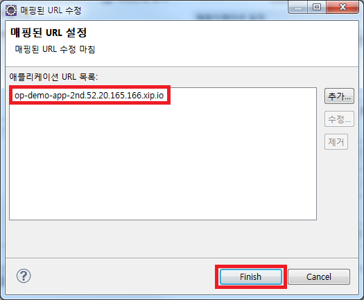
  
##### 매핑된 URL 수정
 
1. [***“매핑된 URL 목록 조회”***](#매핑된-url-목록-조회) 과정을 진행한다.

2. “매핑할 URL”을 수정하기 위해 목록에서 수정을 원하는 “매핑된 URL”을 선택한다. 그리고 오른쪽에 “수정” 버튼을 클릭한다.    
    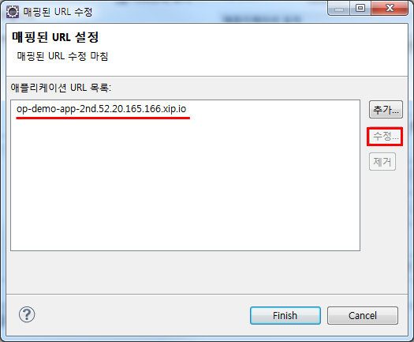

3. “추가 또는 애플리케이션 URL 수정” 대화창이 표시된다. 이 대화창은 애플리케이션을 수정 할 수 있는 대화창이다.  
      원하는 서브도메인을 수정하고, 도메인을 선택하면 “배포된 URL”이 자동으로 작성된다.  
      작성이 완료 되었으면 “Finish” 버튼을 클릭한다.  
    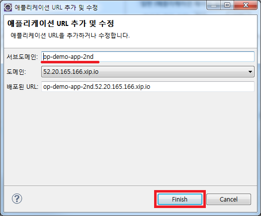

4. 현재 상태에서는 “매핑된 URL” 수정 사항이 플랫폼 서버에 반영되지 않았으므로 “매핑된 URL” 설정 대화창에서 “Finish” 버튼을 눌러야 최종 완료가 된다. 만약 “Cancel” 버튼을 클릭하면 지금까지 진행한 모든 작업들이 취소된다.  
    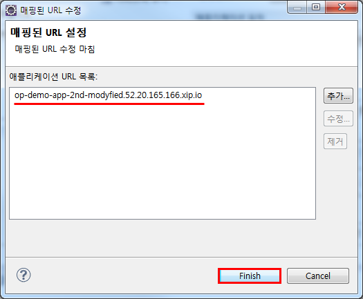

##### 매핑된 URL 제거

1. [***“매핑된 URL 목록 조회”***](#매핑된-url-목록-조회) 과정을 진행한다.

2. 매핑할 URL을 삭제하기 위해 목록에서 수정을 원하는 매핑된 URL을 선택한다. 그리고 오른쪽에 “삭제” 버튼을 클릭한다.  
     그리고 “Finish” 버튼을 눌러야 최종 완료가 된다. 만약 “Cancel” 버튼을 클릭하면 지금까지 진행한 모든 작업들이 취소된다.    
    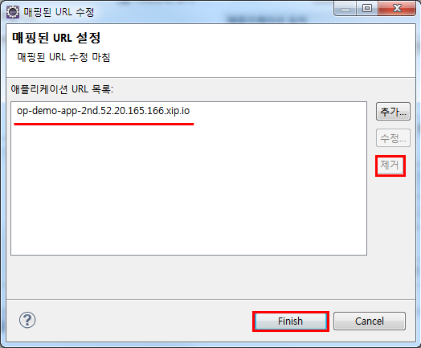

##### 인스턴스 수 변경

일반 섹션에서 인스턴스 수 항목을 찾는다.  
원하는 인스턴스 수만큼 변경 후 설정 버튼을 클릭한다.  
인스턴스 변경이 완료 된다.    
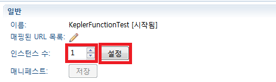

##### 메모리 제한

일반(애플리케이션 재시작 필요) 섹션에서 메모리 제한(MB) 항목을 찾는다.  
원하는 메모리 제한만큼 변경 후 설정 버튼을 클릭한다.  
메모리 제한 변경이 완료 된다.    


##### 환경 변수 목록 조회

1. 일반(애플리케이션 재시작 필요) 섹션에서 환경변수 항목을 찾아 옆의 “수정” 버튼을 클릭한다.  
    

2. “환경변수” 대화창이 표시된다. 이 대화창은 환경 변수를 관리 할 수 있는 대화창이다.  
      이 대화창의 첫 페이지는 환경 변수 목록을 보여준다.  
    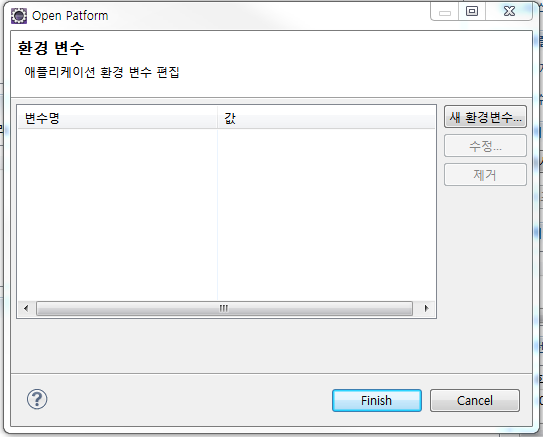

##### 환경 변수 추가

1. [***“환경 변수 목록 조회”***](#환경-변수-목록-조회) 과정을 진행한다

2. 환경 변수를 추가하기 위해 오른쪽에 “추가” 버튼을 클릭한다.  
    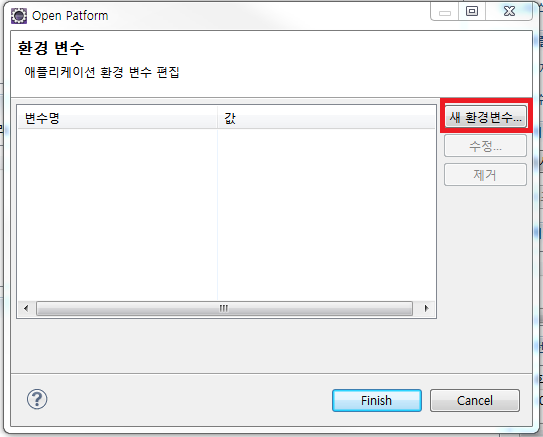

3. “변수 이름과 값을 입력해 주십시오.” 대화창이 표시된다.  
      이 대화창은 환경 변수 추가 할 수 있는 대화창이다.  
      원하는 이름과 값을 작성 후, “OK” 버튼을 클릭한다.    
    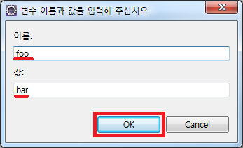

4. 현재 상태에서는 환경 변수가 플랫폼 서버에 반영되지 않았으므로, 환경 변수 대화창에서 “Finish” 버튼을 클릭하면 반영이 완료된다. “Cancel” 버튼을 클릭하면 변경 사항이 적용되지 않는다.  
    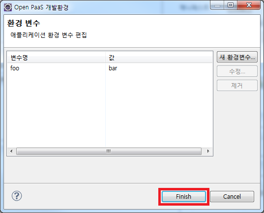

##### 환경 변수 수정

1. [***“환경 변수 목록 조회”***](#환경-변수-목록-조회) 과정을 진행한다.

2. 환경 변수를 추가하기 위해 환경 변수 목록에서 수정을 원하는 환경 변수를 클릭 후 오른쪽 “수정” 버튼을 클릭한다.  
     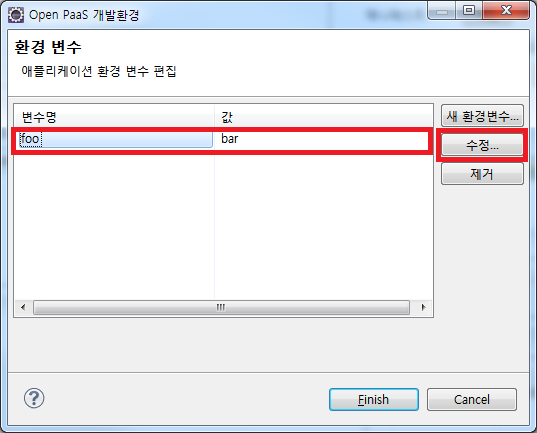

3. 변수 이름과 값을 입력해 주십시오. 대화창이 표시된다. 이 대화창은 환경 변수 수정 할 수 있는 대화창이다.  
      원하는 이름과 값을 수정 후, “OK” 버튼을 클릭한다.  
      “Cancel” 버튼을 클릭하면 변수의 이름과 값이 입력되지 않는다.    
     

4. 현재 상태에서는 환경 변수 수정 사항이 플랫폼 서버에 반영되지 않았으므로, 환경 변수 대화창에서 “Finish” 버튼을 클릭하면 반영이 완료된다. “Cancel” 버튼을 클릭하면 변경 사항이 적용되지 않는다.  
     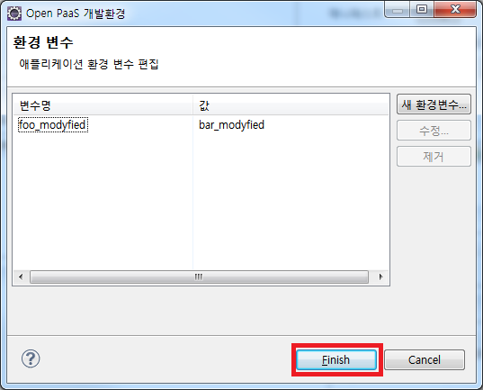

##### 환경 변수 삭제

1. [***“환경 변수 목록 조회”***](#환경-변수-목록-조회) 과정을 진행한다

2. 환경 변수를 추가하기 위해 환경 변수 목록에서 삭제를 원하는 환경 변수를 클릭한다.  
      오른쪽에 “삭제” 버튼을 클릭한다.  
       현재 상태에서는 환경 변수 삭제 작업이 플랫폼 서버에 반영되지 않았으므로, 환경 변수 대화창에서 “Finish” 버튼을 클릭하면 반영이 완료된다. “Cancel” 버튼을 클릭하면 변경 사항이 적용되지 않는다.  
     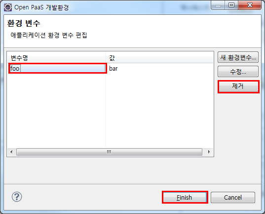

##### 애플리케이션 재시작

[***애플리케이션 인스턴스 관리***](#54-애플리케이션-인스턴스-관리) 화면에서 애플리케이션 동작 섹션을 찾는다.  
      “재시작” 버튼을 클릭하면 재시작 작업을 수행한다.    


##### 애플리케이션 정지

[***애플리케이션 인스턴스 관리***](#54-애플리케이션-인스턴스-관리) 화면에서 애플리케이션 동작 섹션을 찾는다.  
      “정지” 버튼을 클릭하면 정지 작업을 수행한다.    


##### 애플리케이션 갱신 및 재시작

[***애플리케이션 인스턴스 관리***](#54-애플리케이션-인스턴스-관리) 화면에서 애플리케이션 동작 섹션을 찾는다.  
      “갱신 및 재시작” 버튼을 클릭하면 갱신 및 재시작 작업을 수행한다.  


##### 애플리케이션 배포

[***애플리케이션 인스턴스 관리***](#54-애플리케이션-인스턴스-관리)에서 애플리케이션 동작 섹션을 찾는다.  
      “배포” 버튼을 클릭하면 배포작업을 수행한다.    


### 5.5 애플리케이션 삭제

1. 애플리케이션 삭제를 원하는 개방형 플랫폼 서버를 더블 클릭하여 서버
    편집기를 실행한다.  
    편집기에서 애플리케이션 목록을 찾아 삭제를 원하는 애플리케이션을
    리스트에서 찾아 선택하고, 마우스 오른쪽 버튼을 클릭한 뒤, “제거”
    버튼을 클릭한다.  
     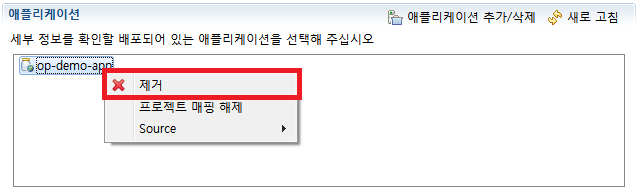

2. 만약 서비스팩 인스턴스와 바인딩이 되어 있다면 “서비스팩 삭제”
    대화창이 표시된다. 서비스팩 인스턴스와 바인딩 되어 있지 않다면 다음
    단계로 넘어간다.  
    이 대화창은 바인딩 되어 있는 서비스팩 인스턴스를 삭제 하는
    화면이다.  
    삭제하고자 하는 애플리케이션과 바인딩 되어 있는 서비스팩 인스턴스가
    더 이상 사용 되지 않는다면 체크하여 서비스팩 인스턴스를 삭제하고,
    서비스팩 인스턴스가 다른 애플리케이션에 바인딩 되어 있다면 서비스팩
    인스턴스를 삭제하면 안되므로 체크를 하지 않는다.  
    그리고 “Finish” 버튼을 클릭한다.  
    만약 “Cancel” 버튼을 클릭하면 서비스팩 인스턴스는 삭제되지 않고
    애플리케이션만 삭제된다.  
     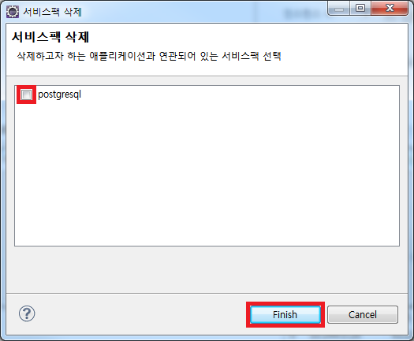

3. 애플리케이션 삭제 확인을 위한 대화상자에서 “OK” 버튼 또는 ”Cancel”
    버튼을 클릭하여 애플리케이션 삭제를 완료하거나 취소한다.    
     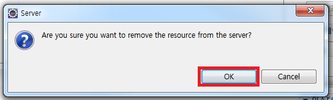

### 5.6 서비스팩 인스턴스 추가

1. 서버 편집기의 “애플리케이션과 서비스팩” 탭을 클릭한다.  
    서비스팩 섹션 타이틀 오른쪽의 “서비스팩 추가” 아이콘을 클릭한다.  
     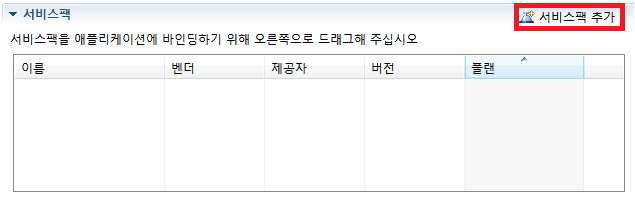

2. “서비스팩 설정” 대화창이 나타난다. 이 대화창에서 서비스팩을 조회 하고, 서비스팩 인스턴스를 추가 할 수
    있다.  
    이용 가능한 서비스팩 목록에서 인스턴스를 생성할 서비스팩을
    선택한다.  
    원하는 서비스팩을 선택하고, 더블 클릭을 하거나 아래에 “추가&gt;&gt;”
    버튼을 클릭한다.  
    그럼 오른쪽에 생성할 서비스팩이 추가된 것을 확인 할 수 있다.  
    그리고 생성할 서비스팩의 인스턴스 이름과 플랜을 설정해준다.  
    플랜은 똑같은 서비스팩을 지원범위나 리소스를 레벨에 따라 다르게
    제공하기 위한 방법을 말한다.  
    이와 같은 과정을 반복하여 여러 개의 서비스팩 인스턴스를 추가 할 수
    있다.  
    그리고 모든 과정이 완료 되면 “Finish” 버튼을 클릭하여 서비스팩
    인스턴스 추가를 완료한다.  
    “Cancel” 버튼을 클릭하면 서비스팩 인스턴스 추가가 취소된다.  
     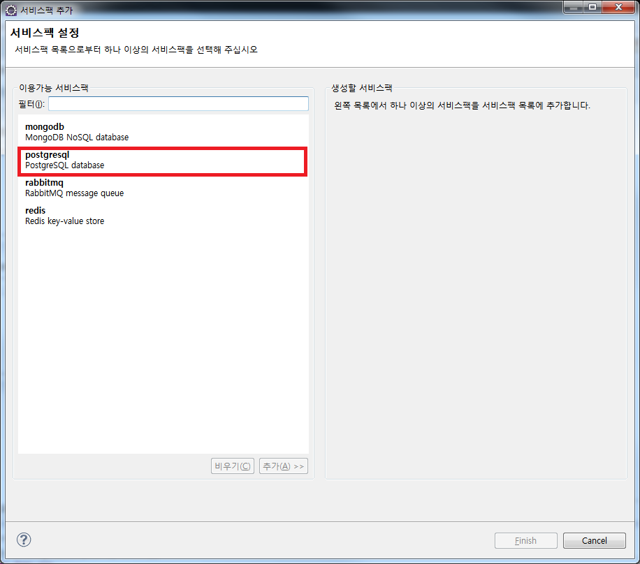  
     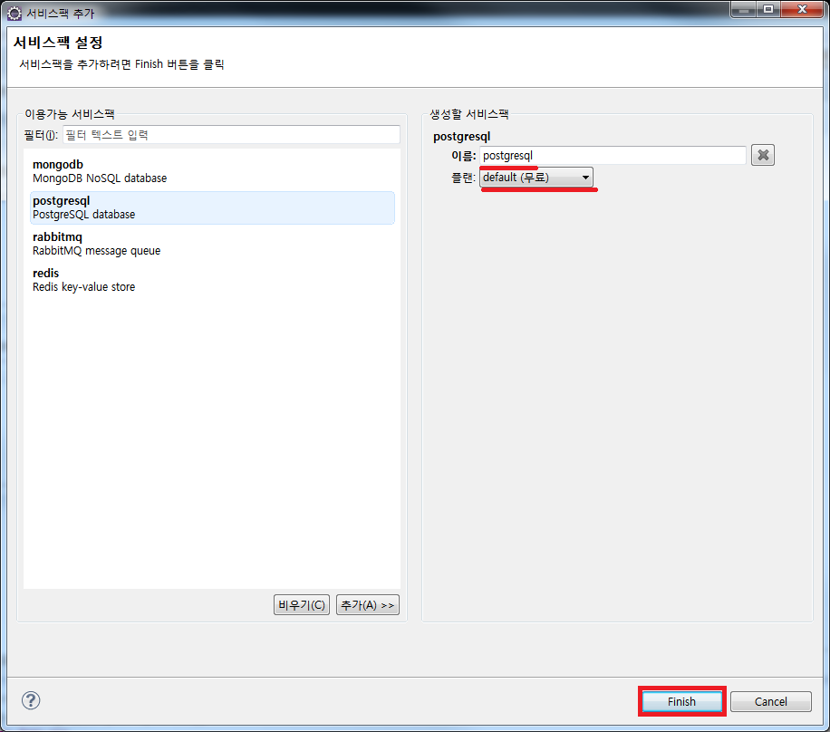

### 5.7 서비스팩 인스턴스 바인딩

1. 서버 편집기의 애플리케이션과 서비스팩 탭을 클릭한다.  
    서비스팩 목록에서 바인딩을 원하는 서비스팩 인스턴스를 선택한 뒤,
    마우스 오른쪽 버튼을 클릭하고, “서비스팩 바인딩 관리…” 메뉴를
    누른다.  
    만약 원하는 서비스팩 인스턴스가 없는 경우 서비스팩 인스턴스 추가
    과정과 동일하게 진행하여 원하는 서비스팩을 추가한다.    
     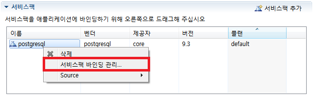

2. “서비스팩 바인딩 관리” 대화창이 표시된다.  
    이 대화창에서 서비스팩 인스턴스와 바인딩 또는 바인딩 해제할
    애플리케이션을 선택할 수 있다.  
    리스트에서 바인딩 할 애플리케이션을 체크 한 후, “Finish” 버튼을
    클릭하면 바인딩이 완료 된다.  
     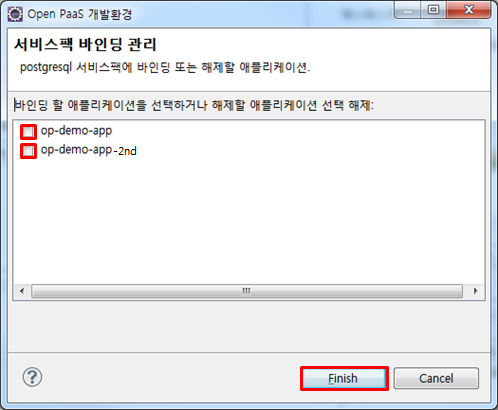

### 5.8 서비스팩 인스턴스 바인딩 해제

1. 서버 편집기의 애플리케이션과 서비스팩 탭을 클릭한다.  
    애플리케이션 서비스팩 목록에서 바인딩을 해제할 서비스팩 인스턴스를
    선택한 뒤, 마우스 우클릭, “서비스팩 바인딩 관리…” 버튼을 누른다.    
     

2. “서비스팩 바인딩 관리” 대화창이 표시된다. 이 대화창은 서비스팩 인스턴스에 바인딩 또는 바인딩 해제할 애플리케이션을 선택하는 대화창이다.  
리스트에서 바인딩을 해제할 애플리케이션을 체크해제 한 후, “Finish” 버튼을 클릭하면 바인딩 해제가 완료 된다.  
     

### 5.9 서비스팩 인스턴스 삭제

1. 서버 편집기의 애플리케이션과 서비스팩 탭을 클릭한다.  
    서비스팩 목록에서 삭제할 서비스팩 인스턴스를 선택한 뒤, 마우스
    우클릭후, “삭제” 메뉴를 클릭한다.  
     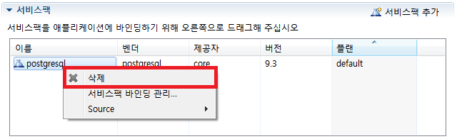

2. “서비스팩 삭제” 대화창이 표시된다..  
    “OK” 버튼을 클릭하면 서비스팩 인스턴스 삭제가 완료된다.  
    “Cancel” 버튼을 클릭하면 서비스팩 인스턴스 삭제가 취소된다.  
     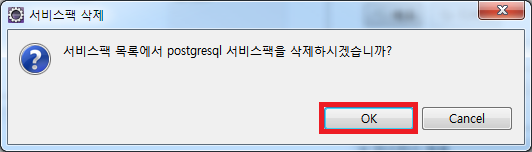

# 6. 매니페스트를 통한 설정

### 6.1 매니페스트 추가

1. 프로젝트의 루트에 매니페스트 파일(manifest.yml)을 추가한다.    
     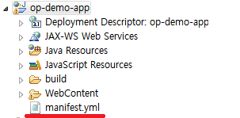
     \* manifest.yml 파일 예시 :    
     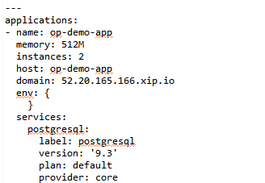
  
2. 애플리케이션을 배포한다.  
    배포방법은 [***“애플리케이션 배포”***](#51-애플리케이션-배포) 과정을 참고한다.  

3. 애플리케이션 배포 위자드 실행시 설정값들이 매니페스트의 값과 동일한
    것을 확인할 수 있다.  
     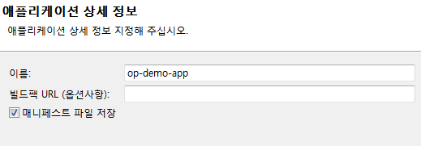

4. 매니페스트 파일(manifest.yml)에 설정한 내용이 반영된 것을 확인할 수 있다.  
       
     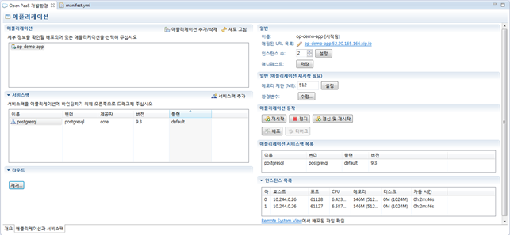

### 6.2 매니페스트 저장

배포한 애플리케이션의 배포 설정을 매니페스트 파일(manifest.yml)로 저장할
수 있다.

1. 애플리케이션과 서비스팩 탭에서 애플리케이션의 상세 화면 조회를 한다.  
     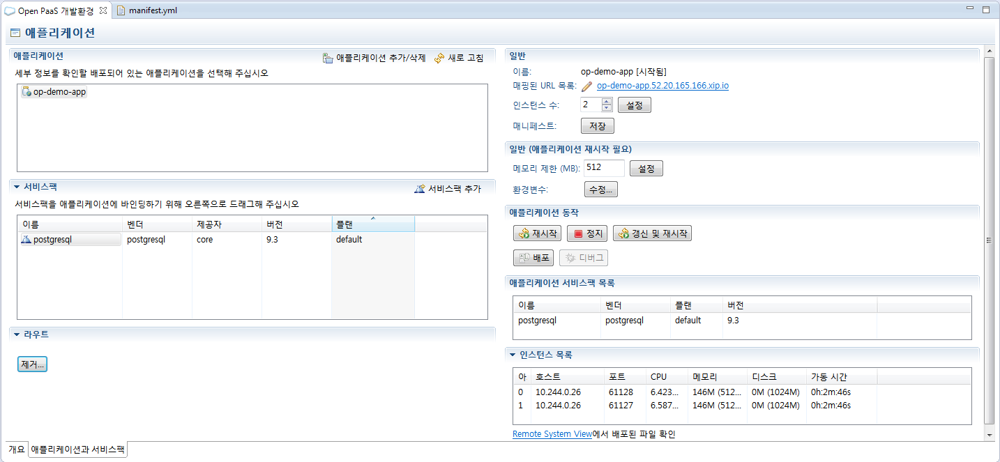

2. 일반 섹션에서 매니페스트 항목의 우측 “저장” 버튼을 클릭한다    
     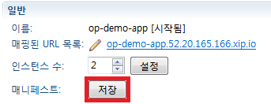

3. 프로젝트에 매니페스트 파일(manifest.yml)이 생성 되었음을 확인한다.  
    이미 매니페스트 파일(manifest.yml)이 있다면 내용이 변경되었는지 확인한다.  
     

# 7. 플러그인 설정(REST API 로그 추적 설정)

1. 플러그인의 설정을 위해 이클립스의 메뉴에서 “Window” – “Preferences”
    를 클릭한다.  
     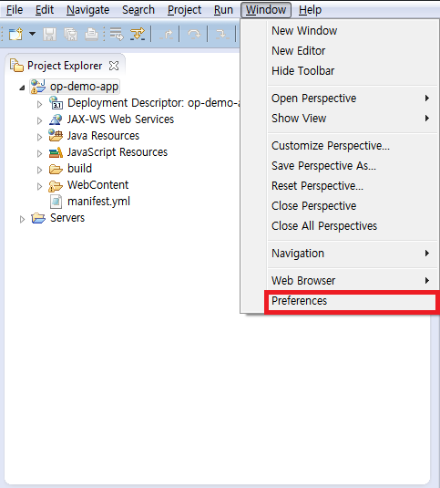

2. “Preferences” 대화창에서 이클립스의 환경 설정을 할 수 있다  
    “Preferences” 대화창의 왼쪽 목록에서 개방형 플랫폼를 찾아서
    클릭하고  
    아래의 “HTTP 로그 추적” 항목을 체크하면 “HTTP 로그 추적” 여부를 설정
    할 수 있다.  
    콘솔창에 “HTTP 로그”를 찍고 싶다면 “HTTP 로그 추적”을 체크하고,
    그렇지 않다면 체크하지 않는다.  
     “OK” 버튼을 클릭하여 설정을 완료한다.  
     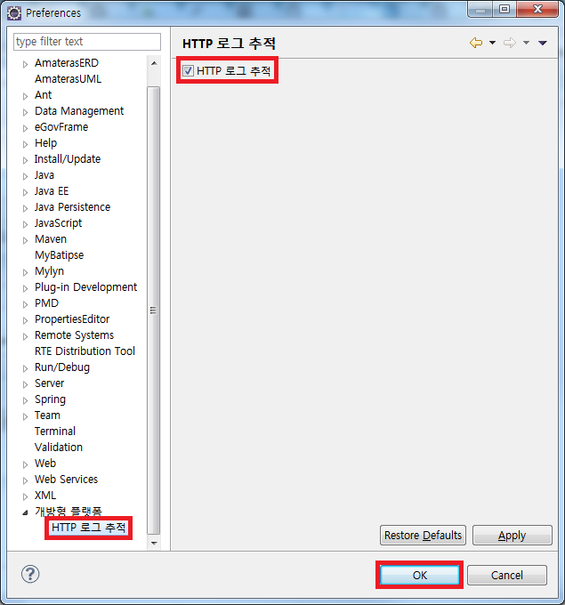


# 8. 예제 프로젝트 설명

해당 예제는 표준프레임워크 3.1 통합예제를 기준으로 작성하였다.  
서비스와 어플리케이션이 바인딩된 상태에서 서비스에 어떻게 접근하는지
예제를 통해 설명한다.

### 8.1 의존성 추가

클라우드 플랫폼에서 서비스에 쉽게 접속할 수 있도록 해주는 Spring Cloud
Connectors를 사용하기 위해 해당 의존성을 추가한다.
```xml
<!-- Spring Cloud Connector Start -->
<dependency>
     <groupId>org.springframework.cloud</groupId>
     <artifactId>spring-cloud-spring-service-connector</artifactId>
     <version>1.2.0.RELEASE</version>
</dependency>
<dependency>
     <groupId>org.springframework.cloud</groupId>
     <artifactId>spring-cloud-cloudfoundry-connector</artifactId>
     <version>1.2.0.RELEASE</version>
</dependency>
<!-- Spring Cloud Connector End -->
```

### 8.2 cloud 네임스페이스 추가

src/main/resources/egovframework/spring/context-datasource.xml 파일을
열어 cloud 네임스페이스를 추가한다.
```xml
<?xml version="1.0" encoding="UTF-8"?>
<beans xmlns="http://www.springframework.org/schema/beans"  xmlns:xsi="http://www.w3.org/2001/XMLSchema-instance"
     xmlns:cloud="http://www.springframework.org/schema/cloud"
     xsi:schemaLocation="http://www.springframework.org/schema/beans http://www.springframework.org/schema/beans/spring-beans-3.2.xsd
          http://www.springframework.org/schema/cloud http://www.springframework.org/schema/cloud/spring-cloud.xsd">
```
  
### 8.3 dataSource 설정 변경

기존의 dataSource 설정을 지우고 새로운 설정을 입력한다.

```xml
<cloud:data-source id="dataSource" service-name="serviceInstanceName">
     <cloud:connection properties="sessionVariables=sql_mode='ANSI';characterEncoding=UTF-8" />
     <cloud:pool pool-size="20" max-wait-time="200" />
</cloud:data-source>
```

### 8.4 dataSource 초기화 설정

애플리케이션 구동시 미리 작성한 SQL 스크립트를 실행하여 DB를 자동으로
초기화 하도록 설정한다.

1. **스크립트 파일 이동**  
   스크립트 파일에 접근하기 위해 script 폴더를 src/main/resources/egovframework로 이동시킨다.

2. **스크립트 파일 수정**  
script\_mysql.sql 파일을 수정한다.  
기존 sql은 실행이 되지 않으므로 일부 수정한다. db생성 구문을 없애고 Drop Table 구문에 IF EXISTS를 추가한다.
```sql
--CREATE DATABASE EASYCOMPANY;

DROP TABLE IF EXISTS `IDS`;
DROP TABLE IF EXISTS `RTETNAUTH`;
DROP TABLE IF EXISTS `RTETNBBS`;
DROP TABLE IF EXISTS `RTETNCART`;
DROP TABLE IF EXISTS `RTETNPURCHSLIST`;
DROP TABLE IF EXISTS `RTETNDLVYINFO`;
DROP TABLE IF EXISTS `RTETNGOODS`;
DROP TABLE IF EXISTS `RTETNCTGRY`;
DROP TABLE IF EXISTS `RTETNGOODSIMAGE`;
DROP TABLE IF EXISTS `RTETNMBER`;
DROP TABLE IF EXISTS `RTETCCODE`;
```

3. **jdbc 네임스페이스 추가**  
src/main/resources/egovframework/spring/context-datasource.xml 파일을 열어 jdbc 네임스페이스를 추가한다.
```xml
<?xml version="1.0" encoding="UTF-8"?>
<beans xmlns="http://www.springframework.org/schema/beans"
     xmlns:xsi="http://www.w3.org/2001/XMLSchema-instance" 
     xmlns:cloud="http://www.springframework.org/schema/cloud"
     xmlns:jdbc="http://www.springframework.org/schema/jdbc"
     xsi:schemaLocation="http://www.springframework.org/schema/beans http://www.springframework.org/schema/beans/spring-beans-3.2.xsd
          http://www.springframework.org/schema/cloud http://www.springframework.org/schema/cloud/spring-cloud.xsd
          http://www.springframework.org/schema/jdbc http://www.springframework.org/schema/jdbc/spring-jdbc-3.2.xsd">
```

4. **데이터베이스 초기화 스크립트 등록**
```xml
<jdbc:initialize-database data-source="dataSource">
<jdbc:script location="classpath:egovframework/script/script_mysql.sql" />
<jdbc:script location="classpath:egovframework/script/data_mysql.sql" />
</jdbc:initialize-database>
```
 

### 8.5 배포시 주의사항

애플리케이션을 배포한다. 배포 방법은 [***애플리케이션 배포***](#51-애플리케이션-배포)를
참고한다.

1.  예제 프로젝트는 메모리를 많이 차지하기 때문에 배포시 메모리 설정은
    1024mb 이상으로 설정한다.
2.  본 예제는 MySql 기반으로 작성하였다. MySql 서비스 인스턴스를
    생성하여 바인딩을 한다.
3.  cloud:data-source 의 service-name 설정과 바인딩시킬 서비스 인스턴스
    이름을 일치시켜야 한다.


### [Index](https://github.com/PaaS-TA/Guide-eng/blob/master/README.md) > [AP User Guide](../README.md) > Eclipse Tools for ClF 사용
