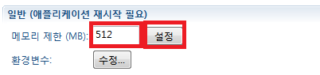

### [Index](https://github.com/PaaS-TA/Guide-eng/blob/master/README.md) > [AP User Guide](../README.md) > Eclipse Tools for Using ClF

# Table Of Contents

1. [Document Outline](#1-문서-개요)  
     1.1. [Purpose](#11-목적)  
     1.2. [Range](#12-범위)  
     1.3. [References](#13-참고자료)  
2. [Preparations Before Installing the Development Environment](#2-개발환경-설치-전-준비사항)  
     2.1. [Preparations Before Installation](#21-설치-전-준비사항)  
     2.2. [Install JAVA Development kit](#22-자바-개발-킷-설치)  
     2.3. [Install e-Government Standard Framework](#23-전자정부-표준프레임워크-설치)  
     2.4. [Install Kepler Version of Eclipse Integrated Development Environment](#24-이클립스-통합개발환경-케플러-버전-설치)  
3. [Install Open PaaS Development Environment](#3-open-paas-개발환경-설치)  
     3.1. [Install Open PaaS Development Environment at e-Government Standard Framework](#31-전자정부-표준프레임워크에-open-paas-개발환경-설치)  
     3.2. [Install Open PaaS Development Environment at Eclipse Integrated Development Environment](#32-이클립스-통합개발환경에-open-paas-개발환경-설치)  
     3.3. [Usage of e-Government Standard Framework Development Environment with Open PaaS Development Environment included](#33-open-paas-개발환경이-포함된-전자정부-표준프레임워크-개발환경-사용)  
4. [Open Platform Server Connection Management](#4-개방형-플랫폼-서버-연결-관리)  
     4.1. [Add Server](#41-서버-추가)  
     4.2. [Register Platform Server Information](#42-플랫폼-서버-정보-등록)  
     4.3. [Replicate Server](#43-서버-복제)  
     4.4. [Modify Server](#44-서버-수정)  
5. [Application and Servicepack Management](#5-애플리케이션-및-서비스팩-관리)  
     5.1. [Application Deployment](#51-애플리케이션-배포)  
     5.2. [Application List Check](#52-애플리케이션-목록-확인)  
     5.3. [Application Route Management](#53-애플리케이션-라우트-관리)  
     5.4. [Application Instance Management](#54-애플리케이션-인스턴스-관리)  
     5.5. [Delete Application](#55-애플리케이션-삭제)  
     5.6. [Add Servicepack Instance](#56-서비스팩-인스턴스-추가)  
     5.7. [Servicepack Instance Binding](#57-서비스팩-인스턴스-바인딩)  
     5.8. [Unbind Servicepack Instance](#58-서비스팩-인스턴스-바인딩-해제)  
     5.9. [Delete Servicepack Instance](#59-서비스팩-인스턴스-삭제)  
6. [Setting through Manifest](#6-매니페스트를-통한-설정)  
     6.1. [Add Manifest](#61-매니페스트-추가)  
     6.2. [Save Manifest](#62-매니페스트-저장)  
7. [Plugin Setting(REST API Log Tracking Settings)](#7-플러그인-설정rest-api-로그-추적-설정)  
8. [Example Project Description](#8-예제-프로젝트-설명)  
     8.1. [Add Dependencies](#81-의존성-추가)  
     8.2. [Add Cloud Namespace0](#82-cloud-네임스페이스-추가)  
     8.3. [Modify dataSource Setting](#83-datasource-설정-변경)  
     8.4. [Set dataSource Reset](#84-datasource-초기화-설정)  
     8.5. [Precautions for deployment](#85-배포시-주의사항)  


# Executive Summary

The purpose of this document is to provide the developers with the necessary environment and the instruction guide when they develop Open PaaS-based applications as they download Open PaaS into the e-Government Framework development environment. The users of the guide are assumed to have basic knowledge about JAVA and JAVA web application development.

The guide is prepared according to the 2 steps below.
* Open PaaS Development Environment Installation
* Open PaaS Development Environment Usage


# 1. Document Outline

### 1.1 Purpose
This document provides a guide on the following: install Open PaaS development environment on e-Government Standard Framework Development Environment and Eclipse IDE, manage and deploy Java Web Application to Open PaaS environment through Open PaaS Development Environment, and manage Servicepack.

### 1.2 Range
The guide provided in this document is written based on e-Government Standard Framework 3.2.0 and Kepler Version of Eclipse (Kepler, 4.3.x).

### 1.3 References
This document refers to Cloud Foundry Eclipse Plugin Document from Cloud Foundry.  
The Cloud Foundry Eclipse Plugin Document:
http://www.eclipse.org/cft/documentation/projectPageLink/CFTProjectPagedocumentation.html

# 2. Preparations Before Installing the Development Environment

### 2.1 Preparation Before Installing

This document provides the installation guide using the 3.1.1 version of the e-Government Standard Framework development environment.
The language used in the e-Government Standard Framework development environment is JAVA, which means Java Development Kit (JDK) or Java Runtime Environment (JRE) should be installed for the execution.
Install JDK before installing the e-Government Framework development environment because Open PaaS Development Environment works as a plugin form. (7 or higher version of Java is recommended.)
If you don't use the e-Government Standard Framework Development Environment, it is alright to install Eclipse instead as it is similar to Eclipse IDE Kepler.

The versions used in the guide.
* jdk-8u60
* Eclipse-jee-kepler-SR2-win32-x86\_64
* openpaas\_dev\_env.jar
* eGovFrameDev-3.1.1

### 2.2 Install JAVA Development kit

1. Access the link below and when the “JavaSE Download” page appears, click the “JDK Download” link shown at the center and it goes to the license agreement page.
[***http://www.oracle.com/technetwork/java/javase/downloads/index.html***](http://www.oracle.com/technetwork/java/javase/downloads/index.html)
2. Agree to the license and download the JDK according to the development environment.
3. Run the installation file and follow the procedures shown on the screen.    
     

4.  Set environment variables for system properties to execute Java commands in command prompt.   

       
       
     

5. Run the command "java –version" at the command prompt to check if the installed JAVA Version outputs properly.  
  
     

### 2.3 Install e-Government Standard Framework

For installing e-Government Standard Framework, Refer to e-Governments Standard Framework's [Guide on installing development environment for developers](http://www.egovframe.go.kr/wiki/doku.php?id=egovframework:dev2:clntinstall).  
> **3.1.1 Version was used**

### 2.4 Install Kepler Version of Eclipse Integrated Development Environment

The installation procedure of the Kepler version of the Eclipse Integrated Development Environment is as follows.

1. Access to [Eclipse IDE Download Page](http://www.eclipse.org/downloads/) from Eclipse's main page.  
     

2. To download Eclipse IDE Kepler Version, click “MORE DOWNLOADS” on the sidebar on the right side of the download page. Click “Eclipse Kepler(4.3)”.  
     

3. When the download screen appears, Download from the right side of “Eclipse IDE for Java EE Developers” by clicking the appropriate link.  
     

4. Unzip the downloaded file and run the “eclipse.exe” file to access Eclipse without any other installation.

# 3. Install Open PaaS Development Environment

In this chapter, the procedure of installing the Open PaaS development environment to the e-Government Standard Framework and Eclipse IDE will be described. If you're using the e-Government Standard Framework Development Environment which includes an Open PaaS development environment, there is no need for extra installation. For Eclipse, use the “openpaas_dev_env.zip” file to install the Open PaaS development environment which is provided as a plugin.

### 3.1 Install Open PaaS Development Environment at e-Government Standard Framework

The procedures for installing an Open PaaS development environment in an e-government standard framework development environment are as follows:

1. Execute the e-Government Standard Framework's development environment and click “Install New Software…” from the “Help” menu.  
     

2. A “Available Software” dialog window will be displayed to proceed to installation.  
    To set the path for the Open PaaS development environment, click the “Add…” button.  
    Click “Cancel” to stop the process and close the screen.  
     

3. Enter the Open PaaS development environment in the “Name” field of the “Add Repository” dialog window
    Click the “Archive” button on the right to find the “openpaas\_dev\_env.jar” file downloaded and click the “OK” button from the “Add Repository” dialog box “OK”.
    Click “Cancel” to cancel the process.    
     

4.  As “Core / Open PaaS” category appears on the dialog box,  
    Select from the checkbox on the left side of the category and click “Next” to proceed to the next step.  
    Click the “Cancel” button to cancel the process and exit the screen.  
     

5. Information about Open PaaS Development Environment can be checked at “Install Details”. Click “Next” to proceed.  
    Click the “Cancel” button to cancel the process and exit the screen.  
     

6.  License of the Open PaaS Development Environment can be checked on the next page.
    Click “I accept the terms of the license agreement” after checking the license and click “Finish”.  
    Click the “Cancel” button to cancel the process and exit the screen.  
     

7. Installation happens with the “Installing Software” dialog box.
   When the “Security Warning” Caution screen appears, click “OK” to resume installation.  
   Cancel installation by clicking the “Cancel” button.  
     

8. When the installation is completed, the “Software Updates” dialog box appears.
 To let the Open PaaS development environment be applied properly, Restart is necessary.
 Click “Yes” to let the e-Government Standard Framework restart.  
 If not, click the “No” button and the e-Government Standard Framework does not restart and Open PaaS Development Environment cannot be used.  
     

9. If restarted, the installation has been completed.

### 3.2 Install Open PaaS Development Environment at Eclipse Integrated Development Environment

For procedures for installing the Open PaaS Development Environment at Eclipse IDE, refer to “3.1 Install Open PaaS Development Environment at e-Government Standard Framework”.

### 3.3 Usage of e-Government Standard Framework Development Environment with Open PaaS Development Environment included
No other installation is required since Open PaaS Development Environment is installed at the e-Government Standard Framework Development Environment. It is possible to start with 4. Open Platform Server Connection Management.

# 4. Open Platform Server Connection Management

This chapter describes how to connect an open platform server.

### 4.1 Add Server

1. Click “New” – “Server” from the “Servers” tab to add a server.  
     

2. A “Define a New Server” dialog box appears. This dialog box is the screen to select the type and create a server.  
    Select “Open PaaS” – “Open Cloud Platform” from the list. 
    Input ”Server name”. (If there is no server name entered, the default name “Open PaaS” will be given.)  
    Click “Next” to proceed to the next page.  
    Click the “Cancel” button to cancel the process and exit the screen.  
     

3. “Open PaaS Account” dialog box appears. This dialog box logs in to Open PaaS to access the organization and space Open PaaS.  
    Enter email and password and click the Confirm Account button to check the validity of the account.  
    When the account is successfully verified, the "Next" button is activated.  
    Click “Next” to proceed to the next page.  
    Click the “Cancel” button to cancel the process and exit the screen.  
    

     > *The URL address shown in the "URL" column above is an arbitrary address. Must follow the procedure below to register the platform server information where the actual Open PaaS is deployed.  
     > Refer to [***4.2 Register Platform Server Information***](#42-플랫폼-서버-정보-등록).
     

4. “Organization and Space” list dialog box appears. This dialog box shows all the organization and space the corresponding account has. It can select organizations and space to manage.  
    Select the organization and space to manage and click “Next” and proceed to the next page. (create organization or space if there are none. Space and Organization cannot be created in Eclipse Development Environment as of the moment CLI has to be installed to create. Refer to [***OpenPaas CLi Guide.md***](OpenPaas CLi 가이드.md)installation and use guide of CLI.)  
    Click “Cancel” button to cancel the process and exit the screen.  
    

5. “Add and Remove” Screen appears.  
    This dialog box purpose is deploy or delete application to an Open PaaS Environment.  
    List of applications that can be deployed are marked as “Available”. “Configured” for applications that are already or expected to be deployed.  
    Click the application to deploy from “Available”.   
    Click “Add” to move to “Configured” and click “Finish” to complete
    application deployment.  
    When the application deployment is finished, the server to manage will be added.  
    Click “Cancel” button to cancel the process and exit the screen.  
    

### 4.2 Register Platform Server Information

1. Click “Manage Platform Server…” and execute “Manage Platform Server URL” dialog box.  
  Click “Add” button to add Platform Server URL.    
    

2. The Add and Platform URL Validation dialog window is displayed.  
  Enter server name and URL of the selected platform and click “Finish”.  
  Click “Cancel” button to cancel the process and exit the screen.    
     

3. The added Platform Server URL are not reflected in the current state.
  Click “Finish” from the “Manage Platform Server URL” dialog box to complete the process.
  Click “Cancel” button to cancel the process and exit the screen.    
     


### 4.3 Replicate Server

Targeted Space cannot be modified from Open Platfrom Server Connection Information.
To change from the same open platform server to a different target space,
space must be reset by replicating Open Platform Server Connection Information.

1. Select the server to replicate from the “Servers” tab,
    right click and click “Replicate Server”.  
     

2. “Organization and Space List” dialog box appears. The purpose of this dialog box is to select the organization and space to replicate.  
    Select the space to replicate and click “Finish”.  
    Click “Cancel” to quit replicating spcae from the organization.  
     

3. The selected space will be replicated with the name of its own and will be added to the list of “Servers” tab.  
    

### 4.4 Modify Server

Server modification can only modify the management server name

1. Double click the management server name to modify from the “Servers” tab.  
     

2. “Outline” dialog box appears. The purpose of this dialog box is to check server and account's information, and manage server status.  
    Modify the server's name and click “File” – “Save” from the menu.  
     

# 5. Application and Servicepack Management

This chapter describes the procedure for managing applications and service packs in an Open PaaS Development Environment.

### 5.1 Application Deployment

#####  Add by “Add and Remove”

1. Select the management server for application deployment from the “Servers” tab, right click and click “Add and Remove”.    
     

2. “Add and Remove” dialog box appears. This dialog box allows to deploy and delete applications in an Open PaaS environment.  
    List of applications that can be deployed are marked as “Available”. “Configured” for applications that are already or expected to be deployed.  
    Click the application to deploy from “Available”.   
    Click “Add” to move to “Configured” and click “Finish” to complete application deployment.  
    For first deployment, there are several settings to do.  
    

3. (For first deployment ONLY)  
    “Application Detailed Information” dialog box appears. This dailog box allows to set the name of the application, the build pack URL, and whether to save the manifest file.  
    Enter the name at “Name” input box. (Default name is the current project name.)  
    “Buildpack URL” can be used as an registered option when you want to use a buildpack that is not supported in the platform. It can be left as a blank when there is no buildpack to use.  
    Check “Save Manifest File” checkbox.  
    Click “Next” button to proceed to the next page.  
    Click “Finish” button to reflect the current status and deploy.  
    Click "Cancel” to cancel deployment.  
    

4. “Execute Deployment” dialog box appears. This dialog box specifies the domain and subdomain of the application, checks the "Deployed URL", and sets the memory limit and whether the deployed application should be started.  
    Enter the “Subdomain” name.(Default name is the current project name.)  
    Select Domain.  
    “Deployed URL” will be automatically be combine the subdomain and domain.  
    Enter the memory limit at the memory limit input box. (Default value is 512.)  
    After setting, click “Next” to proceed to the next page.  
    Click “Finish” button to reflect the current status and deploy.  
    Click "Cancel” to cancel deployment.  
    

5. “Select Servicepack” dialog box appears. This dialog box can add or bind a service pack instance to bind to the application.  
      Select the service pack instance to bind with the application.  
      If there is no wanted service instance, click “Add Servicepack” icon and create servicepack instance.  
      Refer to [***5.6 Add Servicepack Instance***](#56-서비스팩-인스턴스-추가) for instructions on how to add servicepack instance.  
      Select the servicepack instance of your choice and click “Next” to proceed to the next page.  
      Click “Finish” button to reflect the current status and deploy.  
      Click "Cancel” to cancel deployment.  
    

6. “Environment Variables” dialog box appears. This dialog box allows to add, modify, and delete environment variables in an application.  
      Refer to [***5.4 Application Instance Management***](#54-애플리케이션-인스턴스-관리) for environment variable add, delete, and modify.  
      Click “Finish” button to reflect the current status of modifying the environment variable and deploying.  
      Click "Cancel” to cancel deployment.  
    

7. Once the deployment is complete, the deployed applications can be checked from the "Applications and Service Packs" tab of the Server Editor.  
    

##### Add by dragging

1. Double-click the open platform server to deploy the application to run the server editor.  
      Drag the project you want to deploy to the application section to complete the deployment.  
      If deployment is done for the first time, next step must be taken to set up for deployment.  
    

2. Has the same procedure as [***“Add and Remove”***](#51-애플리케이션-배포). Refer from number 2 of the chapter.

##### Add with Application Add/Delete button

1.    Double-click the open platform server to deploy the application to run the server editor.  
      Click the Add/Delete Application button to deploy the application..  
    

2. Refer to [***“Add and Remove”***](#51-애플리케이션-배포) for the procedures.

##### Add by project context menu

1. Select a project to deploy from “Package Explorer” and select “Run As” – “Run on Server” by right clicking .  
    

2. "Run On Server” dialog box appears. This dialog box allows to select the server to depoy.  
      From “Servers”list, select “Cloud” – “Open PaaS”.(If “Cloud” – “Open PaaS” cannot be found from the list, add server or click “Choose an existing server” from “How do you want to select the server?” radio button.)  
      Click “Next” button to start deployment.  
      Click Finish” button to complete deployment.  
    

3. Refer to [***“Add and Remove”***](#51-애플리케이션-배포) for the next procedures.

##### Add when adding a server

Refer to [***“Add Server”***](#41-서버-추가) for the procedures


### 5.2 Application List Check

Double-click the open platform server to check the application list to run the server editor.  
List of deployed applications can be found from the application list found at the editor.  


### 5.3 Application Route Management

1. Double-click the Open Platform of the application route to manage and execute the server editor.  
    Find “Route” list from the editor.  
    Click “Remove…” button.  
    

2.  “Cloud Route List” dialog box appears. This dialog box allows to check or remove cloud route list.  
    Click the route to remove and click “Remove” then click “Finish” to complete deleting the route.  
    Click “Cancel” and the routes to be deleted will be restored.  
    

### 5.4 Application Instance Management

Double-click Open platform server to manage application routes and run the server editor.  
Find the application list from the editor and locate and click the application from the list to manage the instance.  


Various information about the application instance is displayed on the right screen of the editor.  
Informations shown are as follows:
* General : Name, Start Status, Mapping URL, Number of Instance, Manifest
* General(Apllication restart required) : Memory Limit , Environment Variable
* Application Behavior : Restart, Stop, Update and Restart, Deployment, Debug
* Application Servicepack List : Name , vendor, plan, version
* Instance List : Host, Port, CPU, Memory, Disk, run hour

##### Check Mapped URL List

1. Locate the mapped URL list item in the General section..  
      Click the “Pencil” icon.  
     

2. “Create Mapped URL” dialog box appears.  
      This dialog box lets you manage ”Mapped URL”.  
      List of “Mapped URL” can be found at the fist page of the dialog box.

##### Add Mapped URL

1. Do [***“Check Mapped URL List”***](#매핑된-url-목록-조회) process.

2. Click “Add” button at the right to add “URL to be mapped”.  
    

3. “Add or Modify Application URL” dialog box appears. Applications can be added through this dialog box.  
      Enter the subdomain of your choice and select domain. “Deployed URL” will be entered automatically.  
      Click “Finish” after inputting.  
      Click "Cancel” button to dismiss.    
     

4. The “Mapped URL” is not reflected to the current platform server state. Click “Finish” button from the “Mapped URL” setting dialog box to complete. If “Cancel” button is clicked, the process done so far gets cancelled.  
    
  
##### Modify Mapped URL
 
1. Do [***“Check Mapped URL List”***](#매핑된-url-목록-조회) process.

2. To modify “URL to Map”, select “Mapped URL” to modify from the list and click “Modify” button.    
    

3. “Add or Modify Application URL” dialog box appears. This dialog box allows to modify application.  
      Enter the subdomain of your choice and select domain. “Deployed URL” will be entered automatically.  
      Click “Finish” button after inputting.  
    

4. The “Mapped URL” is not reflected to the current platform server state. Click “Finish” button from the “Mapped URL” setting dialog box to complete. If “Cancel” button is clicked, the process done so far gets cancelled.  
    

##### Remove Mapped URL

1. Do [***“Check Mapped URL List”***](#매핑된-url-목록-조회) process.

2. To delete the URL to be mapped, select the mapped URL to modify from the list. Click “Delete” button at the right and click “Finish” to complete the process.
    Click “Cancel” to cancel all the process done.    
    

##### Modify Number of Instances

Look up for the number of instance from the general section.  
Modify the number of instances to as much as you want and click set button.  
Number of instance modification  is completed.    


##### Memory Limit

Look for memory limit(MB) from the General(Application restart required) section.  
After changing the memory limit to as much as you want, click the set button.  
Memory limit modification is completed.    


##### Check Environment Variable List

1. Look for Environment Variable from the General(Application restart required) section and click “Modify” button from the side.  
    

2. “Environment Variable” dialog box appears. This dialog box allows to manage environment variables.  
      The first page of this dialog box shows the environment variable list.  
    

##### Add Environment Variable

1. Do [***“Check Environment Variable List”***](#환경-변수-목록-조회) process

2. Click “Add” button at the right to add the environment variable.  
    

3. “Enter name and value of the variable.” dialog box appears.  
      This dialog box allows to add environment variables.  
      Enter the name and value you want and click “OK” button.    
    

4. The environment variable is not reflected to the platform server yet. click “Finish” from the environment variable dialog box to complete the process. Click “Cancel” to cancel the process.  
    

##### Modify Environment Variable

1. Do [***“Check Environment Variable List”***](#환경-변수-목록-조회) process.

2. To add the environment variable, modify the environment variable by clicking “Modify” button from the environment variable list.  
     

3. “Enter name and value of the variable.” dialog box appears. This dialog box allows to modify environment variables.  
      Enter the name and value you want and click “OK” button.  
      Click “Cancel” button to cancel inputting the variable name and value.    
     

4. The modified environment variable is not reflected to the platform server yet. click “Finish” from the environment variable dialog box to complete the process. Click “Cancel” to cancel the process.  
     

##### Delete Environment Variable

1. Do [***“Check Environment Variable List”***](#환경-변수-목록-조회) process

2. To delete the environment variable, click the environment variable to delete from the list.  
      Click “Delete” button located at the right.   

3. The modified environment variable is not reflected to the platform server yet. click “Finish” from the environment variable dialog box to complete the process. Click “Cancel” to cancel the process..  
     

##### Restart Application

Look for application behavior section from [***Manage Application Instance***](#54-애플리케이션-인스턴스-관리).  
      Click “Restart” button to restart.    


##### Stop Application

Look for application behavior section from [***Manage Application Instance***](#54-애플리케이션-인스턴스-관리).  
      Click “Stop” to stop the process.    


##### Application Update and Restart

Look for application behavior section from [***Manage Application Instance***](#54-애플리케이션-인스턴스-관리).  
      Click “Update and restart” button to update and restart.  


##### Application Deployment

Look for application behavior section from  [***Manage Application Instance***](#54-애플리케이션-인스턴스-관리).  
      Click “Deploy” button to deploy.    


### 5.5 Delete Application

1. Double-click the open platform server to delete application and execute server editor.  
    Look for the application to delete from the application list of the editor. Right click the selected application and click “Remove” button.  
     

2. If it is binded with the Servicepack instance, click “Delete Servicepack” dialog box appears. 
    If not, proceed to the next step.  
    This dialog box allows to delete the binded servicepack instance.  
    If the application to delete is binded with the servicepack instance that is no longer used, check the service pack instance to delete.
    If not, do not check the servicepack instance.  
    Click “Finish” button to complete.  
    If “Cancel” button is clicked, only application gets deleted and not servicepack instance.  
     

3. When the dialog box to verify the application deletion appears, select from “OK” or ”Cancel”
    button to delete or cancel the process.    
     

### 5.6 Add Servicepack Instance

1. Click “Application and Servicepack” tab from the server editor.  
   Click “Add Servicepack” icon from the right side of Service Pack Section Title.  
     

2. “Servicepack Setting” dialogbox appears. This dialog allows to add servicepack instance and look up servicepack.  
    Select a servicepack to create instance from the available servicepack list.  
    Select and double-click the servicepack you want or click “Add&gt;&gt;” button below.  
    You can check the added service pack to be create at the right side.  
    Set the name and plan of the service instance to create.  
    Plan refers to a way to provide the same servicepack with different levels of support or resources.  
    Multiple servicepack instances can be added by repeating this process.  
    Click “Finish” button to complete adding the servicepack instance process.  
    Click “Cancel” button to cancel adding the servicepack instance.  
       
     

### 5.7 Servicepack Instance Binding

1. Click “Application and Servicepack” tab from the service editor.  
   Select a servicepack instance to bind from the servicepack list. Click “Manage Servicepack Binding…” menu by right clicking.  
   If there is no servicepack instance you want to add, do the same procedure with adding servicepack instance and add the servicepack you want.    
     

2. “Servicepack Binding Management” dialog box appears.  
    The application to bind or unbind with the servicepack can be selected in this dialogbox.  
    Check the application to bind from the list and click “Finish” button to complete binding.  
     

### 5.8 Unbind Servicepack Instance

1. Click “Application and Servicepack” tab from the service editor.  
    Select a servicepack instance to unbind from the servicepack list. Click “Manage Servicepack Binding…” menu by right clicking.    
     

2. ““Servicepack Binding Management” dialog box appears. The application to bind or unbind with the servicepack can be selected in this dialogbox.  
    Check the application to bind from the list and click “Finish” button to complete binding.  
     

### 5.9 Delete Servicepack Instance

1.  Click “Application and Servicepack” tab from the service editor.  
    Select a servicepack instance to delete from the servicepack list. Click “Delete” menu.  
     

2. “Delete Servicepack” dialog box appears대화창이 표시된다..  
    Click “OK” button to complete deleting servicepack instance.  
    Click “Cancel” to cancel deleting the servicepack instance.  
     

# 6. Setting through Manifest

### 6.1 Add Manifest

1. Add Manifest file (manifest.yml) to the route of the project.    
     
     \* manifest.yml file example:    
     
  
2. Deploy application.  
    Refer to [***“Application Deployment”***](#51-애플리케이션-배포) for the deployment procedures.  

3. When executing the application deployment wizard, the manifest values can be found the same as the set values.  
     

4. The reflected settings of the Manifest File(manifest.yml) can be checked.  
       
     

### 6.2 Save Manifest

The deployment settings of the deployed application can be saves as manifest file(manifest.yml).

1. Check the detais of the application from the Application And Servicepack Tab.  
     

2. Click “Save” button from the right side of manifest in General section    
     

3. Check the created Manifest file(manifest.yml) at the project.  
    If the Manifest file(manifest.yml) already exists, check if it was modified.  
     

# 7. Plugin Setting(REST API Log Tracking Settings)

1. Click “Window” – “Preferences” from the Eclipse menu to set plugin.  
     

2. Eclipse environment settings can be done at the “Preferences” dialog box.  
    Click Open Platform from the right side of “Preferences” dialog box and check “HTTP Log Track” below to know the wheter “HTTP Log Tracking” is set or not.  
    If you want to 찍다 "HTTP Log" in the console window, check "HTTP Log Track" do not check if not wanted.  
    Click “OK” button to complete Setting.  
     


# 8. Example Project Description

This example was made based on standard example of Standard Framwork 3.1.  
The example illustrates how to access a service while the service and application are bound.

### 8.1 Add Depenencies

Add dependency to use Spring Cloud Connectors, to access services on the cloud platform easily.
```xml
<!-- Spring Cloud Connector Start -->
<dependency>
     <groupId>org.springframework.cloud</groupId>
     <artifactId>spring-cloud-spring-service-connector</artifactId>
     <version>1.2.0.RELEASE</version>
</dependency>
<dependency>
     <groupId>org.springframework.cloud</groupId>
     <artifactId>spring-cloud-cloudfoundry-connector</artifactId>
     <version>1.2.0.RELEASE</version>
</dependency>
<!-- Spring Cloud Connector End -->
```

### 8.2 Add Cloud Namespace

Open src/main/resources/egovframework/spring/context-datasource.xml file and add Cloud Namespace.
```xml
<?xml version="1.0" encoding="UTF-8"?>
<beans xmlns="http://www.springframework.org/schema/beans"  xmlns:xsi="http://www.w3.org/2001/XMLSchema-instance"
     xmlns:cloud="http://www.springframework.org/schema/cloud"
     xsi:schemaLocation="http://www.springframework.org/schema/beans http://www.springframework.org/schema/beans/spring-beans-3.2.xsd
          http://www.springframework.org/schema/cloud http://www.springframework.org/schema/cloud/spring-cloud.xsd">
```
  
### 8.3 Modify dataSource Settings

Delete the previous dataSource settings and input new setting.

```xml
<cloud:data-source id="dataSource" service-name="serviceInstanceName">
     <cloud:connection properties="sessionVariables=sql_mode='ANSI';characterEncoding=UTF-8" />
     <cloud:pool pool-size="20" max-wait-time="200" />
</cloud:data-source>
```

### 8.4 Set dataSource Reset

Run a pre-written SQL script when running the application to automatically initialize the DB.

1. **Move Script File**  
   Move script folder to src/main/resources/egovframework to acess the script file.

2. **Modify Script File**  
Modify script\_mysql.sql file.  
Make some modifications since the previous SQL cannot be executed. Remove the DB creation syntax and add IF EXISTS to the Drop Table syntax.
```SQL
--CREATE DATABASE EASYCOMPANY;

DROP TABLE IF EXISTS `IDS`;
DROP TABLE IF EXISTS `RTETNAUTH`;
DROP TABLE IF EXISTS `RTETNBBS`;
DROP TABLE IF EXISTS `RTETNCART`;
DROP TABLE IF EXISTS `RTETNPURCHSLIST`;
DROP TABLE IF EXISTS `RTETNDLVYINFO`;
DROP TABLE IF EXISTS `RTETNGOODS`;
DROP TABLE IF EXISTS `RTETNCTGRY`;
DROP TABLE IF EXISTS `RTETNGOODSIMAGE`;
DROP TABLE IF EXISTS `RTETNMBER`;
DROP TABLE IF EXISTS `RTETCCODE`;
```

3. **Add jdbc Namespace**  
Open src/main/resources/egovframework/spring/context-datasource.xml file and add jdbc Namespace.
```xml
<?xml version="1.0" encoding="UTF-8"?>
<beans xmlns="http://www.springframework.org/schema/beans"
     xmlns:xsi="http://www.w3.org/2001/XMLSchema-instance" 
     xmlns:cloud="http://www.springframework.org/schema/cloud"
     xmlns:jdbc="http://www.springframework.org/schema/jdbc"
     xsi:schemaLocation="http://www.springframework.org/schema/beans http://www.springframework.org/schema/beans/spring-beans-3.2.xsd
          http://www.springframework.org/schema/cloud http://www.springframework.org/schema/cloud/spring-cloud.xsd
          http://www.springframework.org/schema/jdbc http://www.springframework.org/schema/jdbc/spring-jdbc-3.2.xsd">
```

4. **Register Database Reset Script**
```xml
<jdbc:initialize-database data-source="dataSource">
<jdbc:script location="classpath:egovframework/script/script_mysql.sql" />
<jdbc:script location="classpath:egovframework/script/data_mysql.sql" />
</jdbc:initialize-database>
```
 

### 8.5 Precautions for deployment

Deploy application. Refer to [***Application Deployment***](#51-애플리케이션-배포) for the deployment procedures.

1.  Set memory as 1024mb and above since the example project takes a lot of memory.
2.  This example was made based on MySql. Create a MySql service instance and bind.
3.  The name of the service instance to bind and service-name setting of the cloud:data-source SHOULD be the same.


### [Index](https://github.com/PaaS-TA/Guide-eng/blob/master/README.md) > [AP User Guide](../README.md) > Eclipse Tools for ClF 사용
