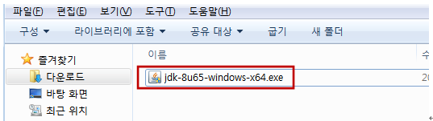
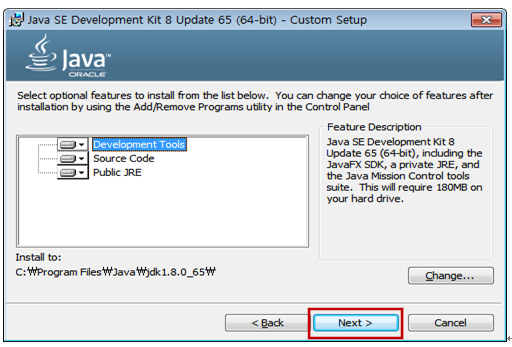
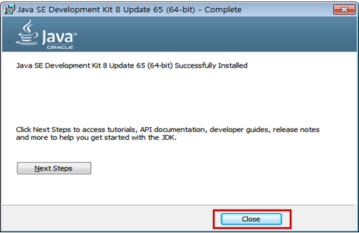

### [Index](https://github.com/PaaS-TA/Guide-eng/blob/master/README.md) > [AP User Guide](../README.md) > Java Development

### 1. Outline

#### 1.1. Document Outline

##### 1.1.1. Purpose
This Document (Java Application Development Guide) presents the service pack of Open PaaS projects (Mysql, Cubrid, MongoDB, RabbitMQ, Radis, and GlusterFS) to work with Java applications and to deploy applications.

##### 1.1.2. Range
The range of this document is limited to the Java application development and service pack linkage of Open PaaS projects..

##### 1.1.3. References
-   [http://java.sun.com](http://java.sun.com)
-   [http://spring.io](http://spring.io)


### 2. JAVA Application Development Guide

#### 2.1. Outline
Various service packs registered in Open PaaS are bound to applications written in Java language, and access information for each service is acquired from environmental information (VCAP_SERVICES) bound to the application, and Java applications can be created in a Windows environment.
 The Java Sample Application provides a UI for REST-based services. Services used include Mysql, Cubrid, Mongodb, Redis, RabbitMq, and ClusterFS, which are available in local and OpenPaas environments. However, ClusterFs do not provide connection information in the Local environment.

#### 2.2. Development Environment Configuration
The development environment is constructed in the following environment for Java application development.
-   OS : Windows 7 64bit
-   Java : 1.8
-   Framwork : Spring-Boot
-   IDE : Eclipse
-   Dependency: Maven

##### 2.2.1. JDK Installation
1.  Download JDK(1.8)

| <span id="__DdeLink__2953_294360055" class="anchor"></span>http://www.oracle.com/technetwork/java/javase/downloads/index-jsp-138363.html |
|-----------------------------------------------------------------------------------|

1.   Download JDK1.8



2. Install JDK

  -  jdk-8u65-windows-x64.exe Double-click to execute installation.



  -  Proceed by clicking the next button.


  -  Installation is executed.


  -   Click Close button to quit installation.

3. JDK  Environment Setting

  -   Right-click on My Computer and click Properties.


  -   Click the Advanced System Settings > Advanced Tapes > Environment Variables button
  -   System Variable Section > Click path > Add the bin of installed jdk directory to path.


4.  Install eclipse

  - Download Eclipse IDE for Java EE Developers from the Eclipse official site.

| <span id="__DdeLink__2953_294360055" class="anchor"></span>http://www.eclipse.org/downloads/ |
|-----------------------------------------------------------------------------------|

  - Select eclipse-jee-mars-1-win32-x86_64.zip and unzzip.


  - Click eclipse.exe.  


  - The eclipse initial screen appears.  


  - Click Project Explore. at the left side and click import.  


  - Click Existing Maven Project.  


  - Click Browse button and select the file with java-sample project. Click Finish button.


  - Verify the added java sample Application.  


#### 2.3. Development
  - OpenPaas Java Sample Application has the following structure. Using the Spring-Boot Library
It can be operated without a separate Tomcat setting. Data management for sample applications uses either MySQL, CubridDB, or MongoDB, so when making an API request, it is determined with the DBType value in the request body.


  - **OpenPaas Java Sample Application Package Structure**

|**Package/File**   |**Description**                 |
|----------|-------------------------|
|Java/sample/biz                  |It is a service section which is a business section.  |
|Java/sample/Config/data          |This is a package that establishes persistence area connection settings such as Mysql, mongodb, redis, clusterFs, cubid, and RabbitMq. Recognize and access the Local/Cloud environment. ClusterFs settings are not supported in the Local environment (Cloud Only)|
|Java/sample /Config/web          |Set the WEB settings information related to MVC, Interceptor, and MultiPart in Sample Application.              |
|Java/sample /controller          |The controller domain that receives the requested information from the UI.            |
|Java/sample/dao                  |Persistence 영역의 데이터를 입력/수정/삭제/조회하는 영역입니다.               |
|Java/sample /model               |VO 영역입니다.     |
|Java/sample /Application.java    |Spring Boot을 활용하여 Sample Application을 Start합니다.   |
|Resource/tables                  |Sample Application이 사용할 DB Table DDL 및 기초데이터 DDL이 포함되어 있습니다.       |
|Resource/ application-cloud.properties  |Sample Application이 Cloud 환경에서 사용할 Property입니다. |
|Resource/ application.properties        |Sample Application이 Local환경에서 사용할 Property입니다.  |
|Resource/logback.xml                    |Logback을 활용한 logging 설정 입니다.   |
|Manifest.yml                            |클라우드 환경에서 Application이 최초 구성될때 사용하는 파일로, Sample Application의 환경정보, 서비스 정보(mysql, rabbitmq등의 서비스), application명, 인스턴스 갯수, 인스턴스 메모리 설정등이 포함되어 있습니다.     |
|pom.xml                                 |Sample Application의 Maven의존성을 정의 합니다.     |
|webapp                                 |UI관련 리소스 위치     |


##### 2.3.1. 애플리케이션 환경 설정
  - 본 문서는 Cloud환경에서 Java Application이 구동 될 수 있는 방법을 제시합니다. Mysql, Cubrid, Redis등의 설치관련 정보는 제공하지 않습니다.

1)   manifest.yml
  - Cloud  


2) resource/application-cloud.properties (application.properties는 Local환경용)
  - Cloud환경에서 적용될 프로퍼티로 Application이 사용할 서비스 명이 설정되어 있습니다.
cubrid 와 GlusterFs는 Spring-cloud-connector에서 정보를 제공하지 않아 Application의 VCAP SERVICE 환경정보를 활용하여 서비스 Connection을 합니다.

```
db.mysql.servicename: mysql-service-instance
mongodb.service.name: mongo-service-instance
redis.service.name:   redis-service-instance
rabbitmq.service.name: rabbitmq-service-instance
```

3) sample/config/data/CloudConfigData.java
  - 애플리케이션의 환경설정  

  ```
  @Profile("cloud") ==> Cloud환경 인식하는 Annotation(manifest.yml의 Env정보와 매팽)
@Configuration    ==> Spring Config
@ServiceScan      ==> Cloud Config Service Scan Annotation
public class CloudDataConfig extends AbstractCloudConfig {

	@Value("${db.mysql.servicename}")
	private String mysqlServiceName; ==> application-cloud.properties의 mysql
                                                서비스 인스턴스명 읽어온다.
	private String cubridJdbcUrl;

	@Value("${mongodb.service.name}")  
	private String mongoServiceName; ==> application-cloud.properties의 mongodb
                                                서비스 인스턴스명 읽어온다.
	@Value("${redis.service.name}")
	private String redisServiceName; ==> application-cloud.properties의 redis
                                                 서비스 인스턴스명 읽어온다
	@Value("${rabbitmq.service.name}")
	private String rabbitServiceName; ==> application-cloud.properties의 redis
                                                 서비스 인스턴스명 읽어온다


	@Bean(name = "dsMysql")
	@Primary
	DataSource mysqlDataSource() {

		CloudFactory cloudFactory = new CloudFactory();
		Cloud cloud = cloudFactory.getCloud();
		ServiceInfo serviceInfo = cloud.getServiceInfo(mysqlServiceName);
		String serviceId = serviceInfo.getId();
		return cloud.getServiceConnector(serviceId, DataSource.class, null);

	}

	@Bean(name = "jdbcMysql")  ==> MySql 서비스 Connection설정
	@Autowired
	public JdbcTemplate mysqlJdbcTemplate(@Qualifier("dsMysql") DataSource dsSlave) {
		return new JdbcTemplate(dsSlave);
	}

	@Bean(name = "dsCubrid")
	public DataSource cubridDataSource() {
		try {

			String vcap_services = System.getenv("VCAP_SERVICES");
			JSONObject jsonObj = JSONObject.fromObject(vcap_services);
			JSONArray userPro = jsonObj.getJSONArray("CubridDB");
			jsonObj = JSONObject.fromObject(userPro.get(0));
			jsonObj = jsonObj.getJSONObject("credentials");
			cubridJdbcUrl = jsonObj.getString("jdbcurl");

			return new SimpleDriverDataSource(cubrid.jdbc.driver.CUBRIDDriver.class.newInstance(), cubridJdbcUrl);
		} catch (Exception e) {
			throw new RuntimeException(e);
		}
	}

	@Bean(name = "jdbcCubrid")  ==> Cubrid 서비스 Connection설정
	@Autowired
	public JdbcTemplate cubridJdbcTemplate(@Qualifier("dsCubrid") DataSource dsSlave) {
		return new JdbcTemplate(dsSlave);
	}

	/**
	 * MongoDBFactory
	 */
	@Autowired
	MongoDbFactory mongoDbFactory;


	@Bean(name = "mongoTemplate")   ==> MongoDB 서비스 Connection설정
	public MongoTemplate mongoTemplate() throws UnknownHostException {

		CloudFactory cloudFactory = new CloudFactory();
		Cloud cloud = cloudFactory.getCloud();
		MongoServiceInfo serviceInfo = (MongoServiceInfo) cloud.getServiceInfo(mongoServiceName);

		// MongoDB 인증 처리
		mongoDbFactory.getDb().authenticate(serviceInfo.getUserName(), serviceInfo.getPassword().toCharArray());

		MongoTemplate mongoTemplate = new MongoTemplate(mongoDbFactory);

		return mongoTemplate;
	}

	@Bean  ==> Redis 서비스 Connection설정
	public JedisPool redisTemplate() {

		CloudFactory cloudFactory = new CloudFactory();
		Cloud cloud = cloudFactory.getCloud();
		RedisServiceInfo serviceInfo = (RedisServiceInfo) cloud.getServiceInfo(redisServiceName);

		JedisPoolConfig poolConfig = new JedisPoolConfig();
		poolConfig.setMaxTotal(128);
		return new JedisPool(poolConfig, serviceInfo.getHost(), serviceInfo.getPort(), 5, serviceInfo.getPassword());
	}

	@Bean
	@Primary
	public CachingConnectionFactory rabbitmqConnectionFactory() throws IOException {

		CloudFactory cloudFactory = new CloudFactory();
		Cloud cloud = cloudFactory.getCloud();

		AmqpServiceInfo serviceInfo = (AmqpServiceInfo) cloud.getServiceInfo(rabbitServiceName);

		ConnectionFactory connectionFactory = new ConnectionFactory();
		connectionFactory.setHost(serviceInfo.getHost());
		connectionFactory.setPort(serviceInfo.getPort());
		connectionFactory.setUsername(serviceInfo.getUserName());
		connectionFactory.setPassword(serviceInfo.getPassword());
		connectionFactory.setVirtualHost(serviceInfo.getVirtualHost());

		try {
			// SslProtocol 사용 설정
			connectionFactory.useSslProtocol("TLS");

		} catch (KeyManagementException e) {
			e.printStackTrace();
		} catch (NoSuchAlgorithmException e) {
			e.printStackTrace();
		}

		CachingConnectionFactory cachingConnectionFactory = new CachingConnectionFactory(connectionFactory);

		return cachingConnectionFactory;
	}

	@Bean  ==> RabbitMQ 서비스 Connection설정
	public RabbitTemplate amqpTemplate(
			@Qualifier("rabbitmqConnectionFactory") CachingConnectionFactory connectionFactory) {

		RabbitTemplate rabbitTemplate = new RabbitTemplate(connectionFactory);

		rabbitTemplate.setQueue("sampleQueue");
		rabbitTemplate.setRoutingKey("sampleQueue");
		rabbitTemplate.setConnectionFactory(connectionFactory);
		return rabbitTemplate;
	}

	@Bean
	public RabbitAdmin rabbitAdmin(@Qualifier("rabbitmqConnectionFactory") CachingConnectionFactory connectionFactory) {

		RabbitAdmin admin = new RabbitAdmin(connectionFactory);
		return admin;
	}

	@Autowired
	Gson gson;

	@Bean  ==> GlusterFs 서비스 Connection설정
	public AccountConfig accountConfig(){

		String vcap_services = System.getenv("VCAP_SERVICES");
        JsonObject jsonObj = gson.fromJson(vcap_services, JsonElement.class).getAsJsonObject();

        JsonArray userPro = jsonObj.getAsJsonArray("glusterfs");
        jsonObj = userPro.get(0).getAsJsonObject().getAsJsonObject("credentials");
//        String provider = jsonObj.get("provider").getAsString();
        String tenantName = jsonObj.get("tenantname").getAsString();
        String username = jsonObj.get("username").getAsString();
        String password = jsonObj.get("password").getAsString();
        String authUrl = jsonObj.get("auth_url").getAsString();

		AccountConfig config = new AccountConfig();
		config.setUsername(username);
		config.setTenantName(tenantName);
		config.setPassword(password);
		config.setAuthUrl(authUrl + "/tokens");
		config.setAuthenticationMethod(AuthenticationMethod.KEYSTONE);
		return config;
	}

}
  ```

4) pom.xml
   - Sample Application에서 사용하는 Maven Dependency


   ```
      <parent>
     		<groupId>org.springframework.boot</groupId>
     		<artifactId>spring-boot-starter-parent</artifactId>
     		<version>1.2.3.RELEASE</version>
     		<relativePath />
     	</parent>

     <dependency>
     			<groupId>org.springframework.cloud</groupId>
     			<artifactId>spring-cloud-starter-config</artifactId>
     		</dependency>

     		<dependency>
     			<groupId>org.springframework.boot</groupId>
     			<artifactId>spring-boot-starter-web</artifactId>
     		</dependency>
     		<dependency>
     			<groupId>org.springframework.boot</groupId>
     			<artifactId>spring-boot-starter-data-jpa</artifactId>
     		</dependency>

     		<dependency>
     			<groupId>org.springframework.boot</groupId>
     			<artifactId>spring-boot-configuration-processor</artifactId>
     			<optional>true</optional>
     		</dependency>
     ==>Spring Boot 의존성


    <!-- Spring Cloud Connector Start -->
 		<dependency>
 			<groupId>org.springframework.cloud</groupId>
 			<artifactId>spring-cloud-spring-service-connector</artifactId>
 		</dependency>

 		<dependency>
 			<groupId>org.springframework.cloud</groupId>
 			<artifactId>spring-cloud-core</artifactId>
 		</dependency>

 		<dependency>
 			<groupId>org.springframework.cloud</groupId>
 			<artifactId>spring-cloud-cloudfoundry-connector</artifactId>
 		</dependency>
 		<!-- Spring Cloud Connector End -->

         ==> Spring Cloud Connector 의존성


 		<!-- MongoDB Dependency Start -->
 		<dependency>
 			<groupId>org.mongodb</groupId>
 			<artifactId>mongo-java-driver</artifactId>
 			<version>2.13.3</version>
 		</dependency>

 		<dependency>
 			<groupId>org.springframework.boot</groupId>
 			<artifactId>spring-boot-starter-data-mongodb</artifactId>
 			<exclusions>
 				<exclusion>
 					<groupId>org.mongodb</groupId>
 					<artifactId>mongo-java-driver</artifactId>
 				</exclusion>
 			</exclusions>
 		</dependency>
 		<!-- MongoDB Dependency End -->

 	<!-- MongoDB Dependency Start -->
 		<dependency>
 			<groupId>org.mongodb</groupId>
 			<artifactId>mongo-java-driver</artifactId>
 			<version>2.13.3</version>
 		</dependency>

 		<dependency>
 			<groupId>org.springframework.boot</groupId>
 			<artifactId>spring-boot-starter-data-mongodb</artifactId>
 			<exclusions>
 				<exclusion>
 					<groupId>org.mongodb</groupId>
 					<artifactId>mongo-java-driver</artifactId>
 				</exclusion>
 			</exclusions>
 		</dependency>
 		<!-- MongoDB Dependency End -->

 		<!-- MySql Connector Start -->
 		<dependency>
 			<groupId>mysql</groupId>
 			<artifactId>mysql-connector-java</artifactId>
 		</dependency>
 		<!-- MySql Connector End -->

 		<!-- Redis Start -->
 		<dependency>
 			<groupId>org.springframework.boot</groupId>
 			<artifactId>spring-boot-starter-redis</artifactId>
 		</dependency>

 		<dependency>
 			<groupId>org.apache.commons</groupId>
 			<artifactId>commons-pool2</artifactId>
 		</dependency>
 		<!-- Redis End -->

 		<!-- RabbitMQ Start -->
 		<dependency>
 			<groupId>org.springframework.boot</groupId>
 			<artifactId>spring-boot-starter-amqp</artifactId>
 		</dependency>

 		<!-- RabbitMQ End -->

 		<!-- Java client for OpenStack Storage Swift(GlusterFS) 설정 -->
 		<!-- GlusterFS Start -->
 		<dependency>
 			<groupId>org.javaswift</groupId>
 			<artifactId>joss</artifactId>
 			<version>0.9.8</version>
 		</dependency>
 		<!-- GlusterFS End -->
   ```
#### 2.3. 개발

  - Java Sample Application은 Spring Boot으로 구성되어 있어 별도의 Tomcat 설정이 필요하지 않습니다.
java package Root에 있는 Application.java 우측 버튼을 클릭 --> Run As --> Java Application실행하면 Sample Application이 실행됩니다.


#### 2.4. 배포
  - cf cli 명령어를 이용하여 Java 샘플 어플리케이션을 배포한다
  - java-sample application이 maven install을 실행하여 war가 존재하여야 한다.
  - cf cli가 설치되어 있고, cf login이 이미 되어 있다는 가정하에 진행한다.
 ```
 ### Java 샘플 어플리케이션 배포
 $ cd “Java 샘플 어플리케이션” 디렉토리

 $cd  /home/csupshin/git/OpenPaaSSample/java-sample-app
 $ cf push
 Using manifest file /home/csupshin/git/OpenPaaSSample/java-sample-app/manifest.yml

Updating app java-sample in org OCP / space dev as admin...
OK

Using route java-sample.52.71.31.153.xip.io
Uploading java-sample...
Uploading app files from: /home/csupshin/git/OpenPaaSSample/java-sample-app/lib/java-sample.war
Uploading 1.6M, 227 files
Done uploading               
OK
Binding service mysql-service-instance to app java-sample in org OCP / space dev as admin...
OK
Binding service cubrid-service-instance to app java-sample in org OCP / space dev as admin...
OK
Binding service redis-service-instance to app java-sample in org OCP / space dev as admin...
OK
Binding service rabbitmq-service-instance to app java-sample in org OCP / space dev as admin...
OK
Binding service glusterfs-service-instance to app java-sample in org OCP / space dev as admin...
OK

Stopping app java-sample in org OCP / space dev as admin...
OK

Starting app java-sample in org OCP / space dev as admin...
Creating container
Successfully created container
Downloading app package...
Downloaded app package (30.5M)
Downloading buildpacks (java_buildpack), build artifacts cache...
Downloading java_buildpack...
Downloading build artifacts cache...
Downloaded java_buildpack
Downloaded build artifacts cache (44.7M)
Downloaded buildpacks
Staging...
-----> Java Buildpack Version: v3.3.1 | https://github.com/cloudfoundry/java-buildpack.git#063836b
-----> Downloading Open Jdk JRE 1.8.0_73 from https://download.run.pivotal.io/openjdk/trusty/x86_64/openjdk-1.8.0_73.tar.gz (found in cache)
       Expanding Open Jdk JRE to .java-buildpack/open_jdk_jre (2.1s)
-----> Downloading Open JDK Like Memory Calculator 2.0.1_RELEASE from https://download.run.pivotal.io/memory-calculator/trusty/x86_64/memory-calculator-2.0.1_RELEASE.tar.gz (found in cache)
       Memory Settings: -Xss995K -Xmx382293K -XX:MaxMetaspaceSize=64M -Xms382293K -XX:MetaspaceSize=64M
-----> Downloading Spring Auto Reconfiguration 1.10.0_RELEASE from https://download.run.pivotal.io/auto-reconfiguration/auto-reconfiguration-1.10.0_RELEASE.jar (found in cache)
       Modifying /WEB-INF/web.xml for Auto Reconfiguration
Exit status 0
Staging complete
Uploading droplet, build artifacts cache...
Uploading droplet...
Uploading build artifacts cache...
Uploaded build artifacts cache (44.7M)
Uploaded droplet (75.4M)
Uploading complete

0 of 1 instances running, 1 starting
0 of 1 instances running, 1 starting
0 of 1 instances running, 1 starting
0 of 1 instances running, 1 starting
0 of 1 instances running, 1 starting
0 of 1 instances running, 1 starting
0 of 1 instances running, 1 starting
1 of 1 instances running

App started


OK

App java-sample was started using this command `CALCULATED_MEMORY=$($PWD/.java-buildpack/open_jdk_jre/bin/java-buildpack-memory-calculator-2.0.1_RELEASE -memorySizes=metaspace:64m.. -memoryWeights=heap:75,metaspace:10,native:10,stack:5 -memoryInitials=heap:100%,metaspace:100% -totMemory=$MEMORY_LIMIT) && SERVER_PORT=$PORT $PWD/.java-buildpack/open_jdk_jre/bin/java -cp $PWD/.:$PWD/.java-buildpack/spring_auto_reconfiguration/spring_auto_reconfiguration-1.10.0_RELEASE.jar -Djava.io.tmpdir=$TMPDIR -XX:OnOutOfMemoryError=$PWD/.java-buildpack/open_jdk_jre/bin/killjava.sh $CALCULATED_MEMORY org.springframework.boot.loader.WarLauncher`

Showing health and status for app java-sample in org OCP / space dev as admin...
OK

requested state: started
instances: 1/1
usage: 512M x 1 instances
urls: java-sample.52.71.31.153.xip.io
last uploaded: Mon Feb 15 06:47:21 UTC 2016
stack: cflinuxfs2
buildpack: java_buildpack

     state     since                    cpu     memory         disk           details   
#0   running   2016-02-15 03:49:33 PM   88.2%   341M of 512M   185.2M of 1G
 ```

#### 2.5. Sample App 배포 확인

1) cf cli 명령어를 이용하여 Java 샘플 어플리케이션의 배포 상태 및 URL을 확인한다.

```
$ cf apps
Getting apps in org OCP / space dev as admin...
OK

name                     requested state   instances   memory   disk   urls   
java-sample              started           1/1         512M     1G     java-sample.52.71.31.153.xip.io   
```

#### 2.6. Sample App 로그인
1) 브라우저에서 java-sample.52.71.31.153.xip.io 에 접속하면 로그인 화면이 나타납니다.
admin/admin 입력후 로그인 합니다.


2) 로그인이 완료되면 다음 조직 화면이 나타납니다. 화면 하단에 집 아이콘을 클릭하면 해당 조직의 상세 조직 화면이 나타납니다. 조직명을 클릭하면 조직의 에하 조직 목록을 조회 할 수 있습니다.


### [Index](https://github.com/PaaS-TA/Guide-eng/blob/master/README.md) > [AP User Guide](../README.md) > Java 개발
