### [Index](https://github.com/PaaS-TA/Guide-eng/blob/master/README.md) > [AP User Guide](../README.md) > Stemcell Development

## Table of Contents
1. [Document Outline](#1--문서-개요)
     * [Purpose](#11--목적)
     * [Range](#12--범위)
     * [References](#13--참고자료)
2. [Environmental Preparation](#2--환경-준비)
     * [Preparations Before Installation](#21--설치전-준비사항)
     * [Configure AWS Environment](#22--aws-환경-구성)
     * [RUBY Installation](#23--ruby-설치)
     * [BOSH Installation](#24--bosh-설치)
     * [Vagrant Installation](#25--vagrant-설치)
     * [VM Installation for Stemcell Creation](#26--스템셀-생성을-위한-vm-설치)
     * [When creating a stem cell by modifying a BOSH Source, etc](#27--bosh-source-등을-수정하여-스템셀을-생성할-경우)
3. [Create default OS Image](#3--기본-os-이미지-생성)
     * [Create Ubuntu OS Image](#31--ubuntu-os-이미지-생성)
     * [Create RHEL OS Image](#32--rhel-os-이미지-생성)
     * [Archive Location for the Default OS Created Image](#33--생성한-기본-os-이미지의-보관장소)
4. [Create BOSH Stemcell](#4--BOSH-스템셀-생성)
     * [Create Stemcell Using the OS Image in Remote Server](#41--원격지의-os-이미지를-사용한-스템셀-생성)
     * [Create Stemcell Using the OS Image in Local Server](#42--로컬의-os-이미지를-사용한-스템셀-생성)
     * [Storage of the Created Stemcell](#43--생성한-스템셀의-보관장소)
5. [Create BOSH Light Stemcell](#5--bosh-light-스템셀-생성)
     * [Create Bosh Light Stemcell](#51--bosh-light-스템셀-생성)
6. [Customizing Stemcell](#6--스템셀-커스터마이징)
     * [Modify Stemcell Creating Source](#61--스템셀-생성-소스-수정)

# 1.  Document Outline

## 1.1.  Purpose 

The purpose is to create user-defined stemcell.

## 1.2.  Range

The guide range describes the establishment of an environment for generating a BOSH stemcell and the contents for generating a BOSH stemcell and a BOSH light stemcell.

## 1.3.  References

This document was writen by referring to Cloud Foundry's BOSH Document.

Create Bosh Stemcell:
[https://github.com/cloudfoundry/bosh-linux-stemcell-builder/blob/master/README.md](https://github.com/cloudfoundry/bosh-linux-stemcell-builder/blob/master/README.md)

# 2.  Environmental Preparation

## 2.1.  Preparations Before Installation

This installation guide is described based on running in a Linux (Ubuntu 14.04 64bit) environment. Ruby and Bosh are installed to generate stemcells. It also configures additional packages and execution environments for installing Ruby and Bosh.

-   AWS Environment
-   rvm
-   Ruby (2.1.6 or 1.9.3-p545)
-   Bundler
-   Bosh
-   Vagrant
-   There should be a internet connection to create a stemcell.

## 2.2.  Configure AWS Environment

BOSH creates and manages VMs that create stemcells on AWS. In order to create a stemcell, an account must be created on AWS and an environment must be configured.

-   AWS Account

	AWS Website: [https://aws.amazon.com/ko/](https://aws.amazon.com/ko/)

-   Access Key Setting

	1.  Login to AWS: [https://console.aws.amazon.com/console/home](https://console.aws.amazon.com/console/home)

		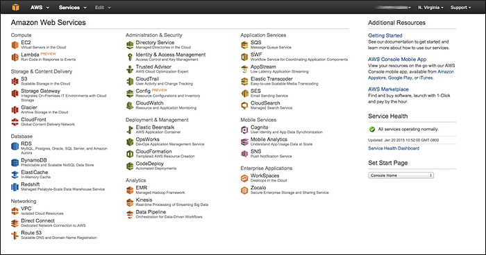

	2.  Select the account from the top right of the screen and select Security Credentials

		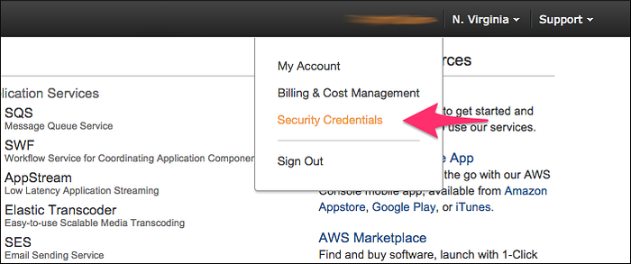

	3.  When 'AWS IAM' confirm pop up appears, select 'Continue to Security Credentials' button and procceed to Security Credentials screen

	4.  Select Access Keys and click Create New Access Key to create the Access Key.
    
		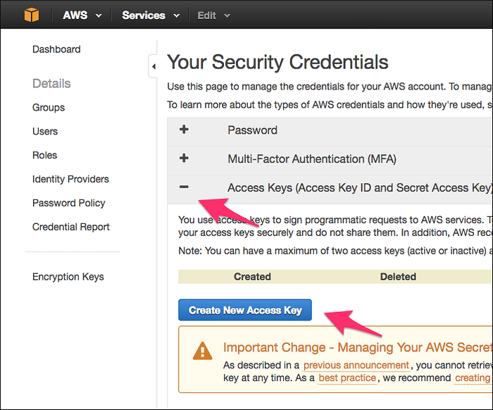

	5.  Check the information of the created key.

		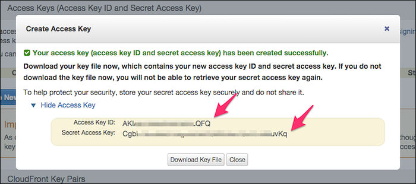

		Set the Access Key ID on the screen at the ***BOSH\_AWS\_ACCESS\_KEY\_ID***.

		Set the  Secret Access Key on the screen at the ***BOSH\_AWS\_SECRET\_ACCESS\_KEY***.

	6.  Close the dialog screen.

-   Configure Virtual Private Cloud (VPC)

	1.  Select the regional menu in the upper right corner of the screen. (The light stemcell is currently available only in the N. Virginia region.)

		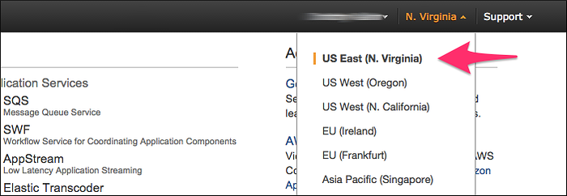

	2.  Select the VPC menu from the AWS console screen.

		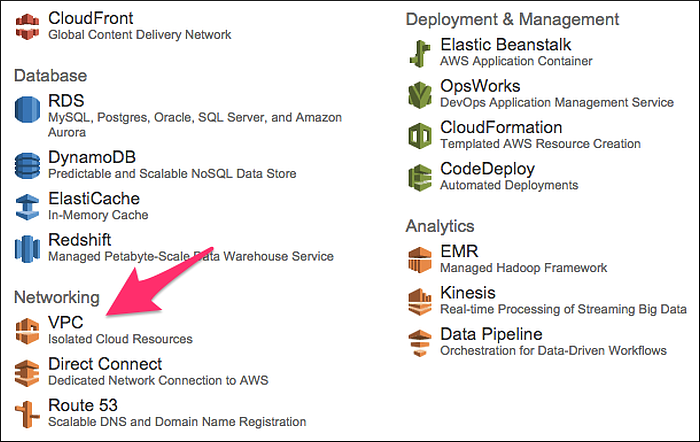

	3.  Select VPC Wizard.

		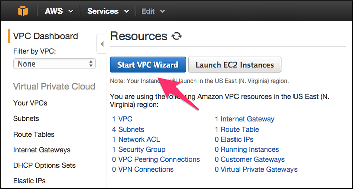

	4.  Select “VPC with a Single Public Subnet”

		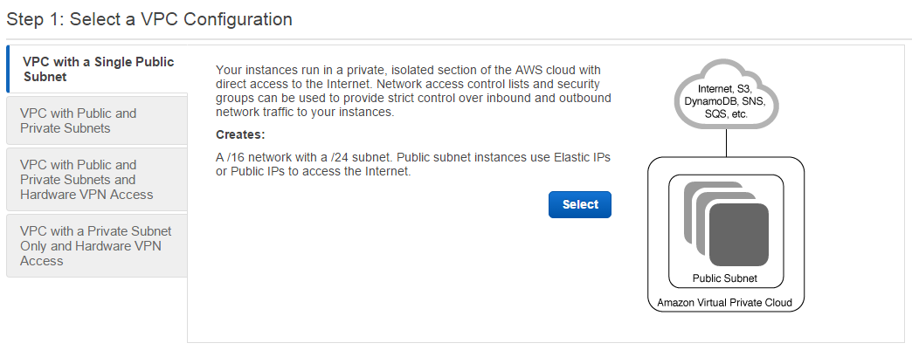

	5.  Enter the network information and click Create VPC button to create VPC.
		
		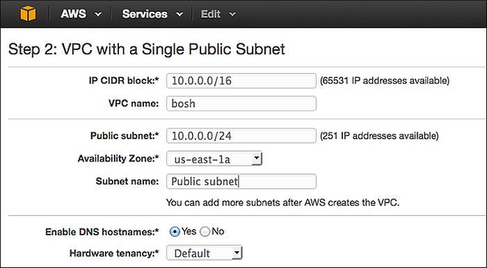

	6.  The list of created VPC as shown below outputs.

		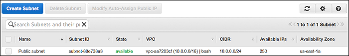

		Set Subnet ID at ***BOSH\_AWS\_SUBNET\_ID***.

-   Create Key Pair

	1.  On the AWS console screen, select the 'EC2' menu to go to the EC2 dashboard screen.

	2.  Select ‘Key Pairs’ and ‘Create Key Pair’ button in order.

		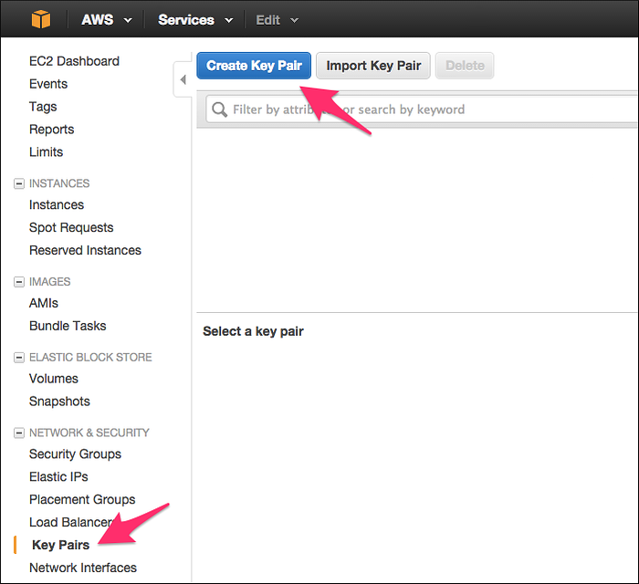

	3.  Enter Key Pair name from the Create Key Pair Dialog Screen. Create and download Key Pair.

		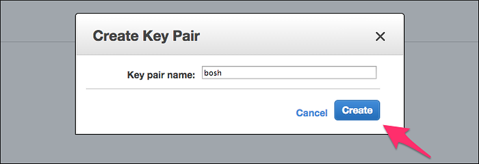

	4.  Relocate the downloaded Key(Ex: bosh.pem) to the key storing directory and change authority.

  
			# When Key pair name downloaded ‘bosh’ key at ‘~/Downloads’ directory
			$ mv ~/Downloads/bosh.pem ~/.ssh/
			$ chmod 400 ~/.ssh/bosh.pem
  

		Set the Key path and name at the ***BOSH\_VAGRANT\_KEY\_PATH***.

-   Create Security group

	1.  EC2 Click  ‘Security Groups’ and ‘Create Security Group’ button in order from the EC2 dashboard screen.

		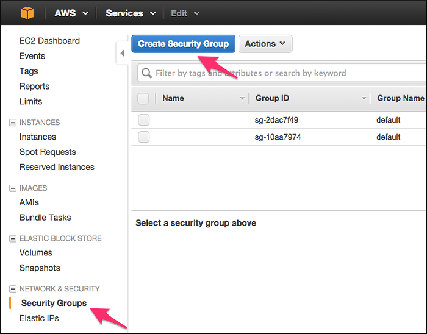

	2.  From the Create Security Group pop up screen, enter the value as shown below and create security group.

		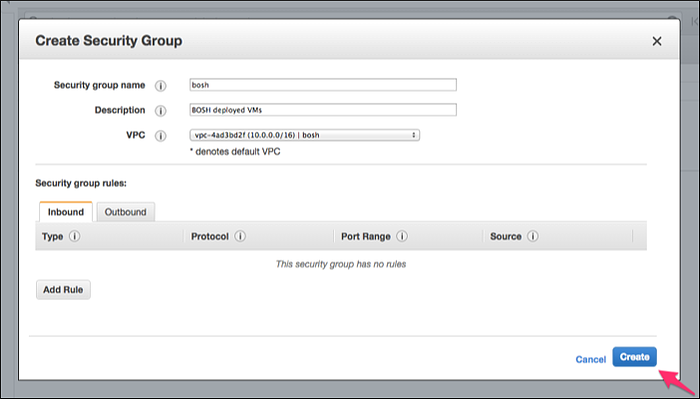

			
		|Provision                  | Set Value                             |Description|
		|---------------------|----------------------------------|----------------------------
		|Security group name   |Any (Ex: bosh_stemcell)           |Security group name|
		|Description           |Any (Ex: BOSH builds Stemcells)   |Description about the security group|
		|VPC                   |VPC created from the VPC             |VPC to apply the security group|

	3.  Select 'Edit' on the 'Inbound' tab to set the security policy for the created security group.

		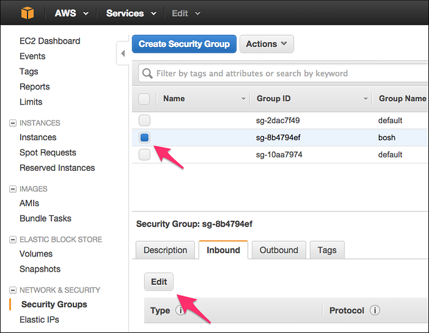

	4.  Add a security policy as shown in the table below.

		|Type   |Protocol   |Port Range   |Source|
		|------|----------|------------|--------|
		|SSH    |TCP        |22           |My IP|

		Set the created Security Group ID at ***BOSH\_AWS\_SECURITY\_GROUP***.

## 2.3.  RUBY Installation

The procedure of installing Ruby is as follows.

1.  Installing dependency packages

  -   For Ubuntu

			$ sudo apt-get update
			$ sudo apt-get install -y build-essential zlibc zlib1g-dev ruby ruby-dev openssl libxslt-dev libxml2-dev libssl-dev libreadline6 libreadline6-dev libyaml-dev libsqlite3-dev sqlite3 libxslt1-dev libpq-dev libmysqlclient-dev
    

  -   For CentOS
   
    		$ sudo yum install gcc ruby ruby-devel mysql-devel postgresql-devel postgresql-libs sqlite-devel libxslt-devel libxml2-devel yajl-ruby
    

  -   For OSX
    
    		$ xcode-select --install
		    xcode-select: note: install requested for command line developer tools
  

2.  Ruby Installation Admin and Ruby Installation

		$ curl -L https://get.rvm.io | bash -s stable
		$ source ~/.rvm/scripts/rvm

		#Install Ruby 2.1.6
		$ rvm install 2.1.6

		#Set Default Version of Ruby
		$ rvm use 2.1.6 --default

3.  Vefify Installation

		$ ruby -v

## 2.4.  BOSH Installation

The procedure for BOSH installation is as follows.

1.  Create environment to install

		#Install git
		$ sudo apt-get install git

		#Create execution directory
		$ mkdir -p ~/workspace
		$ cd ~/workspace

2.  Bosh Installation and Setting
  
		#Install Bosh
		$ git clone https://github.com/cloudfoundry/bosh.git
  		
		#Install Bosh sub-module
		$ cd bosh
		$ git submodule update --init --recursive

		#Install Bosh depending package
		$ bundle install

		#Install bosh_cli
		$ gem install bosh_cli
  

3.  Verify Bosh Installation

		$ bundle exec bosh or bosh

## 2.5.  Vagrant Installation

Vagrant is an open source that builds a virtual environment. Use vagrant to manage VMs for creating stemcells.

1.  Install Vagrant

		$ sudo apt-get install vagrant

2.  Install Vagrant Plugin

		$ vagrant plugin install vagrant-berkshelf
		$ vagrant plugin install vagrant-omnibus
		$ vagrant plugin install vagrant-aws --plugin-version 0.5.0

## 2.6.  VM Installation for Stemcell Creation

Configure the virtual environment for creating stemcell.

1.  Set AWS Environment Variables
  
		#Set the environment variables as below.
		$ export BOSH_AWS_ACCESS_KEY_ID=<YOUR-AWS-ACCESS-KEY>
		$ export BOSH_AWS_SECRET_ACCESS_KEY=<YOUR-AWS-SECRET-KEY>
		$ export BOSH_AWS_SECURITY_GROUP=<YOUR-AWS-SECURITY-GROUP-ID>
		$ export BOSH_AWS_SUBNET_ID=<YOUR-AWS-SUBNET-ID>
  

2.  VM 생성

	***기본으로 설정된 VM 크기는 m3.xlarge 타입으로 AWS 과금 대상이다.***

		$ cd ~/workspace/bosh/bosh-stemcell
		$ vagrant up remote --provider=aws

3.  원격 접속 확인

		#접속 키 정보 설정 실행
		$ export BOSH_KEY_PATH=<접속 키의 경로 및 파일명>
		$ export BOSH_VAGRANT_KEY_PATH=<접속 키의 경로 및 파일명>

		#접속 실행
		$ cd ~/workspace/bosh/bosh-stemcell
		$ vagrant ssh remote

4.  원격 파일 송수신

		#접속 키 정보 설정 실행
		$ export BOSH_KEY_PATH=<접속 키의 경로 및 파일명>
		$ export BOSH_VAGRANT_KEY_PATH=<접속 키의 경로 및 파일명>

		#파일 송수신 실행
		$ cd ~/workspace/bosh/bosh-stemcell

		#파일을 송신할 경우
		$ vagrant scp <로컬 파일> remote:<원격 파일 저장 경로>

		#파일을 수신할 경우
		$ vagrant scp remote:<원격 파일 저장 경로> <로컬 파일>
 

## 2.7.  BOSH Source 등을 수정하여 스템셀을 생성할 경우

1.  Source Code 수정 또는 업데이트한 gem 파일을 스템셀 생성 VM에 반영하는 경우

		$ cd ~/workspace/bosh/bosh-stemcell
		$ vagrant provision remote

# 3.  기본 OS 이미지 생성 

사용자 환경에 맞는 사용자 정의의 OS로 구성한 스템셀이 필요한 경우, 기본 OS 이미지부터 생성한다. 기본 OS 이미지는 스템셀이 요구하는 최소한의 OS 기능과 Bosh agent 및 bosh 모니터로 구성 되어 있다.

## 3.1.  Ubuntu OS 이미지 생성

Ubuntu OS 이미지를 생성하는 절차를 기술한다.

1.  Build\_os\_image 실행

		#기본 OS 이미지 생성
		$ cd ~/workspace/bosh/bosh-stemcell
		$ vagrant ssh -c '
		cd /bosh
		bundle exec rake stemcell:build_os_image[ubuntu,trusty,/tmp/ubuntu_base_image.tgz]
		' remote

2.  입력 옵션 정보

	|옵션명                      |필수   |설명                                          |예시|
	|--------------------------|------|--------------------------------------------|------------------------------|
	|Operating system name      |O      |OS 타입                                      |ubuntu|
	|Operating system version   |O      |OS 버전                                      |trusty|
	|OS image path              |O      |기본 OS 이미지가 생성되는 디렉토리 및 이름       |/tmp/ubuntu_base_image.tgz|

	※ 필수 항목이 아닌 곳에 대해서는 ‘’을 입력한다.

## 3.2.  RHEL OS 이미지 생성 

RHEL OS 이미지를 생성하는 절차를 기술한다.

1.  RHEL 7.0 iso를 다운로드 받아서 스템셀 생성 VM에 업로드 한다.

  	[https://access.redhat.com/downloads/content/69/ver=/rhel---7/7.0/x86\_64/product-downloads](https://access.redhat.com/downloads/content/69/ver=/rhel---7/7.0/x86_64/product-downloads)
  
	※ 다운로드하기 위해서는 RedHat 계정이 있어야 한다.

2.  실행 환경 구성

		#스템셀 생성 VM에 접속
		$ cd ~/workspace/bosh/bosh-stemcell
		$ vagrant ssh remote

		#RHEL 이미지 마운트
		$ sudo mkdir -p /mnt/rhel
		$ sudo mount rhel-server-7.0-x86_64-dvd.iso /mnt/rhel

		#redhat 계정 정보 설정
		$ export RHN_USERNAME=<RHEL 계정>
		$ export RHN_PASSWORD=<RHEL 비밀번호>

3.  Build\_os\_image 실행

		#스템셀 생성 VM에서 build_os_image 실행
		$ cd /bosh
		$ bundle exec rake stemcell:build_os_image[rhel,7,/tmp/rhel_7_base_image.tgz]

	※ 기본 RHEL OS 이미지는 BOSH에서 제공하지 않는다.

	***※ 기본 RHEL OS 이미지 생성 시 오류가 발생할 경우, RHEL에서 기본 RHEL OS 이미지를 제공받아 스템셀을 생성한다.***

## 3.3.  생성한 기본 OS 이미지의 보관장소 

1.  생성한 기본 OS 이미지 확인

		$ cd ~/workspace/bosh/bosh-stemcell
		$ vagrant ssh remote
		$ ll /tmp

2.  생성한 기본 OS 다운로드
 
		$ cd ~/workspace/bosh/bosh-stemcell
		$ vagrant scp remote:/tmp/<생성한 기본 OS 이미지명> <다운받을 로컬 경로>

# 4.  BOSH 스템셀 생성 

## 4.1.  원격지의 OS 이미지를 사용한 스템셀 생성 

원격지의 OS 이미지를 사용해서 스템셀을 생성하는 절차를 기술한다.

1.  Build 실행

		$ cd ~/workspace/bosh/bosh-stemcell
		$ vagrant ssh -c '
		cd /bosh
		CANDIDATE_BUILD_NUMBER=<current_build> bundle exec rake stemcell:build[vsphere,esxi,centos,7,go,bosh-os-images,bosh-centos-7-os-image.tgz]
		' remote

2.  입력 옵션 정보

	|옵션명                      |필수    |설명                       |예시|
	|--------------------------|------|-----------------------------------------------|------|
	|CANDIDATE_BUILD_NUMBER     |O      |현재 스템셀 버전            |3147|
	|Infrastructure             |O      |인프라 타입                 |Vsphere|
	|Hypervisor                 |O      |하이퍼 바이저 타입          |Esxi|
	|Operating system name      |O      |OS 타입                    |Centos|
	|Operating system version   |O      |OS 버전                    |7|
	|Agent type                 |X      |에이전트 타입               |Go|
	|OS image s3 bucket name    |O      |Bosh용 OS 이미지 버킷명     |Bosh-os-image|
	|OS image key               |O      |OS 이미지명                |Bosh-centos-7-os-image.tgz|

	※ 다른 OS image에 대해서는 다음을 참조한다. 
[http://s3.amazonaws.com/bosh-os-images/](http://s3.amazonaws.com/bosh-os-images/)

	※ Agent type타입이 필수 항목은 아니지만 현재 go 타입 이외의 에이전트는 지원하지 않으므로 go를 입력한다.

3.  설정 가능한 옵션 구성

	|Infrastructure             |Hypervisor                |OS|
	|--------------------------|-------------------------|----------------------------|
	|aws                        |Xen                       |ubuntu|
    |aws                        |Xen                       |centos|
	|openstack                  |Kvm						|ubuntu|                       
	|openstack                  |Kvm						|centos|		
	|vcloud					   |Esxi						 |ubuntu|		
	|vsphere					|Esxi						 |ubuntu|
	|vsphere					|Esxi						 |centos|

	※ 위와 다른 옵션을 지정하고 싶은 경우 Bosh source에서 필요한 부분을 수정하거나 개발 한다.

## 4.2.  로컬의 OS 이미지를 사용한 스템셀 생성 

로컬의 OS 이미지를 사용해서 스템셀을 생성하는 절차를 기술한다.

1.  기본 OS 이미지를 생성 또는 다운로드 받는다.

	|OS 명            |URL|
	|----------------|----------------------------------------------------------------------------|
	|ubuntu           |[https://s3.amazonaws.com/bosh-os-images/bosh-ubuntu-trusty-os-image.tgz](https://s3.amazonaws.com/bosh-os-images/bosh-ubuntu-trusty-os-image.tgz)|
	|centos           |[https://s3.amazonaws.com/bosh-os-images/bosh-centos-7-os-image.tgz](https://s3.amazonaws.com/bosh-os-images/bosh-centos-7-os-image.tgz)|
	|사용자 생성 OS     |[3. 기본 OS 이미지 생성 참조](#3--기본-os-이미지-생성)|

2.  기본 OS 이미지를 다운 받은 경우, 스템셀 생성 VM에 업로드 한다.

3.  build\_with\_local\_os\_image 실행
  
		$ cd ~/workspace/bosh/bosh-stemcell
		$ vagrant ssh -c '
		cd /bosh
		bundle exec rake STEMCELL_BUILD_NUMBER=<stemcell version> stemcell:build_with_local_os_image[aws,xen,ubuntu,trusty,go,/tmp/ubuntu_base_image.tgz]
		' remote

	※ STEMCELL\_BUILD\_NUMBER을 생략할 경우, 생성되는 스템셀의 버전은 0000으로 고정된다.

4.  입력 옵션 정보

	|옵션명                      |필수    |설명                                   |예시|
	|--------------------------|------|--------------------------------------|------------------------------|
	|Infrastructure             |O      |인프라 타입                             |Aws|
	|Hypervisor                 |O      |하이퍼 바이저 타입                       |Xen|
	|Operating system name      |O      |OS 타입                                |Ubuntu|
	|Operating system version   |O      |OS 버전                                |Trusty|
	|Agent type                 |X      |에이전트 타입                           |Go|
	|Local os image path        |O      |스템셀 생성 VM에 있는 OS 이미지 경로      |/tmp/ubuntu_base_image.tgz|

	※ Agent type타입이 필수 항목은 아니지만 현재 go 타입 이외의 에이전트는 지원하지 않으므로 go를 입력한다

5.  설정 가능한 옵션 구성

	|Infrastructure             |Hypervisor                |OS|
	|--------------------------|-------------------------|----------------------------|
	|aws                        |Xen                       |ubuntu|
    |aws                        |Xen                       |centos|
	|openstack                  |Kvm						|ubuntu|                       
	|openstack                  |Kvm						|centos|		
	|vcloud					   |Esxi						 |ubuntu|		
	|vsphere					|Esxi						 |ubuntu|
	|vsphere					|Esxi						 |centos|

## 4.3.  생성한 스템셀의 보관장소 

1.  생성한 스템셀 확인

		$ cd ~/workspace/bosh/bosh-stemcell
		$ vagrant ssh remote
		$ ll /bosh/tmp

2.  생성한 스템셀 다운로드

		$ cd ~/workspace/bosh/bosh-stemcell
		$ vagrant scp remote:/bosh/tmp/<생성한 스템셀명> <다운받을 로컬 경로>

# 5.  BOSH Light 스템셀 생성 

## 5.1.  Bosh Light 스템셀 생성

Bosh light 스템셀은 AWS (N. Virgina region 한정)에서만 사용가능한 경량 스템셀이다. 스템셀을 AWS에 AMI로 등록하고 등록한 이미지 아이디, 스템셀 정보 등을 기록한 파일을 생성하여 tgz로 압축한다.

1.  다운로드 받았거나 생성한 스템셀을 스템셀 생성 VM에 업로드한다.

		$ cd ~/workspace/bosh/bosh-stemcell	
		$ scp <업로드 대상 스템셀> remote:/tmp/bosh-stemcell.tgz

2.  build\_light 실행

		$ cd ~/workspace/bosh/bosh-stemcell
		$ vagrant ssh -c '
		cd /bosh
		export BOSH_AWS_ACCESS_KEY_ID=<YOUR-AWS-ACCESS-KEY>
		export BOSH_AWS_SECRET_ACCESS_KEY=<YOUR-AWS-SECRET-KEY>
		bundle exec rake stemcell:build_light[/tmp/bosh-stemcell.tgz,hvm]
		' remote

3.  입력 옵션 정보

	|옵션명                |필수   |설명                   |예시|
	|---------------------|------|----------------------|------------------------|
	|Local stemcell path   |O      |로컬의 stemcell 경로   |/tmp/bosh-stemcell.tgz|
	|Virtualization type   |X      |가상화 타입            |Hvm|

	※ 필수 항목이 아닌 곳에 대해서는 ‘’을 입력한다.

# 6.  스템셀 커스터마이징 

## 6.1.  스템셀 생성 소스 수정 

사용자의 요구사항에 맞는 스템셀을 생성하기 위해서는 스템셀 생성 소스를 수정 해야 할 경우가 있다. 스템셀 생성을 구성하는 대부분의 파일은 아래의 디렉토리에 있다.

	bosh/stemcell_builder/stages/<스템셀 생성 stage>/<폴더 또는 파일>

1.  수정한 내용을 스템셀 생성 VM에 적용한다.

		$ cd ~/workspace/bosh/bosh-stemcell
		$ vagrant provision remote

2.  스템셀을 생성한다. (필요한 경우 기본 OS 이미지부터 생성한다.)

3.  스템셀 생성 중 오류가 발생한 경우, 해당 오류를 조치한 후 오류가 발생한 stage부터 진행 할 수 있다. 이 경우, resume\_from=<스템셀 생성 stage\>를 생성 명령어에 추가한다. ※ 단, resume 옵션으로
    스템셀을 생성할 경우, 이전에 정상적으로 진행된 스테이지에서 오류가 발생하는 경우도 있다. 이런 경우, resume\_from옵션을 사용하지 않는다.

		$ cd ~/workspace/bosh/bosh-stemcell
		$ vagrant ssh -c '
		cd /bosh
		bundle exec rake stemcell:build_with_local_os_image[aws,xen,ubuntu,trusty,go,/tmp/ubuntu_base_image.tgz] resume_from=stemcell_openstack
		' remote

### [Index](https://github.com/PaaS-TA/Guide-eng/blob/master/README.md) > [AP User Guide](../README.md) > Stemcell 개발
